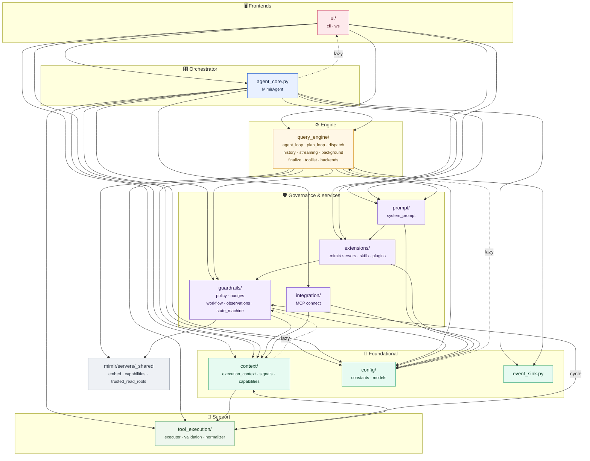

# MIMIR Architecture — Dependency Graph

> **MIMIR docs** — [Overview](README.md) · [Architecture](ARCHITECTURE.md) · [Setup](SETUP.md) · [Policy](POLICY.md) · [Client internals](CLIENT_DETAILED.md) · [Servers](SERVERS_DETAILED.md) · [Extension](EXTENSION_DETAILED.md) · [Plugins](PLUGINS_DETAILED.md)

The layering of `mimir/client/`, derived from the actual imports. Read top-to-bottom:
higher layers depend on lower ones. Solid edges are import-time; **dotted edges are
lazy** — imported inside a function, so they never run at load time.

The graph below shows the layering, not every edge: a unit also imports the
foundational ones (`config`, `context`, `event_sink`) and `mimir/servers/_shared`
freely, and those edges are omitted to keep it readable.

## How to read it

- **Foundational** (`config`, `context`, `event_sink`) depend on nothing above them —
  they are the shared data substrate + IO seam. `context` holds the `ExecutionContext`
  blackboard, the query/tool `signals`, and the capability vocabulary; `event_sink` is
  the injectable `emit()` bus that decouples the engine from any frontend.
- **`guardrails`** (the two guardrail systems — hard `policy` gates and soft `nudges` —
  plus the shared `workflow` state model and the `observations` blackboard writer) sits
  above the foundation and below the engine. Both subsystems read `context`, which
  reaches back only through one lazy import (the bash classifier).
- **`query_engine`** drives the per-query loop and pulls in everything below it.
- **`agent_core.py`** (the `MimirAgent` core) is the orchestrator every frontend, the
  runner, and the sub-agent server instantiate — it is at the client root, **not** in
  `ui/`, because it is the engine the UIs pilot.
- **`ui/`** is only the frontends (CLI + WebSocket/VS Code); it drives `agent_core`.

### Back-edges

Five places where a lower unit reaches a higher one. Each is a **lazy import inside a
function**, so it costs nothing at load time:

| Edge | Where | Why |
|---|---|---|
| `agent_core → ui` | `MimirAgent.chat_loop()` | a convenience "start the CLI" method, without depending on a frontend at load time |
| `config → query_engine` | a token-budget helper in `constants.py` | keeps `config` foundational while still reaching the backend for token counting |
| `context → guardrails` | `execution_context.py` | needs the bash classifier, which lives under `guardrails.policy` |
| `guardrails → prompt` | the checklist reader | the prompt package pulls in the extension loader, which is built while guardrails is importing |
| `prompt → query_engine` | `system_prompt.py` | needs the ledger splitter, and `query_engine.finalize` already imports this module |

### One real cycle

`guardrails` and `tool_execution` import each other **at load time**:
`guardrails/observations.py` needs `tool_execution.validation` (scratch-path rules), and
`tool_execution/executor.py` needs `guardrails.observations` and the policy engine. Python
resolves it because the names each side needs are defined before the other is reached, but
it is a cycle and not a lazy edge. Stated here rather than hidden, so a change that moves
either import knows what it is touching.

Everything else is a straight downward dependency.
