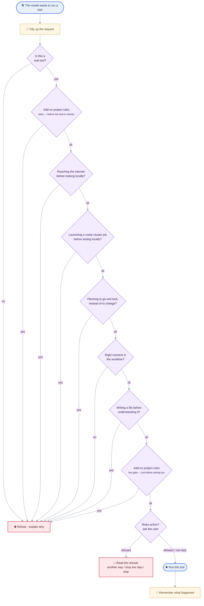

# MIMIR Policy Reference

> **MIMIR docs** — [Overview](README.md) · [Architecture](ARCHITECTURE.md) · [Setup](SETUP.md) · [Policy](POLICY.md) · [Client internals](CLIENT_DETAILED.md) · [Servers](SERVERS_DETAILED.md) · [Extension](EXTENSION_DETAILED.md) · [Plugins](PLUGINS_DETAILED.md)

The authoritative reference for MIMIR client **policy** behavior — use it to find what
policy rules exist, why they exist, where they are enforced in code, and what to update
when policy behavior changes.

---

## Policy Goals

The client policy layer exists to keep the agent useful without allowing low-context or unsafe actions.

Primary goals:
1. Require repository evidence before code changes.
2. Prevent destructive or low-context edits without forcing excessive rigidity.
3. Force validation before claiming success after code mutation.
4. Surface denied sensitive actions as incompleteness, not silent success.
5. Keep tool behavior predictable across runs.
6. Preserve model freedom during legitimate multi-file refactors and targeted repair loops.

The policy is intentionally **guardrail-oriented**, not **over-constraining**:
- it should block blind or unsafe actions,
- but it should still allow the model to finish a reasonable refactor,
- repair a failing file,
- and continue working when it already has enough local context.

---

## Trigger Workflow

Two independent mechanisms run at different moments. **Policies** gate a tool
*before* it runs (per tool call). **Nudges** append at most one reminder to the
conversation *after* a model step (per agent step). Both consult the same
`ExecutionContext`, and both let application packs add rules without editing core.

> The two flowcharts below are **zooms** on the work loop in `README.md`
> (*Architecture → Agentic loop*): the policy checks expand the
> “🛠️ Run the requested tools” step, and the reminder cascade expands the
> “Needs a nudge to finish properly?” step.

### Policy preconditions — per tool call

Every tool call passes through a chain of safety checks before it can run. The
first check that objects stops the call and hands the model an explanation it can
react to (a refused action is weighed against the three readings of a refusal — see
[If approval is refused](#if-approval-is-refused)). The checks run in a
fixed order, and add-on packs can insert extra rules but never remove any.



**The two "add-on project rules" boxes are the same mechanism at two different
moments** — not the same rule checked twice. Add-on packs plug extra rules into
one of two slots, and the difference is *what has already been checked* by the time
the rule runs:

- **Early slot (before the built-in checks)** — runs right after "is this a real
  tool?", *before* MIMIR's own guards (internet, cluster, workflow, file-writing).
  Use it to reject an action up front, on the request alone, without waiting for the
  built-in guards — for example a domain rule that forbids a tool outright, or a
  guard for a non-writing tool the built-in write rule wouldn't cover.
- **Last slot (just before asking you)** — runs *after* every built-in guard has
  already passed, immediately before the approval prompt. At this point the action
  is known to be otherwise allowed, so the rule is a final domain-specific veto right
  at the "about to run" boundary.

In both slots an add-on rule can **only block** an action — it can never wave through
something the built-in guards already rejected.

### Nudge cascade — per agent step

After each model step, MIMIR may add **at most one** short reminder to the
conversation. It first runs *correctness* checks (did the model verify its work?)
— these are always on. Then, unless reminders are switched off, it runs
*good-practice* tips. The first reminder that applies wins; if none apply, nothing
is added.


Each row is `(name, layer, should_fire, render)`; a row's own predicate carries its
per-query frequency cap and (for guidance) the `(enforcement, mode)` gate, so the
runner just walks the table.

---

## Enforcement Modules

- `mimir/client/guardrails/policy/write.py`
  - write-policy enforcement (read-before-overwrite, delete evidence, anti-thrashing)
  - `check_write_policy` / `has_delete_context` / `write_policy_violation`
  - every rule here guards a **loss**. A rule that only enforces a preferred working order does not belong in this module: it blocks reversible work, and as a hard guard it would sit outside the enforcement dial that exists to tune exactly that. The pre-edit planning gate (first code edit refused until a plan/todo was recorded) was removed on that ground — the risk it gestured at is *concluding* with open steps, which the unfinished-plan verification nudge covers directly from disk state.

- `mimir/client/guardrails/observations.py` (at the guardrails root — shared by policy **and** nudges)
  - the `execution_context` blackboard writer: `record_tool_observation` + the ordered `_observe_*` handlers
  - path evidence tracking, repeated-edit retry tracking, workflow transition recording after tool execution
  - `_observe_command`: a shell-command tool (`bash_run`, keyed off the `command_prefix` scope) is classified by `policy/bash_classify.py` and credited to the same fields as the dedicated tools, so a bash `cat`/`grep`/`sed -i` feeds discovery/edit/action state (`read_files`, `searched`, `inspected_dirs`, `dirty_written_files`, `action_op_count`) like the file/search tools would
  - (query-intent classifiers `query_prefers_*` / `query_requires_repo_discovery` moved to `context/signals.py`)

- `mimir/client/guardrails/policy/state_machine.py`
  - the workflow-state guard (`check_state_machine_guard`) + validation-retry-budget enforcement
  - (the validation/denial nudge **message builders** moved to `guardrails/nudges/messages.py`; `finalize_incomplete_answer` lives in `guardrails/workflow.py`)

- `mimir/client/guardrails/policy/engine.py`
  - `evaluate_tool_preconditions` orchestrator
  - registry validation
  - tool rewrite handling
  - registry → cluster-submit guard → plan-shape guard → proxy-exec guard → state guard → write policy → out-of-workspace guard → approval pipeline
  - capability-driven call-time guards (no hardcoded tool names), all living in `guardrails/policy/gates.py`: `_check_cluster_submit` (CLUSTER_SUBMIT held until local-validation evidence, unless the session wrote nothing — see Cluster-Submission Guard), `_check_proxy_exec` (CODE_EXEC tools blocked from running the proxy under optimization directly — see Proxy Direct-Execution Guard), `_check_out_of_workspace_access` (any path outside the workspace root prompts before running — see Out-of-Workspace Access Approval), and `_check_plan_shape` (a plan document whose axes are exploration steps is refused before it is recorded — see Plan-Shape Guard)
  - interactive path clarification (interactive sessions only)
  - violation payload enrichment with:
    - `policy_stage`
    - `state`
    - `missing_evidence`
    - `suggested_next_tool_class`

- `mimir/client/guardrails/policy/approval.py`
  - interactive approval gate (`ApprovalManager`)
  - per-call prompt (with a registry-driven `risk_note` sentence — see below)
  - `always` session-wide grants, **scope-narrowed** by a tool-declared `scope` spec
  - batch-mode queuing
  - pre-write file snapshot capture and unified diff display
  - revert-all on rejection
  - `denial_kind(note)`: maps each front-end's refusal note ("denied by user", "cancelled", …) to a stable token, so the policy layer branches on a kind instead of on prose

- `mimir/client/guardrails/policy/bash_classify.py`
  - classifies a `bash_run` command line (command + options) into capability **kinds** (read / search / inspect / write / exec / env) plus the operands it acts on; `classify_bash_command` (per-segment, `; && || |`) / `bash_command_is_readonly` (all segments read-only?)
  - single source reused by plan-mode gating (`plan_loop`), the read-only approval exemption, and the `_observe_command` blackboard writer. Not a security boundary — the bash server independently validates every call

- `mimir/client/guardrails/policy/readonly_exempt.py`
  - `_readonly_bash_exempt`: waives the sensitive-approval prompt for a **read-only** dual-use bash command (per `bash_command_is_readonly`) **in any mode** — running `rg`/`cat`/`sed -n` unattended is safe; an exec command or an in-place write (`sed -i`) still hits the normal gate. Formerly `plan_mode.py` (plan-mode-only), generalised when the exemption was extended to agent mode

- `mimir/client/tool_execution/bash_effect.py`
  - `capture` / `report` / `created_paths`: what a shell command changed on disk, appended to its result as the `BASH_EFFECT` annotation (see What a Shell Command Changed)
  - triggered by `bash_command_is_readonly` being false, never by the command's classified kind; detection is a `git status`/`git diff --numstat` delta, or a bounded `os.scandir` outside a repo

- `mimir/client/agent_core.py`
  - tool routing
  - approval prompts
  - integration order: precondition → execution → observation

- `mimir/client/guardrails/nudges/engine.py` — `maybe_append_nudge` appends **at most one** reminder per agent step. Built-in nudges are a single ordered table, `_CORE_NUDGES` (each row: `name`, `layer`, a `should_fire` predicate, a `render`), walked by the generic runner `_append_core_nudge`; application packs add more through the `NudgeRegistry` (`_append_custom_nudge`). Both share the same shape, so a built-in and a pack nudge are described identically. There are two layers:
  - **Verification layer** (`layer="verification"`) — reality checks that run at **every** enforcement level: denial, error-recovery, the **validation** nudge (a file you modified was never checked — the one axis the conclude gate blocks on), the **regression** nudge (you edited a source file whose associated test exists on disk but was never run this query — `tests_run` vs. the discovered `test_<stem>.py`/`<stem>_test.py`), the **unexercised** nudge (everything checked, nothing ever run), the **unfinished-plan** nudge (code was written while the model's own checklist still has open non-optional steps), and the **output-verdict** nudge. These point at facts about disk/process state and output honesty that no amount of model capability removes. `test_nudge_table.py` asserts the verification set is disjoint from `_ALL_GUIDANCE`, so a verification row can never be silently switched off by enforcement.
  - **Guidance layer** (`layer="guidance"`) — reasoning babysitting that is **skipped entirely when `enforcement_level == "off"`**: env_resolution, env_cleanup, discovery, documentation, state, blast-radius, creation, and todo. Which categories survive at each `(enforcement, mode)` is the single table `_GUIDANCE_BY_LEVEL_MODE` (consulted via `_guidance_enabled`, **inside each guidance predicate**): `strict` permits all; `light` keeps only `blast_radius` + `env_cleanup` (agent mode). See Enforcement Levels for the full table — it is the authority, and this line is a summary of it.

  Order per step: **core verification → pack verification → (stop if `off`) → core guidance → pack guidance**; the first row whose `should_fire` is true fires and wins. Each nudge's per-query frequency cap (`nudge_count(ec, category) < NUDGE_MAX_*`) lives inside its own predicate. Nudge and prompt text refers to tools by **capability/category**, never by literal MCP tool name (the plan output via "the plan/todo tool"). Validation names nothing at all any more: the check it used to steer toward is performed in-process (`guardrails/builtin_check.py`), so its nudge carries a finding rather than a command.

  The nudge **message copy** (the `render` text for every built-in nudge, plus the stateful `validation_nudge_message` builder) lives in `mimir/client/guardrails/nudges/messages.py` — inside the nudges subsystem, since only it consumes them. `guardrails/workflow.py` keeps only the shared **state model + predicates** (`set_workflow_state`, `has_pending_validation`, `has_blocking_denials`, `pending_validation_paths`, plus the denial ladder — `denial_stage`, `worst_denial_stage`, `handback_required`) and the agent-loop plan/loop copy.

  Separately from the `guardrails/nudges/engine.py` layers, the agent loop itself fires **loop-control correctives** mid-tool-loop (in `agent_loop.py`) when a call is over-repeated: the failing-call guard (identical *failed* non-write call → correct, then hard-block); and, once refusals reach the end of the denial ladder, a one-time **hand-back stop** (`handback_corrective_message()`), which is mid-loop for the same reason — a model that has been told to hand back and hasn't is still calling tools, where no nudge can reach it. A repeated *successful* call is **annotated, never guarded**. Two guards for it were built and both removed — a line-coverage ledger that narrowed reads, and a redundant-success guard that hashed results, blocked, and rewrote history; each cost more than the repetition it caught, and refusing content sent the model to `bash` to read the same file another way. What remains is the part neither of them was: `IDENTICAL_REPEAT`, appended to the result once a call has returned the *same digest* `IDENTICAL_REPEAT_THRESHOLD` times (counted in `LoopControlState.call_results`, beside the failure counter that ignores successes). Nothing is withheld and nothing is rewritten, so the objection that retired the guards does not apply; the per-query cache still answers the repeat itself. It is said once per call key: a model that ignored it will ignore the second. The **firing decision** lives in the loop; the corrective message **TEXT** lives alongside the other loop-control copy in `mimir/client/guardrails/workflow.py` (`repeat_corrective_message()` / `handback_corrective_message()`), keeping wording consistent.

  **`env_resolution` is guidance, but it is delivered mid-loop.** It is the one category whose subject is *recovery* rather than *completion*: every other row answers "is the work done?", which is a question worth holding until the model stops calling tools, while this one answers "why did that just fail?" — and by the time the turn ends, the steps it would have saved are already spent. Worse, the generic failing-call guard only catches the retries that are byte-identical, so a model varying the interpreter or the flags each time is never caught at all. `maybe_inject_env_resolution()` therefore runs from `_post_dispatch_inject()` immediately after the failing dispatch, under the **same `_GUIDANCE_BY_LEVEL_MODE` gate, the same `disabled_nudges` toggle and the same single budget** as the table row that still backs it up — whichever fires first spends `NUDGE_MAX_ENV_RESOLUTION`, and the other stays silent. What changed is the moment, not the policy.

  **One injection path, no exceptions.** Every machine-generated message put in the user's turn slot goes through `guardrails.nudges.inject_reminder(messages, text, category=..., tagged=...)`: the nudge table, the step-limit reminder, the post-dispatch correctives, and the plan-mode control flow. The `nudge_injected` event it emits is not decoration — the webview holds the turn in flight *outside* the transcript and commits it only once the loop accepts it, so a reminder injected with a bare `messages.append` leaves the rejected prose on screen looking like the answer, to be swapped for a different one when the real answer lands. `tagged=False` is for the reminders that are protocol rather than advice (plan-mode delivery, the step limit): the `_NUDGE_TAG` banner says "advisory, apply judgment", which invites the model to skip a step the loop actually requires. The reminders that follow a *user decision* (plan accepted / revised / rejected) do **not** go through it — the delivered prose they answer is legitimate transcript, not a rejected turn.

  **The refused turn is never streamed in the first place.** Dropping the draft on `nudge_injected` keeps the transcript honest, but the user still watched an answer stream in and disappear. So the loop asks *before* the model call whether it would refuse a bare turn produced now — `nudges.nudge_pending()` walks the same table and the same registry in the same layer order, evaluating predicates only (nothing rendered, injected or counted), plus the loop's own two grounds: the no-op streak cap and the once-per-query evidence handback. When something is pending, the step's `token_callback` is swapped for a `_DraftHold` (`query_engine/streaming.py`) that buffers the prose instead of emitting it: released verbatim the moment the turn calls a tool (narration belongs above its cards) or the call is cancelled, dropped silently when the guardrail does refuse it, and left unflushed on the accepted path — the final `answer` carries the text post-processed, so flushing the raw draft would only swap one visible text for another. Plan mode holds on the same principle with an exact condition instead of a probe: until the plan document is recorded, a turn that only talks is always nudged back. Nothing that reaches the screen can be taken back; the cost is that an at-risk turn lands at once rather than token by token.

---

## Enforcement Levels (model-tiered)

`config.models.enforcement_level(model)` resolves a per-model knob from the vLLM profile: `"strict"` | `"light"` (**default**) | `"off"`. It governs **only the reasoning-babysitting layer** — the guidance nudges (env resolution/cleanup, discovery, doc, state, blast-radius, creation, todo) and the plan-mode explore phase. Which guidance categories survive at each `(enforcement, mode)` is the single declarative table `_GUIDANCE_BY_LEVEL_MODE` in `guardrails/nudges/engine.py` (consulted via `_guidance_enabled`); each nudge then layers its own `active_mode`/situational conditions on top:

| level  | agent-mode guidance nudges                                                         | plan-mode guidance nudges          | plan-mode explore phase |
|--------|-----------------------------------------------------------------------------------|------------------------------------|-------------------------|
| strict | **all** (env_resolution, env_cleanup, discovery, doc, state, blast_radius, creation, todo) | all (branch `active_mode` gates still apply) | on |
| **light** *(default)* | **`blast_radius`, `env_cleanup` only**                              | none                               | on                      |
| off    | none                                                                               | none                               | off                     |

The plan-mode explore phase **withholds the plan-document tool** until the model has actually read code (`plan_evidence_ready`), so a plan written over nothing is unreachable rather than flagged after the fact; `off` disables the phase entirely and offers the tool from turn 1. It still never leaves the run without a plan: its trigger (`query_requires_repo_discovery`) is a deliberately broad exit filter that fires just as readily for greenfield work outside the repo, where no exploration could satisfy it, so `PLAN_EXPLORE_MAX_TURNS` unlocks the tool regardless and the plan states its own gaps.

`light` is the **default**, and the reason is that its membership rule is the only one stated as a criterion rather than as a list: keep the nudges guarding a mistake that is **costly, hard to detect, and non-self-correcting** — `blast_radius` (changing a definition without checking callers) and `env_cleanup` (a package install / created env that persists outside the session). Concluding on code that was never checked used to be on this list; it is no longer guidance at all, because it is not a reasoning shim to dial down — `validation` is a verification row now, and fires at `off` too. Everything `light` drops (discovery, env_resolution, doc, state, creation, todo) is procedural hand-holding a capable model does unprompted, and it is not free: each nudge is a message injected into the model's own reasoning stream mid-plan, priced in tokens and in interruption. Having that as the opt-*down* put the burden of proof on the wrong side.

`strict` permits every guidance branch and is now the **opt-in**, declared per model with `"enforcement": "strict"` in `vllm_model_profiles.json`. The branches' own `active_mode == "agent"` gates mean agent-only nudges still don't leak into plan mode, so `strict` does not strip guidance by mode. `off` cuts the whole guidance layer. Ask mode is empty at every level — it neither plans nor edits, so nothing in the guidance layer applies. The line is per-mode, so adding (say) a plan-mode `light` nudge later is a one-line table edit.

Which models opt back in: the marker is **empirical, not a guess about model families** — a profile that already carries a recorded workaround is a model that has been observed struggling. Today that is `devstral` (which also carries a tool-count cap). `test_client_helpers` pins it, so flipping the default can never silently un-rail it.

**Verification and safety/correctness enforcement is never tiered:** the verification-layer nudges (denial, error-recovery, validation, regression, unexercised, unfinished-plan, output-verdict), write-policy, approval/sensitivity, the workflow state-machine anti-thrashing guard, and plan-blocked tool hiding run at every level.

**Resolution and runtime override.** The level is resolved **once** at agent construction (`MimirAgent.__init__` → `self.enforcement = enforcement_level(model)`) — the model is immutable for an agent's lifetime, so there is nothing to re-resolve per turn. Consumers read it via `config.models.resolve_enforcement(agent)` (cached attribute, with a fall-back to `enforcement_level(agent.model)` for agent-like objects that predate the attribute). It can be changed at runtime with the `/enforcement strict|light|off` command (`MimirAgent.set_enforcement`), wired in both the CLI (`chat_commands.py`) and the WebSocket server (`ws_server._handle_command`), and surfaced in `/status`.

---

## Discovery-Evidence Definition (single owner)

"What counts as the model's own discovery this query" is defined **once** in `context/execution_context.py`: `DISCOVERY_EVIDENCE_SIGNALS` — now *derived* from the `DISCOVERY` field trait rather than hand-listed, so a new discovery field cannot be added to the schema and forgotten here (membership: `searched`, `read_files`, `delegated_read_files`, `checked_paths`, `inspected_dirs`) — plus `has_discovery_evidence(ctx, *, min_distinct)`. **Presence is the whole test**: nothing seeds these fields, so a fresh context carries zero evidence.

That is the fix for a bug worth recording, because it was invisible in both directions. A structural snapshot used to pre-fill `inspected_dirs`, and a discount (`BASELINE_SEEDED_DIRS`) was written into `_signal_present` to subtract it back out. The discount worked only for consumers that went through the shared helper; `_check_external_fetch` read the field raw, so on any repo-touching query it was satisfied before the model acted and never fired — while on a bibliography query, where no snapshot was built, it was the one thing that *did* fire. A guard that is a no-op exactly where it was meant to bite, and bites exactly where the prompt says not to explore. Deleting the seeding removed the need for the discount and the class of bug with it.

The agent-mode discovery nudge, the plan-mode explore phase (via `plan_evidence_ready`, which adds a floor on `read_files` — locating files is not reading them), and `engine._missing_evidence` all read this one definition instead of hand-picking field subsets, and all at the same `DISCOVERY_EVIDENCE_MIN_DISTINCT` bar — `_missing_evidence` used to take the default of 1 while the nudge asked 2, so two consumers of "one definition" still disagreed on how much cleared it.

**Delegated reading counts here, and only here.** `delegated_read_files` holds what a sub-agent opened and reported back (credited by `_observe_delegated_exploration`, keyed on the `DELEGATE` capability). These gates ask whether the model has *facts about the code* or is working off file names, and a finding that came back into its conversation is such a fact — `plan_evidence_ready` therefore counts it toward its read floor, or plan mode would punish the fan-out its own prompt asks for and drain the explore budget. It stays out of `read_files`, which answers a second and stricter question — *does this agent hold the lines it is about to edit* — that only a read of its own can settle. Two questions, two fields.

---

## Execution Context Contract

Every run builds a validated execution context via `build_execution_context()` and `validate_execution_context()`.

The context tracks:
- repository discovery evidence
- searched and inspected paths
- known existing files
- explicitly read files
- snippet-only read files
- written and validated files
- `validation_tier_by_file`: which kind of check each validated file passed (`syntax`/`static` — see Validation Policy)
- `runs`: every execution, with whether it completed and the model's verdict on what it printed
- denied sensitive actions
- workflow progress
- `edit_loop_state`: per-file `(signature, count)` of repeated identical **failed** edit attempts
- `steps_since_last_edit`: steps elapsed since the last successful code edit
- `declared_edit_set`: file paths the model committed to editing via `todo_write`
- `similar_candidates_by_dir`: known nearby peer files used to reason about placement and duplication

### Field traits: what a field *is*, declared once

Per-field properties — carried across queries? purged when a file is deleted? counts as discovery? — are declared as a `traits` frozenset on the field's own row in `_FIELD_SPECS`, and every list that answers one of those questions is **derived** (`fields_with(...)`):

| Trait | Meaning | Derived list it feeds |
|-------|---------|------------------------|
| `CARRY` | merged into the next query's context (session memory) | the carry merge + session (de)serialisation in `agent_core` |
| `FILE_PATH` | holds workspace **file** paths | the delete purge (`observations._observe_delete`) |
| `KNOWN_FILE` | holds a file path the model has encountered | `known_existing_files()` — path clarification |
| `DISCOVERY` | counts as the model's own exploration | `DISCOVERY_EVIDENCE_SIGNALS` |

These answers used to live in **eight hand-maintained name lists** across `agent_core`, `observations`, the policy engine and the nudge engine. Nothing kept them correct when a field was added, and they had already gone wrong: two computed the same four-field set twice in two modules; two named `dirty_written_files` as a carried field, which it never was; and two constants in `agent_core` shared the name `_CARRY_SET_FIELDS` with different membership. `test_client_helpers` now fails if a `*_files` / `*_paths` / `*_dirs` field is added without answering the question (or being listed as deliberately traitless).

`inspected_dirs` is `CARRY + DISCOVERY` but **not** `FILE_PATH`: it holds directories, and deleting a file does not un-inspect the directory that contained it.

**One seeder.** `backfill_execution_context()` gives a context every declared field, derived from the same table. It replaced four `bootstrap_*` helpers that each seeded the subset its own module read — one of which defaulted `steps_since_last_edit` to `99` where the schema and the others use `0`, so the same absent field meant "maximally idle" to the idle gates and "just edited" to the message builder. The old names remain as aliases.

### Important semantic distinctions

These are enforced by named predicates in `context/execution_context.py`, not by convention: `was_read()`, `is_known_to_exist()`, `was_checked_for()`. As bare set membership the right field and the wrong one looked equally plausible at the call site.

- `read_files` means the file was explicitly read through a direct read tool (`read_file_lines`). It says a read happened, and deliberately not how much of the file it returned — see *Reading is localized* below.
- `checked_paths` means a pre-check was attempted; it **does not prove existence**.
- `existing_paths` is stronger evidence than `checked_paths`.
- `validated_files` means a **checker** ran and passed on the file: it parses, its imports resolve, it lints. It does **not** mean the artifact is correct, and nothing on this axis ever will — correctness lives on the run axis, where the model's verdict is recorded. `validation_tier_by_file` says which kind of check it was (`structural` < `syntax` < `static` < `compiled` < `measured`).
- `runs` is the other axis: one entry per execution, holding whether it completed, the model's verdict on what it printed, and its failure history. A run credits no file, and a file's check says nothing about a run.
- scratchpad paths (see Out-of-Workspace Access Approval) never enter `dirty_written_files`: they are working material, not produced work.

Policy changes must preserve this contract or explicitly migrate it.

---

## Query Context Lifecycle

Execution context is **query-scoped**. Nothing pre-fills it: a fresh context carries zero discovery evidence, so every gate that asks "has the model explored?" measures the model's own tool calls this query and nothing else.

Current behavior:
- each query builds a fresh `ExecutionContext`; the only thing merged into it is the session **carry-context** (`_apply_carry_context`), which replays long-lived path knowledge — never the discovery *flags* a gate reads
- a structural repo snapshot used to seed `inspected_dirs` here. It was removed along with the snapshot itself: it made a discovery-evidence field non-empty before the model had acted, which any consumer reading the field raw took as exploration (`_check_external_fetch` did exactly that). A per-query cache keyed on a normalized query string was described here too and had already been unwired
- unrelated queries do not reuse cached discovery evidence

Rationale:
- reduce stale cross-query evidence bleed
- keep repeated query handling efficient without treating old context as globally valid

---

## Discovery Policy

Discovery is required when the query implies repository work.

Current rule:
- `query_requires_repo_discovery(query)` decides whether discovery is expected. It matches edit/create/HPC and repo-oriented terms but **not** pure-theory/bibliography terms (`derive`, `prove`, `integrate`, `cite`, `theorem`), so a math or literature query is not forced to scan the repository.
- The hard requirement is enforced at write time: `check_write_policy` / the workflow state guard demand direct target context (`has_direct_target_context`) and, for deletes, existence evidence (`has_delete_context`) before a mutation is allowed.
- nudges are intentionally softer than hard guards:
  - local discovery evidence may include:
    - search activity
    - directory inspection
    - explicit reads
    - successful path checks

Rationale:
- avoid blind edits
- keep planning grounded in repository facts
- avoid over-nudging when the model already has enough local evidence to proceed

---

## Read Policy

Reading is localized. A read answers "what is at this place in this file", never "what
is in this file" — and the policy layer is built to match, rather than to police the
difference.

Current design:
- `read_file_lines` caps every call (`_MAX_READ_LINES`) whatever range it is given, and a
  window that stops short says so: `truncated`, `total_lines`, `next_start_line`,
  `line_cap`. The client turns that into `MORE_CONTENT`, and into an `OUTLINE` symbol map
  for a code file, so the next call can be aimed instead of paged.
- explicit reads (`read_file_lines`) are recorded in `read_files` as discovery evidence.
  **Nothing records how much of the file came back**, and no gate asks.
- the one read precondition left is read-before-overwrite: rewriting a file that already
  exists requires having read it. Any extent satisfies it.

Rationale:
- a gate on "was it read whole" rewards the exhaustive read the rest of the policy
  argues against, and measures nothing else
- the line-coverage ledger that used to answer it cost four context fields, an mtime
  stamp, a diff re-indexer and a crediting path per tool, to spare the tokens of a slid
  window — and duplicated the redundant-call guard while short-circuiting it
- a repeated read is a loop-control concern, handled where the other repeats are

---

## Write Policy

Write actions are guarded more aggressively than reads, but the current policy is designed to remain usable during real refactor loops.

### Current runtime-enforced write-policy behavior

1. `write_file` is blocked on known existing files unless `overwrite=true` is explicitly requested.
2. `write_file` with `overwrite=true` requires the file to have been read first.
3. `delete_file` requires stronger context than a simple pre-check:
   - explicit existence/read evidence for the target file
   - and parent-directory context
4. repeated edit attempts are only blocked after **repeated identical failed edits** on the same file.
5. a successful edit resets the repeated-failure signature for that file.
6. validation-loop retries may bypass some normal write friction for already-read files:
   - `replace_in_file`
   - `replace_lines`
7. after a successful code edit, the workflow enters `validate` only when the declared planned edit set is complete; otherwise it remains in `edit`.
8. a read of any extent satisfies the read-before-overwrite rule: reading is localized, so demanding the whole file would ask for the one thing the read policy forbids.

### Design intent

The write policy is intentionally **not** purely restrictive. It tries to:
- prevent blind overwrite and deletion,
- block sterile repeated retries,
- but still allow the model to continue a legitimate multi-file change set before validation interrupts.

Rationale:
- prefer grounded edits over blind rewrites
- reduce accidental deletion and duplication
- avoid blocking legitimate in-progress refactors too early

---

## Workflow State Machine

Workflow states are:
- `discover`
- `edit`
- `validate`
- `conclude`

### Current state-guard behavior

1. In `edit`, source edits are blocked for a file that has already exhausted its validation retry budget. **This is the only block the guard performs.**
2. The `validate` state blocks nothing. Steering the model back toward pending validation is the validation **nudge**'s job — advisory and dial-tunable — not a block's.

The guard used to police `validate` too, refusing edits to files unrelated to the pending set. That branch accumulated three successive carve-outs (declared edit set incomplete → allow; target already pending → allow; **target already read this session** → allow), and the last one made it nearly unreachable: a model that reads before it edits never triggered it. What stayed reachable — editing a file that was never read — is already covered by `check_write_policy` on the overwrite path, which guards a real loss rather than a working order. It was removed rather than kept as near-dead code on the hot path of every write.

### Design intent

The workflow states still exist and still mean something — they drive the nudges, the
conclude gate and the finalization buckets. What they no longer do is *gate edits* on
anything but a file that has demonstrably stopped converging.

The prompt matches that: `## Workflow` names the four as *modes you move between, not a pipeline traversed once*, and says outright that going back to discovery mid-edit, editing again after a check, or holding several files at different stages is the normal shape of the work. The arrow-shaped wording it replaced described a machine that never existed — every transition in `observations` already runs both ways — and a model that reads the loop as one-way spends turns apologising for re-entering a state, or defers an edit it should just make.

Rationale:
- editing is reversible; a wrong edit costs a diff, and the approval layer snapshots it
- unrelated drift is a *judgement* about the model's plan, not a fact about disk, so it
  belongs in the advisory layer where the enforcement dial can reach it
- a guard that reliably fires only on a case another guard already covers is cost
  without protection, and the cost is paid on every write

---

## Validation Policy

After source edits, success cannot be reported until every modified file has been **checked** or the answer explicitly states that the task remains incomplete. Building it and running it are recommended, never required.

**Three axes, one requirement.** They answer different questions and only the first is owed:

| axis | what it is | standing |
| --- | --- | --- |
| **check** | does it parse, is it whole — no artifact, nothing executed, **no binary**: performed by the loop itself (`guardrails/builtin_check.py`) over every modified file | **required** for every modified file, at every enforcement level — and always possible, so never waived |
| **build** | a compile that emits an object or a binary: `gcc -c`, `nvcc`, `javac`, `make`, `cmake`, `pmake`, the TeX chain | recommended where one direct command reaches it; owes **no** verdict — its exit code is the finding |
| **run** | `pytest`, `python solver.py`, `./solver`, `python -c …`, `ctest` | recommended where one direct command reaches it, and expected when tests already cover the change; a verdict on its output is recommended, never charged |

**"Simply feasible" has three endings, not two.** The criterion is what the step costs, not what the machine happens to carry: *one direct command, against the project as it stands*. Anything that needs a step of its own first — configuring a build, installing a package, creating an environment, fetching data, an allocation, repairing an already-red build — is out of proportion by default, and that list is the whole test. (An always-on *Target platform* block used to carry the pre-flight, listing every command the ladder names so a step could be weighed before being spent. It was removed with the client-side probe: it charged every query for a hardware summary to spare the rare one an error that is cheap and more informative than the guess — the same reasoning that already kept Python imports on the try-then-resolve path.) Absence is not the end of the obligation, only of the attempt: an axis that cannot run must be named, explained, **and handed back as the exact command that would run it once what is missing is in place**, so the user can close the gap the agent could not. Two things are deliberately *not* pre-flighted this way: a dataset or a GPU, which no cheap probe settles, and a Python import, where the failure is cheap and more informative than any guess — those keep the try-then-resolve path (see `env_resolution` above).

**The third ending: disproportionate.** A step is *simply feasible* when one direct invocation of something the probed block lists reaches it against the project as it stands; it is not when the first invocation needs a step of its own — configuring or generating a build system, installing a package, creating an environment, fetching or generating a dataset, obtaining an allocation, or repairing a build that was already red before the edit. Disproportionate is reported exactly like impossible — named, explained, handed back as the command — and is **never** a completion issue. The prose does not carry that rule; the state layer does, on both sides of an attempt:

- *Before.* `_exercise_route` (`guardrails/nudges/engine.py`) returns the one direct command it can find here, in descending order of what it proves: a Python test that already covers the edit; a file this box starts directly; **a suite already registered** (`CTestTestfile.cmake` seen — generated at configure time and only when tests exist — plus `ctest` on PATH); **a build already configured** (`Makefile`/`CMakeCache.txt` seen this session, driver on PATH). `CMakeLists.txt` alone is not a route, because configuring is the step of its own — and neither is a compiled test *source*, because reaching it still means building first, which is the same rule applied to itself. No route, no recommendation, and `exercise_blocked_reason` records why. The recommendation names the route it found, so it is proportionate by construction.
- *After.* A red exit says *that* a run failed, never *whose* fault it was. `report_verdict("blocked", …)` re-imputes it from the change to the environment: no repair budget, no steer back to `edit`, reported by `blocked_run_lines` as a limitation instead of an issue — so attempting a recommended step can no longer turn a finished task into `Task is incomplete.` It never makes the run green (`completed` stays false), so nothing is raised past what the machine saw, and it must be claimed: an unclaimed red exit drives the repair ladder exactly as before. The question is put in-band by the `IMPUTATION_DUE` annotation on the failing result itself.

The one wall the machine names alone is a command that is not installed (`_bash_validation_scan` reads `argv[0]` of each segment that ran, built or checked). Everything else — a build to configure, a dataset, an allocation — needs the model to say so, because deciding it means reading output, which mimir never does.

**Which axis a command is on is declared, never inferred.** `shell_paths` splits the exec taxonomy into `VALIDATOR_COMMANDS` / `BUILD_COMMANDS` / `RUN_COMMANDS` / `ENV_SETUP_COMMANDS` (`EXEC_COMMANDS` is their union), and `EXEC_EFFECTS` maps each head to its effect; `bash_classify` carries it on the segment. It used to be derived by elimination — a head the validator tier table did not know had, by that fact alone, *run the project's code* — so `source set_env_cmake.sh` was recorded as a run owing a verdict, and every `make` came back as "ran but never judged" despite the row above saying builds owe none. Environment setup proves nothing and is recorded as nothing; a build is settled by its exit code; a run in the same chain outranks the build before it (`make && ./solver` produced output somebody must read). A green build still credits **no file**: which sources it compiled is not recorded anywhere, and the check axis is the one that has to stay honest.

Only the check axis blocks: `needs_incomplete_finalization` refuses to conclude over a file that was modified and never checked, and reads **nothing else** — not `workflow_state`, not the run ledger. That third condition used to be there (`code_mutation_started and workflow_state != "conclude"`) and it silently promoted the recommendations to requirements: a failed run — or a `fail` verdict, which drives the same ladder — sends the state machine back to `edit`, so every answer came back `Task is incomplete.` until the run had failed `VALIDATION_RETRY_BUDGET` times. The state machine is *steering*, not evidence. Nothing blocks on a build or a run — a toolchain, a queue, a dataset or a GPU may simply not be there, and a gate that cannot be satisfied is a dead end, not a guarantee. What an unbuilt or unrun change owes instead is a *statement*: the ledger says it was checked and not run, `_collect_completion_issues` names every run left **failing**, `unjudged_run_lines` names every run left unjudged without charging it, and the answer says why.

**One ask for the advisory axis.** `regression` and `unexercised` ration a single `nudge_counts` budget (`EXERCISE_BUDGET`, cap `NUDGE_MAX_EXERCISE`), and an `unknown` verdict sets `exercise_advice_closed`, which retires the question for the rest of the query. They are two phrasings of "does anything actually show this works?", and separate budgets turned one conclusion into several re-prompts. Both stay silent when running is visibly out of reach (`_exercise_looks_feasible`): an unresolved import, no `CODE_EXEC` tool, or a change confined to sources that need a build first. **Silent, but recorded** — the gate writes the obstacle to `exercise_blocked_reason` and the ledger prints it next to "nothing here was built or run". Suppressing an ask the environment cannot satisfy is the point; suppressing the fact that it could not be satisfied was a side effect nobody wanted, and it left the reader with an unexercised change and no reason given.

**A missing module retracts on the next successful run.** `unresolved_modules` gates that feasibility check, so it must not be a one-way flag: it used to be set by the first `ModuleNotFoundError` and never cleared, which meant one transient import failure silenced the run/verdict advice for the whole query — including the case where the model went on to find the right interpreter, whose successful run is precisely the evidence that the environment resolved. A successful `CODE_EXEC` call now clears it (`_observe_missing_module`).

**No nudge asks for a verdict.** There was one (`output_verdict`), and it fired on the *happy* path: edit, run, everything green, final answer — the answer streamed, the reminder discarded it, and the model typically re-ran the command to recover output it no longer had in front of it, all to obtain a label the ledger already prints (`its output was never judged`). A recommended axis must not be able to reject a finished answer. The verdict is asked for where it costs nothing: in-band on the run's own result (`VERDICT_DUE`) and in the judging tool's docstring; when it never comes, the ledger and `unjudged_run_lines` say so, and neither charges completion. Both wordings are recommendations rather than demands — `VERDICT_DUE` names the run and then names the case for skipping it (output that settles nothing), because a hint the model cannot decline is a demand wearing a softer word.

**The mandatory check is performed here, not on the machine.** It used to be an external binary named in the prompt, which made the one blocking axis depend on what happened to be installed (a `.cu` with no `nvcc` became `unverifiable`) and on the handful of languages those binaries covered (`.rs`, `.go`, `.js` were never checked at all). `guardrails/builtin_check.py` replaces that: a **stdlib parser** where one exists (Python, JSON, TOML, XML and its dialects, INI → tier `syntax`) — MIMIR *is* a Python process, so the standard library is available by construction, with no PATH lookup and no subprocess and a **structural scan** for every other text file (unbalanced delimiters, an unterminated block comment, a leftover conflict marker → tier `structural`), driven by a per-extension table so adding a language is adding a line. Two parsers decline rather than answer, and the file falls through to the structural scan: XML that declares entities (the stdlib parser expands internal ones, so checking a billion-laughs file would be a denial of service performed by the checker) and a `.cfg` with no section header (it is not INI, and configparser's first complaint would be about the wrong grammar). `SOURCE_FILE_EXTENSIONS` tracks the structured-data extensions that have a real parser — a broken `pyproject.toml` breaks a project as surely as a broken module — and deliberately not YAML, which has no stdlib parser. Its doctrine is that ambiguity passes — a false positive charges a repair budget against correct code, a false negative only leaves us where we already were, and `test_builtin_check.py` runs it over every file this repository tracks to hold that line.

It runs as **one sweep where the loop asks whether it may conclude** (`sweep_builtin_checks`, called from `agent_loop`), never after each write: a file edited ten times is read once, on the revision it will ship at, and an `(mtime, size)` stamp keeps the several gate sites to a single pass. A pass credits the file at its tier; a failure records the diagnostic in `builtin_check_findings`, charges the file's retry budget and returns the workflow to `edit`; the validation nudge then reports the file and the line instead of asking for a command.

**External checkers did not go away — they stopped being required.** A `ruff check` or a `gcc -fsyntax-only` the model runs still credits the file through `_observe_bash_validation` and *raises* its tier (`structural` → `static`/`compiled`), because `raise_validation_tier` is monotone. They are a bonus on a machine that has them, and nothing in the prompts or nudges names one. What is left in `unverifiable_files` is only a file the floor cannot read as text at all — a binary, or bytes that are not UTF-8 — named in the ledger as *not checked (not readable as text)*.

Current behavior:
- modified code files are tracked in `dirty_written_files`
- **validation and execution are two axes, and they never mix.** `observations._observe_bash_validation` drives both from one command, status-agnostically. Neither is the mandatory axis — that one is settled in-process, above — so everything below describes what a command the model *chose* to run adds on top. A **checker** (`py_compile` → `syntax`; `ruff`/`mypy`/`pyflakes`/`black` → `static`; the compilers `gcc`/`g++`/`gfortran`/`nvcc`/`javac` → `compiled`, demoted to `syntax` when the invocation carries `-fsyntax-only`) validates the files it *names*: its output is a list of problems and an empty one is the finding, so exit 0 settles it and nobody has to read anything; a non-zero exit charges that file's retry budget and returns the workflow to `edit`. An **execution** (`pytest`, `python solver.py`, `./solver`, `python -c …`, `ctest`) validates **no file at all** — it is recorded in `runs`, as is a **build**, which is recorded settled (its exit code is its verdict) so it can never surface as unjudged. A leading `cd` rebases relative operands so the resolved path matches the dirty path exactly. **Whole project:** a green run of a recognised project *checker* that names no specific file (`ruff check .`, `mypy src/`) covers every pending file at once. **Reformatting is not checking:** `ruff format` and a bare `black` rewrite the file and exit 0 whether or not the code is correct, so they credit nothing — the tier was read from the command head alone, which made `ruff format .` a whole-project pass awarded for moving whitespace in the very files it credited. `--check`/`--diff` report instead of writing, and stay checks. Test files go into `tests_run` either way (feeds the regression nudge). A plugin server's dedicated `VALIDATE` tool contributes the same way via `_observe_validation_tool`.
- **Why the split.** "It compiles" and "it is right" are different claims, and one word for both is what let a green `pytest` be reported as a verified solver. A checker's answer is falsifiable from outside the process; a run's is not, which is exactly why the run's answer has to come from the model and be labelled as a claim. Merging them also forced an *attribution* nobody could compute: `python main.py` exercises `mesh.py` without naming it, and every rule for guessing which file a run credited was a guess — the single-pending-file fallback credited `solver.py` for a `python -c "print(2+2)"`. With the axes apart the question disappears: the run is the subject.
- **A server that runs the code itself declares what it saw.** Exit code is the floor on the shell axis, and a non-shell execution tool had none: `proxy_eval` answers `ok` for the *call* even when the run it launched came back red, so the ledger held no machine reading and a stated `pass` was uncontradicted. A tool now declares a `run_outcome` spec (`servers/_shared/capabilities.build_descriptor`) naming the payload field that identifies the run plus the conditions under which the server saw it crash or fail; `observations._observe_run_outcome` reads it. **One way only**, exactly like `observed_failure_verdict`: there is no `passed_when` form, because no server may grant itself a passing verdict on its own output. It needs no enforcement of its own — `unsettled_runs` already excludes a run that is not `completed` or already carries a verdict, putting both beyond the reach of a model's `pass`. What the floor deliberately does **not** charge is an optimisation run that measured correctly without improving on the incumbent: a ratchet `reject` is the ordinary outcome of an experiment, and charging it would punish most of them. The one positive form, `measured_when`, credits the check axis (the `measured` tier) and never the run's verdict.
- **A run is keyed by the run, not by the tool.** The ledger keys on the declared run identifier, so twenty optimisation iterations are twenty entries instead of one overwriting the rest, and — the part that matters — the tool that *launches* a run and the tool that later *reports* how it went settle the same entry. Keying by tool name gave them separate rows, and the machine outcome landed beside a launch row that stayed green and settleable. A tool declaring no `run_outcome` still records against its name, unchanged.
- **Exit 0 is not a result; the model's verdict is.** Exit 0 says a program ended, never that its answer is right, and nothing downstream can read what it printed — no parser generalises across fields, convergence tables, plots, logs and physical units. So mimir never reads the *program's* output for a pass/fail; it records the model's own statement about it. That statement arrives as a **tool call** — the tool declaring the `judge` capability, whose `verdict` / `verdict_reason` / `verdict_scope` arg-roles `observations._observe_verdict_tool` reads before handing them to `guardrails/verdict.apply_verdict`. A structured channel rather than a line of prose, for two reasons: bookkeeping has no business in what the user reads, and there is no grammar left for a model to get wrong. The model is told *when* one is due without any tool name in the system prompt — the tool's own docstring, the `VERDICT_DUE` line appended to the result of the run that opened it (`executor._build_verdict_due_hint`, name resolved from the live registry). No turn-end reminder asks for it — see above.
  - **Recommended for every execution**, whether or not it names a file the model edited, whether or not anything was written at all — recommended, not owed: nothing blocks on it and nothing is charged for its absence. An analysis-only session — "does the suite pass?", "why does this blow up?" — is precisely the one whose whole answer rests on a run's output. Nor is it gated on the command being readable: `classify_bash_command` is all-or-nothing and a single pair of parentheses makes `python -c "print(f(x))"` opaque, while the base prompt actively asks for one-off checks to go inline, so `opaque_command_executes` reads the command-position heads against the same `EXEC_COMMANDS` vocabulary — an unparseable `python -c`, heredoc or `./solver $(cat args)` is still recorded as a run whose output is worth judging, an unparseable `cat` or `grep` is not.
  - **A run that did not complete owes nothing.** Its non-zero exit is the finding, in the one direction an exit code is trustworthy; it goes straight onto the repair ladder. Asking the model to judge output that never came would be asking for a guess.
  - `pass` → recorded on the run. It validates no file: a reading of an output says nothing about whether the source parses.
  - `fail` → `observations._register_run_failure`, the *same* ladder a non-zero exit drives: the run's failure count, its attempt log, back to `edit`, and — past `VALIDATION_RETRY_BUDGET` attempts at the same command — release to `conclude` rather than a wedged loop. There is no second mechanism. **A model may lower its own credit, never raise it.**
  - `unknown` → recorded, and the run stays outstanding. "I cannot tell" is a state somebody has to be told about at the end; a run silently dropped would read back as a clean session.
  - **How far one statement reaches follows the same asymmetry.** `fail` and `unknown` address every outstanding run at once — withholding credit from a run the statement did not mean is never the unsafe direction, and costs a re-judgement at worst. A `pass` settles only what it addresses: the run named by the `verdict_scope` argument (matched as a case-insensitive substring against the command), or — unnamed — **the most recent outstanding run, full stop**, since the model states a verdict right after reading an output. Every other run stays outstanding and is asked about on its own. A scope naming nothing outstanding settles nothing, which beats guessing.
  - **Execution tools** owe a verdict too, not just bash: `_observe_tool_run` fires for any tool carrying `CODE_EXEC` that does **not** declare a `command_prefix` scope (`proxy_exec`, `proxy_eval`, the `benchmark_*` family). The split is by *surface*: a shell tool's calls differ in kind call by call, so only the command text can decide; a structured tool's call *is* the execution. Mutually exclusive by construction, so no run is registered twice.
  - A re-run of the same command replaces its record but **carries the failure history over**: the budget counts attempts at that command, and a re-run is the next attempt, not a fresh start. Re-editing a file retracts that file's check (evidence is about one revision) but never a run — a run is a past event, and a verdict is a statement about what that event showed.
- **A run's declared verdict outranks its exit code, one way only.** A check that evaluates its own criteria, prints that they were not met and returns 0 anyway is a green exit over a red result — observed in the wild: a self-written boundary test reported "significant reflection may be present", exited 0, and was recorded as validated. So a `check=fail` (or `verdict=fail`) line in stdout — strict whole-line `key=value` grammar, `numerics.observed_failure_verdict` — demotes the run to one that did not complete. A `check=pass` line never rescues a red one.
- **Check strength is graded, not boolean.** `validated_files` answers "was it checked?"; `validation_tier_by_file` answers "with what?", on the ladder `syntax` < `static` < `compiled` (`context/execution_context.VALIDATION_TIERS`). The tier comes from the command head (and, for a compiler, from whether the invocation asked for an artifact at all), is raised monotonically, and is retracted whenever `validated_files` is (a re-edit or a failed check), since evidence is about one revision of a file. `compiled` needs a toolchain the environment may not have, and nothing demands it. Above it sits exactly one rung, `measured`, reached by a single route: a server that ran the file itself and *records* which file it ran. Attribution is what normally keeps a run off the check axis — `python main.py` exercises `mesh.py` without naming it — and a proxy optimisation session is the one place where it is not a guess, because the session config names a single source. It is demanded nowhere either (a cluster or a dataset may be missing) and it still says nothing about the *result*: that the file was exercised and measured, never that the measurement was good. That claim remains a verdict on the run.

  **Why a printed invariant earns nothing.** A route existed and was removed: a green run whose stdout carried an `l2_rel=…`-style line was promoted to an `oracle` tier. It rewarded a *string*. The value was never interpreted — it could not be, a forged number is unfalsifiable from out here, which is exactly why the proxy seals references server-side — so the signal amounted to "the run printed something in the right shape". The answer to a run's output is the model's stated verdict, not a regex.

  **Why red→green was dropped with it.** A check seen failing and then passing has *discriminated*, which was the domain-agnostic route to that tier. It was a property of a run all along, expressed as a per-file tier; keeping it meant keeping a set of files a check had been seen failing on, deliberately never retracted on re-edit, plus the whole-project testimony path that fed it. With correctness moved to the run axis the ledger says the same thing more directly — the run failed, then the run passed, both rows visible.

  **Why there is no "pre-existing verifier" signal.** A third route was designed and dropped: treat a verifier file that is tracked by git and clean vs `HEAD` as independently authored. It cannot fire in the current credit model. Validation credit only ever goes to a file already in `dirty_written_files`, and the file the command *names* is the file credited — so the verifier and the target are the same file, which is dirty by construction and therefore never clean vs `HEAD`. Making it fire would require crediting pending files from a test run that does not name them (today `pytest tests/test_parser.py` validates **nothing** after editing `parser.py` — only a bare `pytest` does), which loosens the conclude gate and is a separate decision. Recorded here so the gap is a known one rather than a rediscovery.

  The tier is **report-only**: it gates nothing, blocks nothing, and fires no nudge. Every tier still counts as validated for the conclude-gate, so the whole ladder is additive — it is read by the completion ledger so the *answer* can state what was actually established. Deliberate: a wrong "your evidence is weak" verdict would loop the model, whereas a pessimistic ledger line costs nothing.
- pending validation can trigger the validation guidance nudge (strict/light, not off) and annotate incomplete finalization; if a validator is unavailable in every environment, the agent states which check could not run and why, then proceeds
- after a replace edit, a completeness check may grep for leftover occurrences of `old_text`; if any remain, a `COMPLETENESS_WARNING` is appended directing the agent to finish the replacement
- short generic tokens are exempt from the completeness check to avoid false positives
- validation nudges are deferred until:
  - the model has paused editing for at least 2 steps (`steps_since_last_edit >= 2`)
  - and the declared edit set is complete
- `VALIDATION_RETRY_BUDGET` (defined in `client/config/constants.py`) caps how many times a single file may fail validation before the workflow auto-escapes to `conclude`. The exhausted count also arms the state-machine guard's anti-thrashing hard-stop (blocks further broad edits on a file that keeps failing) and the finalize stuck/retry/fresh bucketing.
- after that auto-escape:
  - residual risk must be surfaced clearly
  - post-escape validation/state nudges are suppressed

### Important nuance

Validation is still mandatory for successful completion, but the policy does **not** try to interrupt every in-progress refactor immediately. The system prefers:
1. finish the planned edit set,
2. then validate,
3. then repair locally if needed.

Rationale:
- keep the model from claiming success prematurely
- avoid deadlocks
- reduce “mid-refactor nagging”

---

## Plan-Shape Guard

PHASE 2 of the plan-mode prompt has always stated the rule — *"exploring, surveying,
examining, reviewing and identifying gaps … are never steps or axes of the plan"* — and
nothing checked it. `_check_plan_shape` does, refusing the plan **before** it is
recorded, so there is no document to clear afterwards.

Observed in the wild, and the reason this exists: a plan whose first axis was *"Audit
Existing Bindings"*. The audit came back "nothing is missing", every axis after it was
vacuous, and the run was padded with cosmetic edits rather than re-decided. An axis that
is a question cannot be planned around, because the plan is then a guess about what the
answer will be.

- **Targeted by capability and arg-role, never by tool name**: `TASK_PLANNING` plus the
  `plan_document` role. That reaches the prose plan and never the checklist
  (`plan_steps`), where "validate the solver" is a legitimate implementation step.
- **Only axis titles are read.** `PLAN_EXPLORE_BUDGET_SPENT` explicitly asks the model to
  state which assumptions it could not verify, and that sentence belongs in the body.
  Stating an open assumption is honest; making it an axis is not. The two instructions
  cannot collide because the guard never looks at prose.
- Structure is excluded by construction: the section boundary is computed from the
  Approach heading's own level (a fixed one cut the section at its first axis), and the
  prescribed headings — Overview, Approach, Decisions & risks, **Validation** — never
  match.
- `map` and `list` are deliberately not exploration verbs: both can head a real change
  ("map the old API onto the new one"), and refusing a legitimate axis costs a turn for
  nothing.

---

## What a Shell Command Changed

An edit through the file tools returns a diff, and `_SECTION_EDITING` tells the model to
check it. A write through the shell returns nothing — `sed -i` prints an empty line and
exits 0 — so the one actor that could catch a bad edit is the one with nothing to look
at. Observed in the wild: a `sed -i` whose address matched every closing brace inserted
its block **eight times** into a C++ header; the model saw `(no output)` and the
corruption survived to the end of the run.

`tool_execution/bash_effect.py` closes that gap with the `BASH_EFFECT` annotation.

- **The trigger is `bash_command_is_readonly` being false, not `Kind.WRITE`.** Classifying
  by kind misses precisely the surprising cases: `git checkout -- f.py` and `patch -p1`
  come back `unknown` with no operands at all, and `python fix.py` comes back `exec`
  crediting the script rather than the twelve files it rewrites. The read-only predicate
  already draws the line the other way round and already backs the approval exemption, so
  it is reused rather than re-derived. A `grep` that prints nothing stays silent: its
  silence *is* the finding.
- **Detection is observation, never parsing.** In a repo it is the delta of
  `git status --porcelain` + `git diff --numstat` across the call — pre-existing edits
  cancel out, `.gitignore` removes build trees, nothing is snapshotted. Outside one it is
  a bounded, non-recursive `os.scandir` over the workspace root, the dirs already written
  to, and any the command names. The candidate set cannot be derived from the command
  alone and no version of it should be: `printf … >> hdr.h` yields its format string
  rather than the redirect target, and the multi-line `sed` that motivated this is opaque
  to the classifier outright.
- **`DUPLICATION_SUSPECTED` tests for a period, not a repeated window.** A window scan
  fires on ordinary code — three closing braces recur in every C++ file — and once a
  block genuinely repeats, every longer window repeats too, so the largest match says
  nothing. A period says the whole inserted region is one block over and over, which is
  the signature of an unanchored address applying everywhere it matched. The shortest
  period is reported, so the block named is the unit actually written.
- Added lines are claimed for the command only when the file was **clean** before it:
  there the whole diff against HEAD is this command's work. Blaming this call for a block
  somebody else added is worse than saying nothing.
- An annotation, never a refusal — nothing is lost by the write, and `write.py` blocks
  only losses. The same probe supplies the created paths that feed `FORK_SUSPECTED` and
  `PROBE_PLACEMENT`, so `cp solver.py solver.py.bak` reaches the existing rule instead of
  needing a new one. Fails open throughout: a git error, an oversized delta or a binary
  file costs the annotation, never the call.

---

## Cluster-Submission Guard

Expensive cluster launches consume real allocation hours, so a trivial unvalidated error is costly. Tools that submit/launch on the cluster declare the `CLUSTER_SUBMIT` capability (`salloc_submit`, `ft_run_slurm`, `proxy_slurm`); `engine._check_cluster_submit` runs as a call-time precondition (before approval).

Behavior:
- if the tool lacks `CLUSTER_SUBMIT`, or there is local-validation evidence (`validated_files` non-empty), the call proceeds;
- **if the session wrote nothing** (`dirty_written_files` empty), the call proceeds;
- otherwise the call is **held, and stays held**, with a structured warning (`policy_stage: "cluster_submit"`, `suggested_next_tool_class: "local_validation"`).

**The stated exit has to be reachable, or the hold is a wall.** `validated_files` is credited only by a checker run against a file the model edited, so a session whose whole job is to launch something that already exists ("resubmit this job on 64 nodes") can never satisfy the condition however many times it tries — the guard named an exit the run had no way to take. Nothing was changed, so there is nothing that ought to have been checked; the user's approval prompt, which these `IRREVERSIBLE`/`non_batch` tools always raise, is the protection that applies to that session. Pinned by `test_cluster_submit_not_held_when_the_session_wrote_nothing`.

**This used to be one-shot** (warn once, set the flag, let the next call through). That made it a reminder, not a guard: against a model that simply calls again — the normal reaction to an error — it cost one round trip and constrained nothing, on the most expensive and least reversible action in the system. The condition is a fact about the session ("has anything been validated?"), not a nagging budget, so it holds until that fact changes; the error names exactly what clears it, so this is a precondition with a stated exit rather than a wall. Pinned by `test_policy_manager.test_cluster_submit_stays_held_until_something_is_validated`. The `cluster_submit_warned` latch that shortened the message on later attempts is gone: it was the only `execution_context` field written from inside `gates.py`, against the one-writer rule the schema states, and it bought a slightly terser second message.

This is a **verification-class** guard: it checks a fact (was anything validated locally?), independent of model strength, so it is **never** enforcement-tiered. It is capability-driven — no hardcoded tool names — so a new cluster-launch tool is covered simply by declaring the capability.

---

## Proxy Direct-Execution Guard

During a proxy optimization session the model must improve the proxy only by editing its source and going through `proxy_eval(op='run')`. A direct `python proxy.py` / `./proxy` bypasses reference sealing, the numerical invariants and the ratchet, and would let a hand-run be reported as a win. `gates._check_proxy_exec` runs as a call-time precondition (right after the cluster-submit guard).

- It is scoped by the **`command_prefix` scope** — the tools that take a raw shell command — not by `CODE_EXEC`, which also marks tools that execute through structured arguments (`proxy_exec`, `benchmark_*`). Reading those arguments as shell would take the bare `proxy_name` for a program in command position and block the sanctioned route this guard exists to steer the model towards. A tool with no such scope abstains immediately, without touching disk.
- When a session is initialized (resolved from the proxy store's `active_session` → `opt_config.json`, single source of truth read read-only via `servers/proxy/_lib/store`), the guard blocks the call **only** when one of its string arguments *executes* the proxy's source/executable **in command position** — the shell command is parsed (mirroring the `bash_classify.classify_bash_command` segmentation: split on `; && || |`, skip `VAR=val`/wrapper prefixes, resolve `python X` → X). Read-only inspection of the source (`cat`/`grep`/`ls proxy.py`) never matches, because the proxy is an *argument* there, not the executed program.
- Blocking returns `policy_stage: "proxy_exec"`, `suggested_next_tool_class: "proxy_eval_run"`, steering the model to `proxy_eval(op='run')`.
- The session is closed with `proxy_eval(op='end')`, which clears `active_session` so the guard lifts (the proxy can be run by hand again). `reset`/`reset_to_best` are mid-loop reverts and do **not** end the session.

This is a **correctness / anti-bypass** guard (a hard block, like reserved-metrics purging on the server side), so it is **never** enforcement-tiered. It is capability-driven — no hardcoded tool names — and **fail-open** on any internal error (a store/parse failure yields "no opinion", never a wedged pipeline). Residual gap: executing the proxy by pasting its body inline into a fresh script is not detected; the server-side reserved-metrics guard still prevents forging an accepted result there.

---

## Out-of-Workspace Access Approval

Reads/writes/execs that touch a path **outside the workspace root** are held for explicit user approval (allow-once / always-for-this-file / deny) before the tool runs. `engine._check_out_of_workspace_access` runs as a call-time precondition, **before** the sensitive/approval gate, so a previewable write cannot bypass it.

Target extraction (`_out_of_workspace_targets`) reuses the existing file/edit-target extractor, any `cwd` arg-role, and **every path a shell command names** — file operands and `cd` destinations alike (`_shell_path_targets`) — resolves each to a realpath, and drops:
- paths under the workspace root;
- **reads** under the trusted read roots (proxy/HPC caches + state dir), defined once in `servers/_shared/trusted_read_roots.py` and mirrored client-side by `_trusted_read_roots` so the gate and the servers can't drift. The shared helper resolves the state dir from `MIMIR_STATE_DIR`, which `server_manager` only places in the **server subprocesses'** env — so the client mirror appends `constants.STATE_DIR` explicitly. Without it the two *did* drift in the one direction nothing tested: the servers admitted the state dir, the gate prompted for it, and the agent could not read back its own plans or sessions;
- paths already approved `always` this session (`ApprovalManager.is_path_approved`);
- the **scratchpad** (see below), which is granted by the system rather than the user.

Behavior:
- with no approval hook wired the gate **fails closed** — out-of-workspace access is denied;
- a granted path is recorded via `ApprovalManager.grant_path`, which mirrors the full allow set to `<state_dir>/approved_paths.json`. The sandboxed servers read that sidecar **per call** (their env is frozen at spawn, so the file is the only live client→server channel) and pass the entries as `extra_roots` to `resolve_path_in_root`. `always` also records a `path:<abspath>` scope token that skips re-prompting for the session. Both the token check and the gate's target list work by **containment**, as the server does: `extra_roots` admits a granted path as a *root*, so once a directory is approved everything under it is already allowed there and a prompt for a child could no longer deny anything;
- grants reset on session change (`reset_allowed_paths`, wired on the WS worker); a missing/corrupt sidecar yields `[]` (fail-closed — a broken allowlist can never widen the sandbox).

**Shell commands carry their paths inside a string**, where the file-target extractor cannot see them — so `cat /etc/passwd` and `python /tmp/evil.py` used to be refused by the server with no prompt ever shown, leaving the user unable to grant an access they might well have wanted. `_shell_path_targets` walks the command's segments and surfaces every path they name, so the rule is uniform: *anything* reaching outside the workspace asks the user, whatever tool or syntax it arrives in.

The operand extraction is `servers/_shared/shell_paths.py`, imported by **both** this gate and the bash server's sandbox guard — the gate prompts for exactly the paths the guard would otherwise refuse. Two copies of "which tokens are paths" would fail silently in both directions: a path the gate misses cannot be granted, a path the guard misses is never gated. `test_server_contracts` asserts the invariant directly: over a corpus of commands, every path the guard refuses is one the gate offers.

Extraction is command-family aware, so no prompt is raised for text that merely looks like a path — a `grep` pattern or a `sed` script (`grep /etc/passwd notes.txt` opens nothing) — nor for flags (`-I/usr/include`, `-m pytest`). A path built from a shell **expansion** raises no prompt either, because it is refused outright by the guard: expansion happens in the child shell, so the path checked would not be the path read. The gate does parse *around* a bare `$VAR` (`shell_segments(allow_expansion=True)`), since a command mixing `gcc -I$CUDA_HOME/include` with a genuine out-of-workspace operand must still reach the user; command substitution (`$(...)`, backticks) stays opaque on both sides because it runs code.

`cd` deserves a word, because it is the one target that is not itself an access. Moving the shell is side-effect-free, so a `cd` **inside** the workspace never reaches this gate — the approval for such a chain is decided by whatever command follows it, exactly as for any other call. Stepping **outside** does change what every later relative path in the chain resolves to, so the destination is surfaced here and the user decides. The walk threads the current directory through the segments (chained `cd`s accumulate) exactly as the server's `_resolve_cd_target` does, so `cd /etc && cat passwd` surfaces `/etc` **and** the `/etc/passwd` it reaches — then asks only about `/etc`, the grant that covers both (one command naming a directory and paths inside it used to raise one prompt per path). The gate is scoped to tools declaring a `command_prefix` scope — the property it needs, since it reads arguments *as shell* — and driven off the shared segmenter, so no tool name or shell keyword is spelled out in it.

**Scope.** This gate sees the paths a call *names*, not what an executed program then opens: `python`, `make`, `gcc` and a locally-built binary run with the account's full privileges, so `python -c "open('/etc/passwd')"` reaches outside without any path appearing in an argument. Note this gate is not the only line — the sensitive-tool approval below it stops **every** execution, in or out of the workspace, so nothing runs unasked (outside the auto-approving headless runner). The user therefore controls *whether* something runs; neither gate controls *what it does* once it does. That needs process-level isolation (namespaces, seccomp, a container), which is not implemented — see [SERVERS_DETAILED.md](SERVERS_DETAILED.md#scope-of-the-sandbox-read-this-before-trusting-confined) for the bounds on what an "always" grant covers.

This is a **safety-class** gate (like sensitive-tool approval): it runs at every enforcement level. The front-ends supply the prompt hook — the WS worker routes it through the approval UI, the headless runner auto-approves, and the CLI prompts on the terminal (EOF = deny).

### The scratchpad (standing grant)

`state_paths.scratch_dir()` — `<TMPDIR or /tmp>/mimir-<uid>-<workspace-id>/<sid>/`, falling back to the home itself outside a session — is writable **without approval**, and never prompts. It is the agent's place for throwaway probe scripts, intermediate data and working files.

Why it exists: without one, the only writable location is the user's own workspace, so every temporary file is indistinguishable from produced work — it lands in the repo *and* in the change ledger, and then demands validation before the run can conclude. Consequently `observations._record_code_edit` **excludes** scratch paths from `dirty_written_files`, which is what makes the scratchpad useful rather than a new source of validation noise.

Why the temp dir: that is where throwaway work belongs and where the OS reclaims it, and it is the location a user looking for MIMIR's working files will actually think of. The price is that `/tmp` is world-writable, so an existing directory at our name is not necessarily ours. `state_paths.ensure_scratch_home()` is the one function here that touches the disk: it creates the home `0700`, and **declines** — returning `""` — on a symlink, a non-directory, or a foreign owner. The client calls it **once** at startup (`MimirAgent.__init__`) and on a refusal falls back to `<state_dir>/scratch`, where the scratchpad used to live: degraded, never absent. The resolved path is then published in `MIMIR_SCRATCH_DIR`, in the client's own environment *and* the servers' (`server_manager`), so the vetting happens in exactly one place and no other end re-derives the path. `scratch_home()` stays a pure resolution — a sandbox check runs on every call and must not materialise directories.

`state_paths.standing_roots()` is deliberately **separate** from `approved_roots()` — that sidecar is the record of decisions the *user* made, and folding a system grant into it would both misreport consent and let a stale/corrupt sidecar revoke the scratchpad. It grants the scratchpad **home**, one root covering the per-session subdirectory and the session-less fallback alike, so a session switch mid-run cannot revoke a path already being written.

The grant is the scratchpad specifically, not "outside is fine now": the temp dir itself and a same-named sibling (`<home>_evil`) still prompt, paths under the state dir (plans, sessions) still prompt, and `/etc/passwd` is still refused. Client-side the exemption lives in `_out_of_workspace_targets`; `constants.STATE_DIR` is still passed to the shared helper, but only to read the active-session sidecar.

### Placement (where a new file goes)

Handled at the **tool boundary, not by a gate**: file tools reject relative paths (`server_files._require_abs`, see `SERVERS_DETAILED.md`). There is no resolution step left to get wrong — the model states the destination in the call, so a wrong choice is visible in the call itself rather than inferred from a root it cannot see.

Two prompt-level attempts failed before this. Stating the absolute root did not help; nor did rendering the tree's root line absolutely *and* spelling out the inference. Both tried to make an inference reliable; the fix removes the inference. The remaining prompt-side pieces are now prerequisites rather than patches: the orientation block names the workspace root (needed to *build* an absolute in-workspace path) and one `## Editing` bullet says file tools take absolute paths.

For the rule to be coherent the model must **copy** paths rather than construct them, so discovery reports absolute paths too (search and code-intel — see `SERVERS_DETAILED.md` → *The round-trip*). Read-only tools still *accept* relative input: their failure mode is benign, and the write-side rule exists for silent irreversible misplacement, which reads cannot cause.

Still not covered: MIMIR does not parse "outside directory X" out of the request and compare it to the destination. It does not have to — a relative path can no longer be accepted, and an absolute one names where it goes. Writing outside the workspace remains subject to the out-of-workspace approval gate above, which is the correct, user-visible outcome.

---

## Nudge Policy

Nudges are guidance, not hard blocks.

The current nudge layer is intentionally softer than the write/state guards.

Nudges are split into two layers (see Enforcement Modules / Enforcement Levels):
- **Verification nudges** (denial, error_recovery, validation, regression, unexercised, unfinished_plan) check *reality* and run at every enforcement level.
- **Guidance nudges** (env_resolution, env_cleanup, discovery, documentation, state, blast-radius, creation, todo) babysit *reasoning* and are skipped entirely at `enforcement == "off"`; at `"light"` only `blast_radius` + `env_cleanup` survive (agent mode) per the `_GUIDANCE_BY_LEVEL_MODE` table — see Enforcement Levels for the authoritative table.

Verification is evaluated first, so a pending verification reminder always preempts a guidance reminder. Within verification, the required axis speaks before the recommended one: `validation` precedes the three rows sharing `EXERCISE_BUDGET`.

### Regression nudge (verification, advisory axis)
Appended when the model edited a Python source file whose associated test (`test_<stem>.py` / `<stem>_test.py`) is **known to exist** (seen via discovery) but is **not** in `tests_run` for this query. `tests_run` is populated by `observations._observe_command` whenever a bash command runs a test file (e.g. `pytest test_x.py`). Reality check — the test is on disk and was not executed — so it is model-strength independent, and it is the strongest case on the advisory axis: the test already exists, so running it is cheap. It still shares the one `EXERCISE_BUDGET` ask, and "out of scope" or "cannot run here" are accepted endings.

### Unfinished-plan nudge (verification)
Appended once (`NUDGE_MAX_UNFINISHED_PLAN = 1`) when code has been written **and** the model's own checklist still has non-optional `- [ ]` steps. A reality check — the open boxes are in a file on disk that the model itself wrote — so it runs at every enforcement level, like the other verification rows. The message offers **two** valid exits: do the steps, or say explicitly in the final answer that a step is out of scope and leave it unchecked. A nudge with only one acceptable answer is a loop.

The same predicate also **blocks** finalization (`needs_incomplete_finalization` tests it first, before either validation shortcut). That is why `## Planning & todo` sits in `_CORE_SYSTEM_CONTENT` rather than in the overridable doctrine half: the nudge alone asks nothing the model must have been told in advance, but the blocker is a contract about an artifact — the checklist — that only that section describes, and an application `.mimir/system_prompt.md` used to delete it while the loop kept enforcing it. `CoreNudgeCoverageTests` now maps this row like every other verification nudge, with no exemptions.

Requires `code_mutation_started`, so a discovery-only turn is never nudged, and degrades to silent when there is no checklist (`unchecked_checklist_items` fails closed to `[]` on a missing or unreadable file), which is the majority of runs. Note the checklist must also be *visible* to the model for this to be fair — see the checklist pin (`build_checklist_pin_block`), which is the only live channel for it since the copy in `messages[0]` is a build-time snapshot.

### Output-verdict nudge — removed
There is no turn-end reminder asking for a verdict. It existed and was withdrawn: its condition (a completed run nobody judged) is satisfied on the ordinary successful session, so it fired *after* the final answer had streamed, discarded it, and sent the model back to re-run the command to recover the output — the whole cost of a rejected turn for a label the ledger already prints. An `unknown` verdict still closes the advisory axis (`exercise_advice_closed`), and an outstanding run is carried to the ledger (`its output was never judged`) and to the completion report under its own heading, *Ran, with no verdict on record* (`unjudged_run_lines`). That heading is deliberately not *Remaining issues*: both a run nobody judged and a run judged `unknown` used to be `_collect_completion_issues` lines, which made a recommended axis decide the `Task is incomplete.` headline and taught the model to emit a label for every command it issued rather than for every output it read. Same standing as `blocked_run_lines`: reported, never counted. The ask itself lives where it costs nothing: the `VERDICT_DUE` annotation on the result of the run that opened it, and the judging tool's own docstring.

Two message variants: name the commands left unjudged, or push a standing `unknown` towards resolution (find the reference, the documented value, the analytical limit, the invariant, the refinement trend — then re-judge, or say explicitly why it is out of reach). Both are recommendations: `unknown` is a complete ending that counts against nothing, and extending it is worth doing only in proportion to what the answer is worth.

The guidance `validation` nudge needs no special case against it any more. The two axes do not interact: an unjudged run leaves a file exactly as unchecked as it was, so "pending a check" and "pending a judgement" are no longer the same state wearing one label — which is what the deferral existed to disentangle.

### Discovery nudges (guidance)
Discovery nudges are only appended when:
- the query requires repository discovery
- and local discovery evidence is still very weak

The system does **not** insist on a full heavy discovery ritual before every move if enough local context already exists.

### Validation nudges
Validation nudges are only appended when:
- validation is pending
- at least one pending file still has retry budget left
- the model appears to have paused editing
- the declared edit set is complete

### Denial nudges
Denial nudges are appended when a denied sensitive action is still blocking completion, but they are suppressed in exhausted-validation dead-end states where they would only add noise.

### State nudges
State nudges are now a soft catch-all:
- lower frequency
- delayed until the model has been idle long enough
- suppressed while validation is already pending
- suppressed while the declared edit set is still incomplete

### Blast-radius nudges
Blast-radius nudges are recommendations, not hard mandates:
- they encourage call-site/import-site inspection before broad signature changes
- but they explicitly allow clearly local changes to proceed

### Creation nudges
Creation nudges encourage the model to start writing once enough context exists, but they are phrased as guidance rather than imperative forcing.

### Documentation nudges
Documentation nudges are low-frequency reminders to update catalogs / READMEs after code changes, and can be ignored if no relevant documentation exists.

Rationale:
- help the model recover
- avoid policy spam
- preserve freedom during legitimate multi-step work

---

## Sensitive Tool Approval

Sensitive actions require explicit user approval.

Examples:
- file mutations
- code execution and compilation
- shell execution
- HTTP POST
- Slurm allocation submission
- Python-environment mutation (pip install/uninstall, env create/delete)
- memory deletion or clearing

Not approval-gated by design:
- `todo_write` and `todo_read` — they manage only a markdown checklist file, not source files, and must be available without a prompt during plan and agent mode
- `todo_update` is neither approval-gated nor plan-blocked: like `todo_write`/`todo_set_plan` it only manages the checklist, and the model may update an existing plan (mark/adjust items) during plan mode rather than overwrite it
- `replace_lines` is an edit tool subject to write-policy guards and is plan-blocked like its siblings, but is not in `SENSITIVE_TOOLS` (no approval prompt)

**Reversibility is the declared dimension; sensitivity is derived from it.** A tool declares `tool_caps(..., reversibility="reversible" | "recoverable" | "irreversible")`, and the client sets `SENSITIVE` for anything that is not `reversible` — the same way `PLAN_BLOCKED` is already derived from the write caps. One fact stated per tool instead of two that can drift, and the failure mode of that drift is a tool running unasked.

| level | meaning | approval | examples |
|-------|---------|----------|----------|
| `reversible` | **MIMIR itself holds the undo** — the approval manager snapshots the file and `revert_last` restores it | not gated | in-workspace file writes/edits, every read tool |
| `recoverable` | undoable, but by hand and off the client's record | gated | `delete_file`, `env_pip_install`, `memory_clear`, `bash_run`, `proxy_eval` |
| `irreversible` | leaves this machine or spends something real | gated, and **no enforcement level may soften it** | `salloc_submit`, `sbatch_submit`, `proxy_slurm`, `ft_run_slurm`, `http_post` |

A tool that declares nothing gets a conservative derivation (`_derive_reversibility`): `CLUSTER_SUBMIT` → irreversible; `REMOVE`/`ENV_MUTATE`/`CODE_EXEC` → recoverable; everything else → reversible. The base case is `reversible` on purpose — since sensitivity is derived, defaulting to `recoverable` would put every read tool in the catalog behind an approval prompt. `EXTERNAL_FETCH` is deliberately *not* a trigger: it means "reaches outside the workspace", which a read-only GitHub query does as much as a POST; what makes an outbound call irreversible is that it *sends*, and no capability expresses that, so such tools declare the level themselves. A legacy descriptor still carrying `approval.sensitive: true` reads as `recoverable`, so a third-party server written before the field keeps its prompt.

The approval prompt shows the level on its own `Undo :` line (`ApprovalManager.describe_reversibility`): a binary gate spent identical friction on a file the client can restore and on a Slurm submission burning allocation hours, and the prompt is the only place that difference reaches the user.

**Registry-driven risk notes and confirm-gating.** The one-line risk sentence shown in the approval prompt is no longer a hardcoded client dictionary — each tool declares its own `risk_note` in its capability descriptor (`tool_caps(..., risk_note="…")`), seeded into the live registry at connect and read via `risk_note_of(name)`. Dry-run/preview variants are handled generically too: a tool with a `confirm_gate` arg-role is read-only when that arg is falsy and sensitive only when it is truthy (the gate can *add* sensitivity to an otherwise-unclassified tool but never downgrade one that is independently declared `SENSITIVE`). A URL-narrowing tool (e.g. an HTTP GET) is sensitive only when its `host` arg targets an authenticated/mutating endpoint. So approval logic re-lists no literal tool names.

**Scope-narrowed `always` grants.** A tool may declare a `scope` spec (`{"args": [...], "kind": "<kind>", "noun": ...}`) so that choosing **always** narrows the grant to a per-call scope token rather than the whole tool. The derivation `kind` is generic and reused across tools — `command_prefix` (the first two argv tokens of a shell command, skipping leading `cd`/connectors, so `cd /work && python3 …` and `python3 …` share one scope), `host` (URL netloc), `basename` (a path-like arg), `packages` (sorted package set), `lang_target` (`language:target` for a code job). An argless or kindless spec is dropped; tools without a spec keep the coarse `server:tool` scope. This lets the user grant "always for *this* command family / *these* packages / *this* host" without re-approving every unrelated call to the same tool.

**Where these classifications live.** There are **no hardcoded classification lists** in the client. Each tool's capabilities (`sensitive`, `plan_blocked`, `edit`, `non_batch`, …) are declared by its server via `@mcp.tool(**tool_caps(...))` and resolved at connect time into a **per-agent** live registry (`agent.tool_caps`) by `infer_tool_caps` (`tool.meta["mimir"]` › standard `annotations` › conservative default — no static fallback). The policy/approval/execution layers query that registry (`has_cap(name, cap, agent.tool_caps)` / `names_with_cap(cap, agent.tool_caps)`); the approval manager is seeded from it after connect (`MimirAgent.seed_classification_from_caps`). So a new MCP server is classified correctly with zero client edits. At startup the client logs an info line listing connected tools that declared no caps (`unannotated_live_tools` — either genuinely pure tools or one that forgot to declare). The registry is strictly per-agent because `spawn_agent` runs sub-agents concurrently with a subset of servers. The registry also carries two per-tool declarations the loop reads instead of holding name-keyed tables: `timeout_secs` (the tool's own per-call wall, clamped by `TOOL_CALL_TIMEOUT_MAX_SECS`, read by `timeout_for` in `dispatch`) and `readonly_when` (which argument value makes a dual-use `PLAN_READONLY` call the read-only one, read by `readonly_guard`). Both exist because the flat defaults were wrong for exactly one tool each and a client-side exception list is the thing this design removed.

### If approval is refused

A refusal is treated as an **instruction**, not as an error to report and retry. It can carry one of three meanings, and the model is required to weigh which, in this order of priority:

1. **"Not this way"** — the goal stands, the means is wrong: reach it another way (the declared fallbacks are offered here as guidance; nothing is executed automatically).
2. **"Unnecessary"** — the step is not needed: drop it, continue the rest of the task, and report it as skipped at the user's request. Dropping a step is *never* the same as getting past the approval gate, which remains a non-negotiable.
3. **"Stop"** — end the turn and hand back, reporting what is done, what is blocked, and what is needed from the user.

The client does not guess which one the user meant, but it does put a floor under the model's choice, so a wrong first guess cannot become a loop. Every refusal is appended to `denial_history` in the execution context, keyed by the same **approval scope** the `always` grants use — so refusing `pip install numpy` also escalates `pip install scipy`, while an unrelated command family starts fresh. The stage (`guardrails/workflow.denial_stage`) governs what is still open:

| stage | reached when | readings left |
|-------|--------------|---------------|
| `reconsider` | 1st refusal of the scope | all three, model's judgment |
| `drop_or_stop` | 2nd refusal of the scope, or 3 refusals in the query | (2) or (3) — another route to the same goal is off the table |
| `handback` | 3rd refusal of the scope, 4 in the query, or the run was cancelled at the prompt | (3) only |

At `drop_or_stop`, further sensitive calls on that scope are **refused by the gate without prompting again** (`workflow.approval_is_settled`, read once in `policy/engine.py`) — the ladder has already ruled out another attempt at the same goal, and the same route is one. Being shown the same card a third time after saying no twice is precisely the friction this removes. The query-wide hand-back keeps its own reach: past four refusals nothing sensitive is worth another prompt, whatever scope it belongs to.

The stage reaches the model through three carriers, all saying the same thing: the tool result it gets mid-loop (`agent_core._denied_tool_result`, which also carries `denial_reason` / `denial_kind` / `denial_stage`), the denial nudge once it stops calling tools (`nudges/messages.denial_nudge_message`), and — at `handback` only — a one-time mid-loop stop injected from `query_engine/dispatch.py`, since a model that has been told to hand back and hasn't is by definition still calling tools. The ladder is stated once in the system prompt's **Non-negotiables**, the only carrier that survives every enforcement level.

Two ledgers are kept, deliberately: `denied_tool_calls` is the *open* set that feeds the completion report and is cleared once the action later succeeds; `denial_history` is append-only and is what the ladder counts, so a refusal followed by an unrelated success never silently resets the escalation.

**Reporting.** A refusal alone no longer forces `Task is incomplete.` — reading (2) says the step was not needed, and the honest report of that is a finished task with a named omission. `finalize_incomplete_answer` picks one of three headlines (`is_incomplete_answer` is the predicate the CLI's re-plan offer and the sub-agent `completed` flag use):
- `Stopped at your request.` — hand-back; residual risk stays **high**
- `Task complete, except for what you refused.` — refusal absorbed, everything else done; risk **medium**, with the skipped actions listed under *Not performed*
- `Task is incomplete.` — some other blocker is open

A skipped step is never silent, whichever headline applies. Two report sections sit outside the issue list that picks the headline, on the same principle: *Not attempted (a prerequisite this environment does not have)* (`blocked_run_lines`) and *Ran, with no verdict on record* (`unjudged_run_lines`). Both are recommended axes, so they are reported in full and charged at nothing — a headline a recommendation can set is a requirement.

### Interactive clarification vs approval

The engine may offer **interactive path clarification** before surfacing some write-policy violations to the model, but only in truly interactive sessions.

Clarification is suppressed in:
- batch mode
- non-interactive sessions
- CI/headless execution

Batch mode:
- when `batch_mode` is enabled (via `/batch on`), sensitive tool calls are auto-approved and queued during the turn
- `flush_pending_review()` presents a unified diff and a single approval prompt at the end of the turn
- rejecting the batch review reverts all file snapshots captured during the turn

---

## Final Answer Gating

### Verification ledger (always emitted)

`query_engine/verification.build_ledger` + `render_ledger` (called from `finalize._annotate_answer_with_changes`) append a machine-recorded block to **every** answer, on every exit path — not enforcement-gated, not conditional on a plan:

```
<!--mimir:ledger status="warn" files="2" summary="2 files · checked: static · 2 runs · 1 unjudged"-->
Verification ledger — machine-recorded, not model-authored:
- `solver.py` — checked: static
- `boundary.py` — checked: static
- `pytest -q` — ran; verdict: pass — the L2 error is 3e-4 against the analytic solution
- `python boundary_test.py` — ran; **its output was never judged**
- Verdicts are the model's own reading of a run's output, recorded as stated and
  never checked — exit 0 says a program ended, not that its answer is right.
- **Declared but never written:** `helper.py`
- Checklist: **2 steps unchecked** — add the convergence test; document it
- Checklist: 1 optional step not done
```

Rows with no content are omitted, so a clean run with no checklist collapses to a single row. Why it exists: the model's closing prose and the recorded evidence used to sit side by side with nothing reconciling them, so "verified and working" could be emitted directly above files that had only ever been executed. The ledger lands *after* the model stops acting — it cannot loop and cannot be argued with.

**Marker contract** (how the ledger stays out of the way while still reaching the model). The block is always the answer's tail and opens with the `<!--mimir:ledger …-->` marker, which carries `status` (`ok` = settled evidence, nothing open · `note` = it passed but discriminates nothing · `warn` = something needs action), the number of files written, and the one-line `" · "`-separated summary. Front-ends split on the marker (`split_answer_ledger`, `parseLedger` in `ledgerUtils.ts`) and render the block as a **collapsed disclosure panel**: the VS Code webview as `VerificationLedger`, the CLI as a one-liner plus `/ledger` to expand. Bold marks exactly the rows a reader has to act on, which is what the webview tints rows by. Nothing is lost if a consumer ignores the marker — the block is plain markdown and the framing line repeats what the marker says.

- the ledger has **two kinds of row**, kept apart on purpose. A *file* row says what a checker established (`checked: static`, or `**not checked**`) — it parses and lints, nothing more. A *run* row says what happened when the code was executed and what the model read in the output (`ran; verdict: pass — …`, `ran; **verdict: fail** — …`, `ran; **judged unknown** — …`, `ran; **its output was never judged**`, `**did not complete**`). Merging them is what let "validated" be reported as "correct".
- when files were checked and nothing was ever run, the ledger says so in one line: *a checker says a file parses, imports and lints — it says nothing about whether the answer is right*. Worded **domain-neutrally** on purpose: it used to name reference comparisons, conservation checks and convergence measurements — vocabulary a parser or a CLI can never satisfy — so it fired on every non-numerical run and became wallpaper.
- a run still outstanding at the end is rendered for what it is rather than dropped. The reminder budget stops asking after two tries; the ledger is where the run stops being asked about and starts being reported.
- **"Declared but never written"** is the plan-vs-implementation check, obtained free from `declared_edit_set` — paths already scraped out of the checklist's own step text, which until now only fed a state transition. The comparison is `unwritten_declared_files` (one definition, read by the ledger, the completion issues, the residual-risk level, the validation nudge and the edit-state guidance), and it matches by **resolved path**, not by string: a write records the path the file tools took (absolute outside the workspace, root-relative inside) while the prose names the file however it reads best, so a bare mention (`write wave_solver_2d.py in ../other/`) matches on basename and a relative one is resolved against the root. A raw set difference announced a file as promised-and-skipped whenever the two spellings differed — which out-of-workspace writes guarantee.
- **Optional steps** (`- [ ] (optional) …`, `[optional]`, `optional:`) are counted separately and never block; without this a step the plan marked aspirational vanished silently.

### Blocking conditions

Blocking conditions include:
- unfinished non-optional steps on the model's own checklist, once code has been written — checked **before** both validation shortcuts below, since each concludes from validation alone and neither is evidence about steps the model never started
- unvalidated written files
- denied required actions
- workflow not progressed to `conclude` after code mutation
- files declared in the plan but never written (medium residual risk)
- a run left red — not completed, or the model judged it `fail` — raises residual risk to medium. It is `failed_runs()`, so a **blocked** run is excluded and a missing toolchain stays a limitation rather than a defect of the change. A run merely unjudged is deliberately not charged: a verdict is a recommendation, and charging its absence is the trade refused above. A run the *machine* judged red is a different matter and is charged — see the run-outcome floor below. Separately, an optimisation source edited and never measured is reported under *Checked but never measured* and raises residual risk to medium: where the objective is a number, a check proving the file parses establishes nothing about the change. Until this read the run ledger the level contradicted the lines above it — `Run failing, unresolved` and `Residual risk: low.` three lines apart was observed in the wild

Incomplete finalization reports:
- completed sub-conditions
- remaining blockers split into:
  - **budget-exhausted**: files that exceeded `VALIDATION_RETRY_BUDGET`
  - **failing-but-retryable**: files with at least one failed check but budget not yet consumed
  - **fresh-unvalidated**: files that have not been checked at all
- denied actions with fallback hints
- residual risk level

`needs_incomplete_finalization()` blocks on exactly two things: a modified file that still owes a check, and denials that still block completion — **plus** open non-optional checklist steps, which are tested first (validating the two files you wrote is no evidence about the three steps you never started). `workflow_state` is reported nowhere either: "still in 'edit' state" names no gap the user can act on, and every real one has its own line. `_collect_completion_issues` also reports the achieved evidence level: `All modified files validated (weakest evidence: executed)`, governed by the **weakest** tier across the change, since a change is only as well established as its least-checked file. (The label said "highest" while printing the floor — the exact inversion a model reads back as licence.) The bare, unqualified form of that sentence was what a model read back as licence to report the work as verified.

If all remaining pending files are already budget-exhausted, the system suppresses further validation/state nudges and relies on incomplete finalization to describe residual risk cleanly.

---

## Violation Payload Metadata

Policy violations that are JSON payloads are enriched in the policy engine with:
- `policy_stage` (for example `state_guard`, `write_policy`, `approval`, `registry`)
- `state` (workflow state when available)
- `missing_evidence` (discovery/analysis gaps inferred from execution context)
- `suggested_next_tool_class` (next action category for recovery)
- `tool` (the tool name that triggered the violation)

Non-JSON violations are preserved unchanged for backward compatibility.

---

## Change Checklist

When changing policy behavior, update all relevant items:

1. code in:
   - `mimir/client/guardrails/policy/write.py` (write gate) or `guardrails/observations.py` (state updates)
   - and/or `mimir/client/guardrails/policy/state_machine.py`
   - and/or `mimir/client/guardrails/policy/engine.py`
   - and/or `mimir/client/guardrails/nudges/engine.py`
2. targeted tests in `mimir/tests/`
3. this file if behavior or rationale changed
4. `README.md` if user-facing behavior changed
5. `CLIENT_DETAILED.md` if execution flow or architecture changed

---

## Known Notes

- `checked_paths` proves that a pre-check happened; it must not be treated as proof that a file exists.
- a read records that a file was looked at, not how much of it was returned; nothing in the context tracks read extent.
- successful code edits may keep the workflow in `edit` until the declared edit set is complete; this is intentional.
- repeated edit blocking is based on repeated identical **failed** edits, not on the first retry.
- success payload helpers intentionally drop reserved protocol keys; if a success payload needs `hint`, attach it after `ok()` construction or change the helper contract explicitly.
- after `_rewrite_tool_for_context(...)`, the rewritten tool name must still be validated against the registered tool registry.
- a `role="task"` sub-agent writes under **its own** approval layer, not the parent's: `_run_sub_agent` patches no approval shim, so a child's prompts surface from its thread rather than as a card on the parent's call. The spawn tool is deliberately not `SENSITIVE` (per-tool granularity would gate the exploring role too, which is the behaviour the design exists to make cheap); closing this properly means wiring the shim, not changing the declaration.