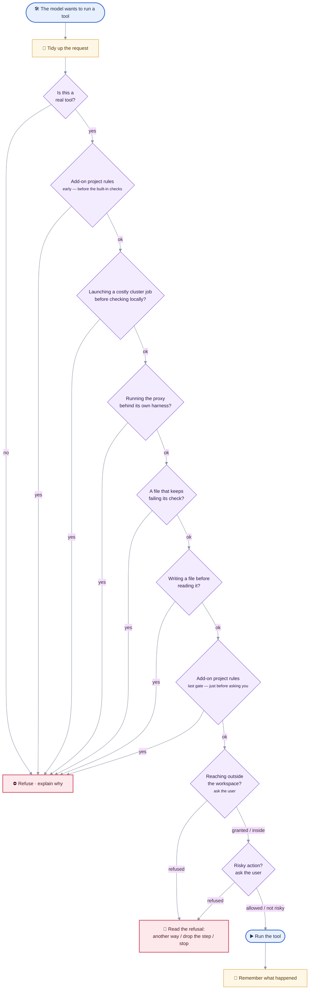
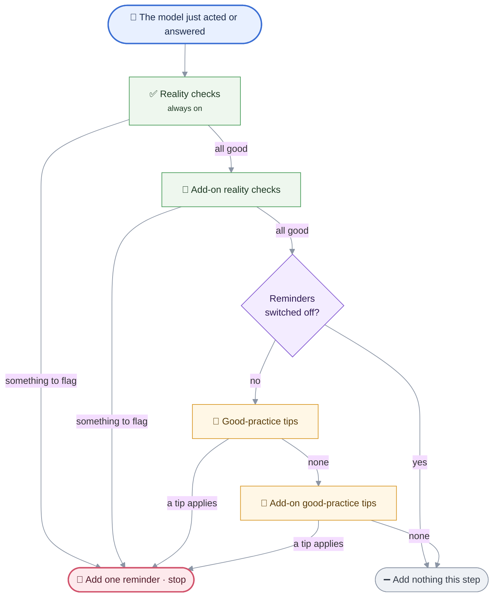

# MIMIR Policy Reference

> **MIMIR docs** — [Overview](README.md) · [Architecture](ARCHITECTURE.md) · [Setup](SETUP.md) · [Policy](POLICY.md) · [Client internals](CLIENT_DETAILED.md) · [Servers](SERVERS_DETAILED.md) · [Extension](EXTENSION_DETAILED.md) · [Plugins](PLUGINS_DETAILED.md)

What the client's policy layer does, why, and where it is enforced. Update this file
when policy behaviour changes.

Two mechanisms, at two different moments:

- **Policy gates** run *before* a tool call. They can block it.
- **Nudges** add *at most one* reminder after a model step. They only advise.

Both read the same `ExecutionContext`, and both accept extra rules from application
packs without touching core code.

---

## Quick reference

Three dials control what the agent is allowed to do and how much it is reminded.
They are independent of each other.

| Dial | Values | Set by | Governs |
|---|---|---|---|
| **Enforcement** | `strict` · `light` *(default)* · `off` | model profile, `/enforcement` | which guidance nudges fire |
| **Approval mode** | `manual` *(default)* · `auto` · `auto_all` | `/approvals manual\|auto\|all`, webview button | which prompts the user still answers |
| **Session mode** | `agent` · `plan` · `ask` | `/mode` | which tools exist, and which nudges apply |

### Nudges by enforcement level

Two layers. **Verification** rows check a fact and always run. **Guidance** rows
babysit reasoning and are tuned by the dial.

| Nudge | Layer | Fires on | `strict` | `light` | `off` |
|---|---|---|:--:|:--:|:--:|
| `denial` | verification | a refused action still blocks completion | ✅ | ✅ | ✅ |
| `error_recovery` | verification | repeated failed edits on one file | ✅ | ✅ | ✅ |
| `stuck_repair` | verification | one command keeps failing (2 then 4 times) | ✅ | ✅ | ✅ |
| `validation` | verification | the built-in check rejected a file | ✅ | ✅ | ✅ |
| `regression` | verification | an edited source has a test on disk, never run | ✅ | ✅ | ✅ |
| `unexercised` | verification | everything checked, nothing ever run | ✅ | ✅ | ✅ |
| `unfinished_plan` | verification | the checklist still has open steps | ✅ | ✅ | ✅ |
| `blast_radius` | guidance | about to change an **existing** target, callers never searched | ✅ | ✅ | ❌ |
| `env_cleanup` | guidance | the environment was mutated, the run is concluding | ✅ | ✅ | ❌ |
| `env_resolution` | guidance | a run failed on a missing module, envs never listed | ✅ | ❌ | ❌ |
| `doc` | guidance | code changed, nothing pending, no docs touched | ✅ | ❌ | ❌ |
| `state` | guidance | editing paused after validation, not concluded | ✅ | ❌ | ❌ |
| `creation` | guidance | a target declared that does **not** exist yet, nothing written | ✅ | ❌ | ❌ |
| `todo` | guidance | multi-step work underway, no checklist written | ✅ | ❌ | ❌ |

`light` is the default. It keeps only the two nudges guarding a mistake that is
**costly, hard to notice, and does not self-correct**: breaking callers, and leaving a
package install behind. Everything it drops is procedural hand-holding a capable model
does unprompted, and every nudge costs tokens and interrupts the model's own plan.
`strict` is opted into per model with `"enforcement": "strict"` in
`vllm_model_profiles.json`, and is marked from observation — a profile that already
carries a recorded workaround is a model seen struggling.

The authority is `_GUIDANCE_BY_LEVEL_MODE` in `guardrails/nudges/engine.py`. Each row
then applies its own mode condition on top:

| | `agent` | `plan` | `ask` |
|---|---|---|---|
| `strict` | every guidance row | `env_resolution`, `env_cleanup`, `state` | none |
| `light` | `blast_radius`, `env_cleanup` | none | none |
| `off` | none | none | none |

`doc`, `blast_radius`, `creation` and `todo` are agent-only by their own predicate, which
is why `strict` + `plan` is a shorter list than "everything". Ask mode neither plans nor
edits, so no guidance row has anything to guard.

Every nudge has a per-query cap (`NUDGE_MAX_*` in `config/constants.py`), mostly 1 or 2.
`regression` and `unexercised` share one budget: they are two phrasings of "does anything
show this works?", and separate budgets turned one conclusion into several re-prompts.

Two reminders are delivered **mid-loop** rather than at the end of a step, because their
subject is recovery rather than completion: `env_resolution` (fired right after the call
that failed, where the steps it saves are still ahead) and `todo_tick` (after a
successful write, offering to tick the step off). Both honour the same caps and the same
enforcement gate as the table rows.

### Policy gates by approval mode

Gates run in this fixed order. The first one that objects stops the call.

| # | Gate | What it does | `manual` | `auto` | `auto_all` |
|---|---|---|:--:|:--:|:--:|
| 1 | registry | unknown tool name | blocks | blocks | blocks |
| 2 | pack `pre_mutation` | application rules, before the built-ins | blocks | blocks | blocks |
| 3 | cluster-submit | holds a cluster job until something was checked locally | blocks | blocks | blocks |
| 4 | proxy-exec | forbids running an optimised proxy outside `proxy_eval` | blocks | blocks | blocks |
| 5 | state guard | refuses edits to a file that exhausted its retry budget | blocks | blocks | blocks |
| 6 | write policy | read-before-overwrite, delete evidence, anti-thrashing | blocks | blocks | blocks |
| 7 | pack `pre_approval` | application rules, just before the prompt | blocks | blocks | blocks |
| 8 | out-of-workspace | any path outside the workspace root | **asks** | **asks** | granted |
| 9 | sensitive approval | anything not `reversible` | **asks** | granted | granted |

The command spells the last mode `all` (`/approvals manual|auto|all`); the stored value is
`auto_all`.

An auto mode removes the **question**, never the policy. Gates 1–7 are unaffected, and so
are the bash denylist and the servers' own path and redirection validation. A card that is
already on screen when the user switches mode is still answered by the user: "auto" does
not mean "auto, starting after you clear this one". A refusal the denial ladder has
already settled stays refused in every mode — auto decides what is *asked*, not what was
already answered.

Approval mode is **session state and never persisted**. A mode that answers for the user
has to be chosen for the session it applies to.

### What each session mode changes

| | `agent` | `plan` | `ask` |
|---|---|---|---|
| Tools offered | all | read-only (`PLAN_BLOCKED` hidden) | read-only |
| Dual-use shell | full | read-only commands only | read-only commands only |
| Can edit files | yes | no | no |
| Guidance nudges | per the table above | `strict` only | none |
| Explore phase | — | plan tool withheld until code is read | — |

Plan and ask are the `READONLY_MODES`. Gating is by capability, never by tool name, so a
new server is covered without a client edit.

---

## Goals

The policy layer keeps the agent useful without letting it act blind. It aims to:

1. require repository evidence before code changes;
2. prevent destructive or low-context edits, without becoming rigid;
3. require a check before success is claimed;
4. report a denied action as incompleteness, never as silent success;
5. keep tool behaviour predictable across runs;
6. leave the model free during a legitimate multi-file refactor or repair loop.

It is a guardrail, not a cage. It should block a blind or unsafe action, and still let
the model finish a reasonable refactor, repair a failing file, and keep working when it
already has the context it needs.

---

## The two flows

Both diagrams below zoom in on the work loop in `README.md` (*Architecture → Agentic
loop*): the first expands "🛠️ Run the requested tools", the second expands "Needs a
nudge to finish properly?".

### Policy gates — per tool call

The first check that objects stops the call and hands the model an explanation. A refused
action is then read against the three meanings of a refusal — see
[If approval is refused](#if-approval-is-refused). Packs can add rules but never remove
one.



**The two "add-on project rules" boxes are one mechanism at two moments**, not one rule
checked twice. What differs is what has already been checked:

- **Early slot** (`pre_mutation`) — right after "is this a real tool?", before any
  built-in guard. Use it to reject an action on the request alone: a domain rule that
  forbids a tool outright, or a guard for a non-writing tool the write rule never sees.
- **Late slot** (`pre_approval`) — after every built-in guard has passed, just before the
  prompt. The action is known to be otherwise allowed, so the rule is a final veto at the
  "about to run" boundary.

A pack rule can only **block**. It can never wave through what a built-in guard rejected.
A rule that raises is treated as "no opinion", so a bad pack cannot break the pipeline.

### Nudge cascade — per agent step

At most one reminder per step. Verification rows run first and always. Guidance rows run
after, unless enforcement is `off`. The first row that applies wins.



Each row is `(name, layer, should_fire, render)`. Its predicate carries its own per-query
cap and, for guidance, the enforcement gate — so the runner just walks the table.

**Every predicate reads recorded state, never the wording of the request.** A nudge
interrupts the model's reasoning, so what triggers it must be checkable: a file on disk,
an exit status, a counter. Four guidance rows used to open on a keyword match over the
user's query. That is a guess about intent dressed as a test, and in a French session it
mostly guessed wrong. The remaining conditions were already doing the work.

The keyword did earn one thing, and it was replaced rather than dropped: it told
`blast_radius` from `creation`. Both fire on "a target declared, files read, nothing
written yet", and they give opposite advice. What separates them is whether the declared
target **already exists** — a file that does not exist yet has no callers to break.
`_declared_targets_already_existing` reads that from the workspace.

---

## Where the code lives

| Module | Holds |
|---|---|
| `guardrails/policy/engine.py` | `evaluate_tool_preconditions` — the gate order, pack slots, violation enrichment |
| `guardrails/policy/gates.py` | the individual gates: cluster-submit, proxy-exec, out-of-workspace |
| `guardrails/policy/write.py` | read-before-overwrite, delete evidence, anti-thrashing |
| `guardrails/policy/state_machine.py` | the workflow-state guard and the retry budget |
| `guardrails/policy/approval.py` | `ApprovalManager`: prompts, `always` grants, batch mode, snapshots, revert |
| `guardrails/policy/bash_classify.py` | classifies a shell command into kinds (read/search/inspect/write/exec/env) |
| `guardrails/policy/readonly_exempt.py` | waives the prompt for a read-only dual-use shell command, in any mode |
| `guardrails/observations.py` | the blackboard writer: `record_tool_observation` and the `_observe_*` handlers |
| `guardrails/workflow.py` | the state model, the denial ladder, the completion report |
| `guardrails/nudges/engine.py` | `maybe_append_nudge`, the `_CORE_NUDGES` table, the pack registry |
| `guardrails/nudges/messages.py` | every nudge's message text |
| `guardrails/builtin_check.py` | the in-process check that every modified file owes |

A few notes worth keeping:

- **`write.py` guards a loss, never a working order.** A rule that only enforces a
  preferred order does not belong there: it blocks reversible work, and as a hard guard it
  sits outside the enforcement dial that exists to tune exactly that. The pre-edit
  planning gate was removed on that ground. The risk it gestured at — concluding with
  open steps — is covered by the `unfinished_plan` nudge, from disk state.
- **`observations.py` credits shell commands like dedicated tools.** `bash_classify`
  reads the command, so a `cat`/`grep`/`sed -i` feeds `read_files`, `searched`,
  `inspected_dirs`, `dirty_written_files` and `action_op_count` the same way the file and
  search tools do. It is not a security boundary: the bash server validates every call
  independently.
- **No hardcoded tool names anywhere.** Each server declares its tools' capabilities via
  `@mcp.tool(**tool_caps(...))`; `infer_tool_caps` resolves them at connect into a
  per-agent registry (`agent.tool_caps`), and the policy, approval and execution layers
  query that. A new MCP server is classified with zero client edits. The registry is
  per-agent because `spawn_agent` runs sub-agents with a subset of servers.

### One injection path

Every machine-generated message placed in the user's turn slot goes through
`nudges.inject_reminder(...)`: the nudge table, the step-limit reminder, the mid-loop
correctives, the plan-mode control flow. The `nudge_injected` event it emits is not
decoration. The webview holds the turn in flight *outside* the transcript and commits it
only once the loop accepts it, so a reminder appended directly leaves rejected prose on
screen looking like the answer, to be swapped later for the real one.

`tagged=False` is for reminders that are protocol rather than advice (plan-mode delivery,
the step limit). The `_NUDGE_TAG` banner says "advisory, apply judgment", which would
invite the model to skip a step the loop actually requires.

**A refused turn is never streamed.** Before the model call, `nudges.nudge_pending()`
walks the same table and registry, evaluating predicates only — nothing rendered,
injected or counted. When something is pending, the step's token callback is swapped for
a `_DraftHold` that buffers the prose: released verbatim once the turn calls a tool
(narration belongs above its cards), dropped silently if the guardrail does refuse the
turn, and left unflushed on the accepted path. Nothing that reaches the screen can be
taken back. The cost is that an at-risk turn lands at once rather than token by token.

### Loop-control correctives

Separate from the nudge layers, the agent loop fires correctives mid-tool-loop when a
call repeats:

- **failing call** — an identical *failed* non-write call is corrected, then hard-blocked.
- **hand-back stop** — once refusals reach the end of the denial ladder, fired once,
  mid-loop, because a model told to hand back and still calling tools is out of reach of
  any end-of-step nudge.
- **repeated success** — annotated, never guarded. `IDENTICAL_REPEAT` is appended once a
  call returns the same digest `IDENTICAL_REPEAT_THRESHOLD` times. Two guards for this
  were built and both removed: a line-coverage ledger and a result-hashing blocker. Each
  cost more than the repetition it caught, and withholding content just sent the model to
  `bash` to read the same file another way.

The firing decision lives in the loop; the message text lives with the other copy in
`guardrails/workflow.py`, so wording stays consistent.

---

## Enforcement levels in detail

`config.models.enforcement_level(model)` reads the level from the model's vLLM profile.
See [the table above](#nudges-by-enforcement-level) for what each level keeps.

The level is resolved **once**, at agent construction: the model cannot change during an
agent's life, so there is nothing to re-resolve per turn. Consumers read it through
`resolve_enforcement(agent)`. `/enforcement strict|light|off` changes it at runtime, in
both the CLI and the WebSocket server, and `/status` shows it.

**Nothing about safety or correctness is tiered.** Verification nudges, write policy,
approval, the state guard and plan-blocked tool hiding all run at every level.

The **plan-mode explore phase** is the one non-nudge thing the dial touches. It withholds
the plan-document tool until the model has actually read code (`plan_evidence_ready`), so
a plan written over nothing is unreachable rather than flagged afterwards. `off` disables
the phase and offers the tool from turn 1. It never leaves a run without a plan: its
trigger is a deliberately broad filter that fires for greenfield work too, where no
exploration could satisfy it, so `PLAN_EXPLORE_MAX_TURNS` unlocks the tool anyway and the
plan states its own gaps.

---

## Execution context

Every run builds a validated context (`build_execution_context()` /
`validate_execution_context()`). It tracks:

- discovery evidence: what was searched, inspected, read, checked;
- known existing files, and files read explicitly;
- written files, validated files, and `validation_tier_by_file` (which kind of check each
  one passed);
- `runs`: every execution, whether it completed, and the model's verdict on what it
  printed;
- denied sensitive actions, and the denial history the ladder counts;
- workflow progress and `steps_since_last_edit`;
- `edit_loop_state`: per-file signature and count of repeated identical **failed** edits;
- `declared_edit_set`: the files the model committed to editing via the checklist tool;
- `similar_candidates_by_dir`: nearby peer files, for placement and duplication.

### Field traits

Per-field questions — is it carried across queries? purged when a file is deleted? does it
count as discovery? — are answered once, as a `traits` frozenset on the field's row in
`_FIELD_SPECS`. Every list that answers one of them is derived with `fields_with(...)`.

| Trait | Meaning | Derived list |
|---|---|---|
| `CARRY` | merged into the next query's context | the carry merge and session (de)serialisation |
| `FILE_PATH` | holds workspace **file** paths | the delete purge |
| `KNOWN_FILE` | holds a path the model has encountered | `known_existing_files()` |
| `DISCOVERY` | counts as the model's own exploration | `DISCOVERY_EVIDENCE_SIGNALS` |

These answers used to live in eight hand-maintained name lists across four modules, and
they had already drifted: two computed the same four-field set twice, two named
`dirty_written_files` as carried when it never was, and two constants shared a name with
different membership. `test_client_helpers` now fails if a `*_files` / `*_paths` /
`*_dirs` field is added without answering the question.

`inspected_dirs` is `CARRY + DISCOVERY` but not `FILE_PATH`: it holds directories, and
deleting a file does not un-inspect the directory that held it.

**One seeder.** `backfill_execution_context()` gives a context every declared field from
that same table. It replaced four `bootstrap_*` helpers that each seeded their own
module's subset — one of which defaulted `steps_since_last_edit` to `99` where everything
else used `0`, so an absent field meant "maximally idle" to one reader and "just edited"
to another.

### What each field means

Enforced by named predicates (`was_read()`, `is_known_to_exist()`, `was_checked_for()`),
not by convention: as bare set membership, the right field and the wrong one looked
equally plausible at the call site.

- `read_files` — the file was read through a direct read tool. It says a read happened,
  deliberately not how much came back.
- `checked_paths` — a pre-check was attempted. It does **not** prove existence.
- `existing_paths` — stronger evidence than `checked_paths`.
- `validated_files` — a checker ran and passed: it parses, imports resolve, it lints. It
  does **not** mean the artifact is correct, and nothing on this axis ever will.
- `runs` — the other axis. One entry per execution, with completion, the model's verdict,
  and failure history. A run credits no file; a file's check says nothing about a run.
- scratchpad paths never enter `dirty_written_files`: they are working material, not
  produced work.

Policy changes must preserve this contract or migrate it explicitly.

### Query lifecycle

The context is **query-scoped**. Nothing pre-fills it, so every gate asking "has the model
explored?" measures this query's tool calls and nothing else. The only thing merged in is
the session carry-context, which replays long-lived path knowledge — never the discovery
flags a gate reads.

A structural repo snapshot used to seed `inspected_dirs` here. It was removed with the
snapshot itself, and the reason is worth keeping: it made a discovery field non-empty
before the model had acted. A discount was then written into the shared helper to subtract
it back out, which worked only for consumers that went through the helper. One guard read
the field raw, so on any repo-touching query it was satisfied before the model acted and
never fired — while on a bibliography query, where no snapshot was built, it was the one
thing that did fire. A guard that is a no-op exactly where it should bite. Deleting the
seeding removed the discount and the whole class of bug.

### Discovery evidence

"What counts as the model's own discovery" is defined once, in
`context/execution_context.py`: `DISCOVERY_EVIDENCE_SIGNALS`, derived from the `DISCOVERY`
trait (`searched`, `read_files`, `delegated_read_files`, `checked_paths`,
`inspected_dirs`), plus `has_discovery_evidence(ctx, *, min_distinct)`. Presence is the
whole test.

The plan-mode explore phase and `engine._missing_evidence` both read that one definition,
at the same `DISCOVERY_EVIDENCE_MIN_DISTINCT` bar. They used to disagree — one took the
default of 1 while the other asked 2 — so "one definition" still had two answers.

**Delegated reading counts here, and only here.** `delegated_read_files` holds what a
sub-agent opened and reported back. These gates ask whether the model has *facts about the
code*, and a finding that came back into its conversation is such a fact — so
`plan_evidence_ready` counts it, or plan mode would punish the fan-out its own prompt asks
for. It stays out of `read_files`, which answers a stricter question: does this agent hold
the lines it is about to edit? Only a read of its own settles that. Two questions, two
fields.

---

## Discovery policy

Discovery is expected when the query implies repository work.

- `query_requires_repo_discovery(query)` decides whether the plan-mode explore phase
  applies. It matches edit, create, HPC and repo-oriented terms, but not pure theory or
  bibliography (`derive`, `prove`, `integrate`, `cite`, `theorem`), so a maths or
  literature question is not forced to scan the repository. It is the **last query-keyword
  predicate in the client**, it is read only as a coarse exit filter, and no nudge reads
  it.
- The hard requirement is enforced at write time instead: `check_write_policy` and the
  state guard demand direct target context before a mutation, and existence evidence
  before a delete.
- Nudges stay softer than guards, and local evidence can be search activity, directory
  inspection, an explicit read, or a successful path check.

---

## Read policy

Reading is localized. A read answers "what is at this place in this file", never "what is
in this file". The policy layer matches that rather than policing it.

- `read_file_lines` caps every call whatever range it is given, and says so when the
  window stops short (`truncated`, `total_lines`, `next_start_line`, `line_cap`). The
  client turns that into `MORE_CONTENT`, plus an `OUTLINE` symbol map for code, so the
  next call can be aimed instead of paged.
- Explicit reads are recorded as discovery evidence. **Nothing records how much of the
  file came back**, and no gate asks.
- The one read precondition left is read-before-overwrite. Any extent satisfies it.

A gate on "was it read whole" would reward the exhaustive read the rest of the policy
argues against, and measure nothing else. The line-coverage ledger that used to answer it
cost four context fields, an mtime stamp, a diff re-indexer and a crediting path per tool
— to spare the tokens of a slid window, while duplicating the repeat guard. A repeated
read is a loop-control concern, handled where the other repeats are.

---

## Write policy

Writes are guarded harder than reads, but the policy is built to stay usable during a real
refactor.

1. `write_file` is blocked on a known existing file unless `overwrite=true` is explicit.
2. `write_file` with `overwrite=true` requires the file to have been read first. A read of
   any extent counts — demanding the whole file would ask for the one thing the read
   policy forbids.
3. `delete_file` needs more than a pre-check: explicit existence or read evidence for the
   target, plus parent-directory context.
4. Repeated edits are blocked only after repeated **identical failed** edits on one file.
5. A successful edit resets that file's failure signature.
6. Validation-loop retries may bypass some friction for files already read
   (`replace_in_file`, `replace_lines`).
7. After a successful code edit the workflow enters `validate` only once the declared edit
   set is complete; otherwise it stays in `edit`.

The intent is not pure restriction. Prevent blind overwrite and deletion, block sterile
retries, and still let the model finish a legitimate multi-file change before validation
interrupts it.

---

## Workflow state machine

States: `discover` → `edit` → `validate` → `conclude`. They are **modes the model moves
between, not a pipeline traversed once** — going back to discovery mid-edit, editing again
after a check, or holding several files at different stages is the normal shape of the
work. The system prompt says so in those words. The arrow-shaped wording it replaced
described a machine that never existed (every transition already runs both ways), and a
model reading the loop as one-way spends turns apologising for re-entering a state.

The guard does exactly one thing: **in `edit`, it refuses a source edit to a file that has
exhausted its validation retry budget.** The `validate` state blocks nothing — steering
the model back to a pending check is the validation nudge's job, advisory and
dial-tunable.

The guard used to police `validate` too, refusing edits to files unrelated to the pending
set. That branch accumulated three carve-outs, and the last one (target already read this
session) made it nearly unreachable: a model that reads before it edits never triggered
it. What stayed reachable — editing a file never read — is already covered by
`check_write_policy`, which guards a real loss rather than a working order. It was removed
rather than kept as near-dead code on the hot path of every write.

The states still drive the nudges, the conclude gate and the finalization buckets. What
they no longer do is gate edits on anything but a file that has demonstrably stopped
converging. Editing is reversible, a wrong edit costs a diff, and the approval layer
snapshots it.

---

## Validation policy

After a source edit, success cannot be claimed until every modified file has been
**checked** — or the answer says the task is incomplete. Building it and running it are
recommended, never required.

### Three axes, one requirement

| Axis | What it is | Standing |
|---|---|---|
| **check** | does it parse, is it whole. No artifact, nothing executed, no binary. Performed in-process by `guardrails/builtin_check.py` | **required** for every modified file, at every level — and always possible, so never waived |
| **build** | a compile that emits an object or binary: `gcc -c`, `nvcc`, `javac`, `make`, `cmake`, the TeX chain | recommended where one direct command reaches it. Owes **no** verdict: its exit code is the finding |
| **run** | `pytest`, `python solver.py`, `./solver`, `python -c …`, `ctest` | recommended where one direct command reaches it, expected when tests already cover the change. A verdict on its output is recommended, never charged |

**Only the check axis blocks.** `needs_incomplete_finalization` refuses to conclude over a
file that was modified and never checked, and reads nothing else — not `workflow_state`,
not the run ledger. `workflow_state` used to be a third condition, and it silently
promoted the recommendations to requirements: a failed run sends the state machine back to
`edit`, so every answer came back `Task is incomplete.` until the run had failed its whole
budget. The state machine is *steering*, not evidence.

Nothing blocks on a build or a run. A toolchain, a queue, a dataset or a GPU may simply
not be there, and a gate that cannot be satisfied is a dead end, not a guarantee. What an
unbuilt or unrun change owes instead is a **statement**: the ledger says it was checked and
not run, the completion report names every run left failing, unjudged runs are named
without being charged, and the answer says why.

### What counts as feasible

The criterion is what the step costs, not what the machine happens to carry: **one direct
command, against the project as it stands**. Anything needing a step of its own first —
configuring a build, installing a package, creating an environment, fetching data, getting
an allocation, repairing an already-red build — is out of proportion. That list is the
whole test.

"Impossible" and "disproportionate" are reported identically: named, explained, and handed
back as the exact command that would run it once what is missing is in place, so the user
can close the gap. Neither is ever a completion issue.

The state layer carries this on both sides of an attempt:

- **Before.** `_exercise_route` returns the one direct command it can find, in descending
  order of what it proves: a test that already covers the edit; a file this box starts
  directly; a suite already registered (`CTestTestfile.cmake` present, `ctest` on PATH); a
  build already configured (`Makefile`/`CMakeCache.txt` seen this session, driver on
  PATH). `CMakeLists.txt` alone is not a route, because configuring is a step of its own —
  and neither is a compiled test *source*, because reaching it means building first. No
  route, no recommendation, and `exercise_blocked_reason` records why. The recommendation
  names the command it found, so it is proportionate by construction.
- **After.** A red exit says *that* a run failed, never *whose fault* it was.
  `report_verdict("blocked", …)` re-imputes it to the environment: no repair budget, no
  steer back to `edit`, reported as a limitation instead of an issue — so attempting a
  recommended step can no longer turn a finished task into `Task is incomplete.` It never
  makes the run green, and it must be claimed: an unclaimed red exit drives the repair
  ladder exactly as before. The question is put in-band by an `IMPUTATION_DUE` annotation
  on the failing result.

The only wall the machine names by itself is a command that is not installed. Everything
else — a build to configure, a dataset, an allocation — needs the model to say so, because
deciding it means reading output, which MIMIR never does.

Two things are deliberately **not** pre-flighted: a dataset or a GPU, which no cheap probe
settles, and a Python import, where the failure is cheap and more informative than a
guess. Both keep the try-then-resolve path.

### The built-in check

The mandatory axis is performed **here, not on the machine**. It used to be an external
binary named in the prompt, which made the one blocking axis depend on what happened to be
installed (a `.cu` with no `nvcc` became unverifiable) and on the few languages those
binaries covered (`.rs`, `.go`, `.js` were never checked at all).

`guardrails/builtin_check.py` replaces that with two tiers:

- a **stdlib parser** where one exists — Python, JSON, TOML, XML and its dialects, INI →
  tier `syntax`. MIMIR *is* a Python process, so the standard library is there by
  construction: no PATH lookup, no subprocess.
- a **structural scan** for every other text file — unbalanced delimiters, an unterminated
  block comment, a leftover conflict marker → tier `structural`. A per-extension table
  drives it, so adding a language is adding a line.

Two parsers decline rather than answer, and fall through to the structural scan: XML that
declares entities (the stdlib parser expands internal ones, so checking a billion-laughs
file would be a denial of service performed by the checker), and a `.cfg` with no section
header (it is not INI, and configparser's first complaint would be about the wrong
grammar). YAML is deliberately absent — no stdlib parser.

Its doctrine is that **ambiguity passes**. A false positive charges a repair budget
against correct code; a false negative only leaves us where we already were.
`test_builtin_check.py` runs it over every file this repository tracks to hold that line.

It runs as **one sweep** (`sweep_builtin_checks`) at the point where the loop asks whether it may conclude, never
after each write: a file edited ten times is read once, on the revision it will ship at,
and an `(mtime, size)` stamp keeps several gate sites to a single pass. A pass credits the
file at its tier. A failure records the diagnostic, charges the file's retry budget and
returns the workflow to `edit`; the validation nudge then reports the file and the line
instead of asking for a command.

**The retry budget bounds the whole thing.** `VALIDATION_RETRY_BUDGET`
(`config/constants.py`, currently 5) caps how many times one file may fail its check
before the workflow auto-escapes to `conclude`. The same exhausted count arms the state
guard's anti-thrashing stop and drives the finalize buckets. After an auto-escape, the
residual risk must be stated clearly, and further validation and state nudges are
suppressed so the report describes the dead end instead of nagging about it.

**A replace edit is checked for completeness.** After one, a grep looks for leftover
occurrences of the replaced text; if any remain, a `COMPLETENESS_WARNING` is appended
telling the model to finish the replacement. Short generic tokens are exempt, or the check
would fire on everything.

**External checkers did not go away — they stopped being required.** A `ruff check` or a
`gcc -fsyntax-only` the model runs still credits the file and *raises* its tier, because
`raise_validation_tier` is monotone. They are a bonus on a machine that has them, and
nothing in the prompts or nudges names one. What is left in `unverifiable_files` is only a
file the floor cannot read as text at all — a binary, or bytes that are not UTF-8.

### Checks and runs are two axes

`observations._observe_bash_validation` drives both from one command, status-agnostically.
Neither is the mandatory axis; everything here describes what a command the model *chose*
to run adds on top.

- A **checker** validates the files it *names*. `py_compile` → `syntax`;
  `ruff`/`mypy`/`pyflakes`/`black` → `static`; `gcc`/`g++`/`gfortran`/`nvcc`/`javac` →
  `compiled`, demoted to `syntax` with `-fsyntax-only`. Its output is a list of problems
  and an empty one is the finding, so exit 0 settles it and nobody has to read anything. A
  non-zero exit charges that file's retry budget and returns the workflow to `edit`.
- A green run of a project checker naming no file (`ruff check .`, `mypy src/`) covers
  every pending file at once.
- **Reformatting is not checking.** `ruff format` and a bare `black` rewrite the file and
  exit 0 whether or not the code is correct, so they credit nothing. The tier used to be
  read from the command head alone, which made `ruff format .` a whole-project pass
  awarded for moving whitespace. `--check`/`--diff` report instead of writing, and stay
  checks.
- An **execution** validates **no file at all**. It is recorded in `runs`. So is a
  **build**, recorded already settled — its exit code is its verdict — so it can never
  surface as unjudged.
- A leading `cd` rebases relative operands so the resolved path matches the dirty path.

**Why the split.** "It compiles" and "it is right" are different claims, and one word for
both is what let a green `pytest` be reported as a verified solver. A checker's answer is
falsifiable from outside the process; a run's is not, which is exactly why the run's
answer has to come from the model and be labelled as a claim. Merging them also forced an
attribution nobody could compute: `python main.py` exercises `mesh.py` without naming it,
and every rule for guessing which file a run credited was a guess. With the axes apart the
question disappears — the run is the subject.

**Which axis a command is on is declared, never inferred.** `shell_paths` splits the exec
taxonomy into `VALIDATOR_COMMANDS` / `BUILD_COMMANDS` / `RUN_COMMANDS` /
`ENV_SETUP_COMMANDS`, and `EXEC_EFFECTS` maps each head to its effect. It used to be
derived by elimination — a head the validator table did not know had, by that fact alone,
run the project's code — so `source set_env.sh` was recorded as a run owing a verdict, and
every `make` came back as "ran but never judged". Environment setup proves nothing and is
recorded as nothing. A run in the same chain outranks the build before it (`make &&
./solver` produced output somebody must read). A green build credits **no file**: which
sources it compiled is recorded nowhere, and the check axis has to stay honest.

### Verdicts

**Exit 0 is not a result.** It says a program ended, never that its answer is right, and
nothing downstream can read what it printed — no parser generalises across fields,
convergence tables, plots, logs and units. So MIMIR never reads a program's output for a
pass or fail. It records the model's own statement about it.

That statement arrives as a **tool call** — the tool declaring the `judge` capability,
whose `verdict` / `verdict_reason` / `verdict_scope` arg-roles are read before being handed
to `apply_verdict`. A structured channel rather than prose, for two reasons: bookkeeping
has no business in what the user reads, and there is no grammar left to get wrong. The
model learns *when* one is due without any tool name in the prompt — from the tool's own
docstring and from a `VERDICT_DUE` line appended to the run's result.

There are **five** verdicts. Which set a verdict addresses, and how widely, is the whole
design:

| Verdict | Means | Addresses | Reach | Charges the repair budget |
|---|---|---|---|---|
| `pass` | the output shows it worked | outstanding runs | **narrow** | no |
| `rejected` | it measured cleanly and lost | outstanding runs | **narrow** | no |
| `fail` | the run is broken | outstanding runs | **wide** | yes |
| `unknown` | the output settles nothing | outstanding runs | **wide** | no |
| `blocked` | it failed on a wall outside the change | **failed** runs | **wide** | returns it |

*Outstanding* (`unsettled_runs`) means a run that **completed** and carries no verdict, or
carries `unknown`. *Failed* (`failed_runs`) means a run that did not complete, or that the
model judged `fail`, and is not already blocked. The two sets are **disjoint**, which is
why `blocked` cannot collide with the other four.

**Narrow versus wide is the safety asymmetry.** Withholding credit from a run the
statement did not mean costs a re-judgement at worst, so `fail` and `unknown` address
everything outstanding at once. Granting it is the unsafe direction, so `pass` and
`rejected` settle only what they actually address. **A model may lower its own credit,
never raise it.**

`rejected` exists so that `fail` is not borrowed for a losing candidate. An optimisation
loop rejects most of what it tries; that is the search working, not a defect. Spending
`fail` on it would both charge a repair budget and withhold credit from every other run
awaiting one.

`unknown` addresses a run without closing it: `unsettled_runs` keeps a run carrying
`unknown`, so it can be re-judged later, and it is reported unresolved at the end. It is a
complete answer that counts against nothing.

`blocked` does not argue with a red exit, it **re-imputes** it. The run keeps
`completed=False`, so nothing is raised past what the machine saw; what changes is who is
charged. Its failure count is reset to zero and it leaves `failed_runs`, so the repair
ladder stops treating it as a defect to fix. It must be claimed — an unclaimed red exit
drives the ladder exactly as before.

Both `unknown` and `blocked` close the build-it/run-it recommendation for the query
(`exercise_advice_closed`): one says the output cannot be read, the other that the
environment will not produce one. Asking again after either is asking for a different
answer to a question already answered.

#### How a scope is matched

`verdict_scope` names the run being judged, as its command or a recognisable fragment.
Matching is a case-insensitive substring, tried **both ways round**, against the ledger key
**and** the command as typed:

1. the scope inside the key or command — the ordinary case;
2. the key or command inside the scope — because the ledger key drops flags and pipelines,
   so it is usually *shorter* than anything the model would write.

The second direction was added after a session in which every scope matched nothing: told
`run="proxy_eval"`, the model wrote the more informative `proxy_eval(op='run') OMP=64`, so
the key sat inside the scope rather than the other way round. **The more exactly the model
named its run, the wider the damage** — thirteen runs were wrongly failed.

**An unmatched scope is read as no scope at all, never discarded.** Dropping it silently
was the worse failure: nothing recorded, nothing emitted, and a reminder asking for the
statement the model had just made — which a model answers by making it again, unchanged.
The asymmetry survives the fallback, because the direction is what matters:

- `fail` / `unknown` fall back to **every** outstanding run — and for `fail`, a status line
  says the scope matched nothing and lists what it could have named, so the model can learn
  the difference;
- `pass` / `rejected` fall back to **exactly one**, the most recent outstanding run — which
  is what a model stating a verdict right after reading an output is speaking about.

A scoped `pass` that *does* match settles **every run it matched**, which may be more than
one.

Other rules on this axis:

- **A verdict is recommended for every execution**, whether or not it names an edited file,
  whether or not anything was written. An analysis-only session — "does the suite pass?",
  "why does this blow up?" — is precisely the one whose whole answer rests on a run's
  output. Nothing blocks on it and nothing is charged for its absence. A check, a lint or a
  type run needs none: an exit code is the whole finding there.
- **A run that did not complete owes nothing.** Its non-zero exit is the finding, in the
  one direction an exit code is trustworthy. It goes straight onto the repair ladder.
  Asking the model to judge output that never came would be asking for a guess.
- **`fail` routes through the same ladder a non-zero exit drives** —
  `_register_run_failure`: the run's failure count, its attempt log, and a return to
  `edit`. There is no second mechanism. The return to `edit` happens only if code was
  actually mutated this query, so a discovery-only session is not pushed into an edit
  state. Once every failed run has spent `VALIDATION_RETRY_BUDGET` attempts and nothing
  else owes a check, the workflow is released to `conclude` rather than wedged: the run is
  reported unresolved with what was tried, and the answer carries the residual risk.
- **A declared verdict outranks the exit code, one way only.** A check that evaluates its
  own criteria, prints that they were not met, and returns 0 anyway is a green exit over a
  red result — observed: a boundary test reported "significant reflection may be present",
  exited 0, and was recorded as validated. A `check=fail` line in stdout (strict whole-line
  `key=value` grammar) demotes the run. A `check=pass` line never rescues a red one.
- **A server that runs code itself declares what it saw.** A tool declares a `run_outcome`
  spec naming the payload field that identifies the run, plus the conditions under which
  the server saw it crash or fail. **One way only** — there is no `passed_when` form,
  because no server may grant itself a passing verdict on its own output. The one positive
  form, `measured_when`, credits the check axis and never the run's verdict. The floor
  withholds credit only for what the server actually saw go wrong — a crash, or measured
  metrics that miss the session's stated requirements. A candidate that measured cleanly
  and merely failed to beat the incumbent is **not** charged: that is the ordinary outcome
  of an experiment, and it is what the model's own `rejected` verdict is for.
- **A run is keyed by the run, not the tool.** Twenty optimisation iterations are twenty
  entries, and the tool that *launches* a run and the tool that later *reports* it settle
  the same entry. Keying by tool name gave them separate rows, leaving the machine outcome
  beside a launch row that stayed green and settleable.
- A re-run of the same command replaces its record but **carries the failure history
  over**: the budget counts attempts at that command. Re-editing a file retracts that
  file's check (evidence is about one revision) but never a run — a run is a past event.
- Unparseable commands still count. `classify_bash_command` is all-or-nothing, and a
  single pair of parentheses makes `python -c "print(f(x))"` opaque, while the prompt asks
  for one-off checks to go inline. So `opaque_command_executes` reads command-position
  heads against the same vocabulary: an unparseable `python -c`, heredoc or
  `./solver $(cat args)` is still a run worth judging; an unparseable `cat` is not.

**No nudge asks for a verdict.** One existed and was withdrawn — see
[the removed output-verdict nudge](#the-removed-output-verdict-nudge).

### Check tiers

`validated_files` answers "was it checked?". `validation_tier_by_file` answers "with
what?", on the ladder `structural` < `syntax` < `static` < `compiled` < `measured`. The
tier is raised monotonically and retracted whenever `validated_files` is, since evidence is
about one revision.

`measured` has a single route: a server that ran the file itself and *records* which file
it ran. Attribution is what normally keeps a run off the check axis, and a proxy
optimisation session is the one place where it is not a guess, because the session config
names a single source. It is demanded nowhere, and it still says nothing about the
*result* — only that the file was exercised and measured.

The tier is **report-only**: it gates nothing, blocks nothing, fires no nudge. Every tier
counts as validated for the conclude gate, so the ladder is purely additive. The
completion ledger reads it so the answer can state what was actually established. A wrong
"your evidence is weak" verdict would loop the model; a pessimistic ledger line costs
nothing.

Three routes to a higher tier were designed and dropped, recorded so they are not
rediscovered:

- **A printed invariant earns nothing.** A green run whose stdout carried an `l2_rel=…`
  line used to be promoted. It rewarded a *string*: the value was never interpreted — it
  could not be, a forged number is unfalsifiable from out here — so the signal amounted to
  "the run printed something in the right shape".
- **Red→green was dropped with it.** A check seen failing then passing has discriminated,
  which was the domain-agnostic route to that tier. It was a property of a *run* all along,
  expressed as a per-file tier. With correctness on the run axis the ledger says it more
  directly: the run failed, then the run passed, both rows visible.
- **A pre-existing verifier cannot fire.** Treating a verifier file that is tracked by git
  and clean vs `HEAD` as independently authored does not work in the current credit model:
  credit only goes to a file already in `dirty_written_files`, and the file the command
  names is the file credited — so the verifier and the target are the same file, dirty by
  construction and never clean vs `HEAD`. Making it fire would mean crediting pending files
  from a run that does not name them, which loosens the conclude gate and is a separate
  decision.

---

## What a shell command changed

An edit through the file tools returns a diff, and the prompt tells the model to check it.
A write through the shell returns nothing — `sed -i` prints an empty line and exits 0 — so
the one actor that could catch a bad edit has nothing to look at. Observed: a `sed -i`
whose address matched every closing brace inserted its block **eight times** into a C++
header; the model saw `(no output)` and the corruption survived the run.

`tool_execution/bash_effect.py` closes that with the `BASH_EFFECT` annotation.

- **The trigger is `bash_command_is_readonly` being false, not the classified kind.**
  Classifying by kind misses exactly the surprising cases: `git checkout -- f.py` and
  `patch -p1` come back `unknown` with no operands, and `python fix.py` comes back `exec`
  crediting the script rather than the twelve files it rewrites. The read-only predicate
  already draws the line the other way round and already backs the approval exemption, so
  it is reused. A `grep` that prints nothing stays silent: its silence *is* the finding.
- **Detection is observation, never parsing.** In a repo it is the delta of
  `git status --porcelain` plus `git diff --numstat` across the call — pre-existing edits
  cancel out, `.gitignore` removes build trees, nothing is snapshotted. Outside one it is a
  bounded, non-recursive `os.scandir` over the workspace root, the directories already
  written to, and any the command names. The candidate set cannot be derived from the
  command alone, and no version of it should be: `printf … >> hdr.h` yields its format
  string rather than the redirect target.
- **`DUPLICATION_SUSPECTED` tests for a period, not a repeated window.** A window scan
  fires on ordinary code — three closing braces recur in every C++ file — and once a block
  genuinely repeats, every longer window repeats too, so the largest match says nothing. A
  period says the whole inserted region is one block over and over, which is the signature
  of an unanchored address. The shortest period is reported, so the block named is the unit
  actually written.
- Added lines are claimed for the command only when the file was **clean** before it.
  Blaming this call for a block somebody else added is worse than saying nothing.
- It is an annotation, never a refusal: nothing is lost by the write, and `write.py` blocks
  only losses. The same probe supplies the created paths that feed `FORK_SUSPECTED` and
  `PROBE_PLACEMENT`. It fails open throughout — a git error, an oversized delta or a binary
  file costs the annotation, never the call.

---

## Cluster-submission guard

A cluster launch spends real allocation hours, so a trivial unvalidated error is
expensive. Tools that submit or launch declare `CLUSTER_SUBMIT`; `gates._check_cluster_submit`
runs before approval. Pinned by `test_cluster_submit_stays_held_until_something_is_validated`
and `test_cluster_submit_not_held_when_the_session_wrote_nothing`.

- No `CLUSTER_SUBMIT`, or local-validation evidence exists → proceed.
- **The session wrote nothing** → proceed.
- Otherwise the call is **held, and stays held**, with
  `suggested_next_tool_class: "local_validation"`.

**The stated exit has to be reachable, or the hold is a wall.** `validated_files` is
credited only by a check against a file the model edited, so a session whose whole job is
to launch something that already exists ("resubmit this job on 64 nodes") could never
satisfy the condition. Nothing was changed, so nothing ought to have been checked; the
approval prompt these irreversible tools always raise is the protection that applies
there.

**It used to be one-shot** — warn once, then let the next call through. That made it a
reminder, not a guard: against a model that simply calls again, it cost one round trip and
constrained nothing, on the least reversible action in the system. The condition is a fact
about the session, not a nagging budget, so it holds until that fact changes, and the
error names exactly what clears it.

This is a **verification-class** guard: it checks a fact, independent of model strength, so
it is never enforcement-tiered. It is capability-driven, so a new cluster tool is covered
by declaring the capability.

---

## Proxy direct-execution guard

During a proxy optimisation session the model may improve the proxy only by editing its
source and going through `proxy_eval(op='run')`. A direct `python proxy.py` bypasses
reference sealing, the numerical invariants and the ratchet, and would let a hand-run be
reported as a win.

`gates._check_proxy_exec` runs right after the cluster-submit guard.

- Scoped by the **`command_prefix` scope** — the tools taking a raw shell command — not by
  `CODE_EXEC`, which also marks tools executing through structured arguments. Reading
  those as shell would take the bare `proxy_name` for a program in command position and
  block the sanctioned route. A tool with no such scope abstains without touching disk.
- With a session initialized, the guard blocks only when a string argument *executes* the
  proxy **in command position**. The command is parsed the same way `bash_classify`
  segments it. Read-only inspection (`cat`/`grep`/`ls proxy.py`) never matches: the proxy
  is an argument there, not the executed program.
- Blocking steers to `proxy_eval(op='run')` via `suggested_next_tool_class`.
- `proxy_eval(op='end')` clears the session and lifts the guard. `reset`/`reset_to_best`
  are mid-loop reverts and do not end it.

A hard anti-bypass block, so **never** enforcement-tiered, capability-driven, and
**fail-open** on any internal error — a store or parse failure yields "no opinion", never a
wedged pipeline. Residual gap: pasting the proxy's body inline into a fresh script is not
detected; the server-side reserved-metrics guard still prevents forging a result.

---

## Why there is no plan-shape guard

The plan-mode prompt states the rule — *"exploring, surveying, examining, reviewing and
identifying gaps … are never steps or axes of the plan"* — and a guard used to enforce it,
refusing a plan document whose axis titles began with one of 23 listed verbs. It was
removed, and the reasoning applies to anything proposed in its place.

Deciding that *"Audit the existing bindings"* is exploration while *"Map the old API onto
the new one"* is a change is a semantic judgement. A verb list is an approximation of it,
and an approximation is the wrong instrument for a **refusal**: a nudge that misfires costs
a sentence, a block that misfires costs a turn and teaches the model to word its way past
the check. That happened — an early version read sub-steps as axes and refused *"Add a
conditional block that: 1. Check the flag"*, so the model cleared the gate by deleting the
steps, and the guard bought a vaguer plan than the one it turned down.

The failure it was built for is real: a plan whose first axis was *"Audit Existing
Bindings"*, the audit returning "nothing is missing", every axis after it vacuous, and the
run padded with cosmetic edits. But the cause is a model planning before it has explored,
and the cure for a cause is instruction, not a wall at the door. The prompt carries it, and
the explore phase already makes the plan tool **unreachable** until code has been read —
a gate on a fact, which is the kind that belongs here.

---

## Out-of-workspace access approval

Any read, write or exec touching a path **outside the workspace root** is held for
explicit approval — allow once, always for this path, or deny — before the tool runs.
`gates._check_out_of_workspace_access` runs **before** the sensitive-tool gate, so a
previewable write cannot slip past it.

`_out_of_workspace_targets` reuses the file/edit-target extractor, any `cwd` arg-role, and
**every path a shell command names**. It resolves each to a realpath and drops:

- paths under the workspace root;
- **reads** under the trusted read roots (proxy/HPC caches, the state dir), defined once in
  `servers/_shared/trusted_read_roots.py` and mirrored client-side so gate and servers
  cannot drift. They *did* drift once, in the one direction nothing tested: the servers
  admitted the state dir, the gate prompted for it, and the agent could not read back its
  own plans;
- paths already approved `always` this session;
- the scratchpad, which the system grants rather than the user.

Behaviour:

- **One card per call, whatever it names.** Every out-of-workspace path of a call travels
  in a single prompt, and one answer settles all of them. The gate used to loop and prompt
  per path: `cd /data && python /opt/x.py > /var/log/y.log` put three cards in front of the
  user, in sequence, for a decision already made when they read the command. The
  parent/child collapse stays; it simply never applied to siblings, which is where the
  repetition came from.
- With no approval hook wired the gate **fails closed**.
- A granted path is mirrored to `<state_dir>/approved_paths.json`. The sandboxed servers
  read that sidecar **per call** — their env is frozen at spawn, so the file is the only
  live client→server channel — and pass the entries as `extra_roots`. Both the token check
  and the target list work by **containment**, as the server does: once a directory is
  approved, everything under it is allowed, and a prompt for a child could no longer deny
  anything.
- Grants reset on session change. A missing or corrupt sidecar yields `[]` — a broken
  allowlist can never widen the sandbox.

**Shell commands carry their paths inside a string**, where the file-target extractor
cannot see them. `cat /etc/passwd` used to be refused by the server with no prompt ever
shown, leaving the user unable to grant an access they might well have wanted.
`_shell_path_targets` walks the segments and surfaces every path, so the rule is uniform:
anything reaching outside the workspace asks, whatever tool or syntax it arrives in.

The operand extraction lives in `servers/_shared/shell_paths.py`, imported by **both** this
gate and the bash server's sandbox guard, so the gate prompts for exactly the paths the
guard would otherwise refuse. Two copies of "which tokens are paths" would fail silently in
both directions: a path the gate misses cannot be granted, a path the guard misses is never
gated. `test_server_contracts` asserts it over a corpus.

Extraction is command-family aware, so no prompt is raised for text that merely looks like
a path — a `grep` pattern, a `sed` script — nor for flags like `-I/usr/include`. A path
built from a shell **expansion** raises no prompt either, because the guard refuses it
outright: expansion happens in the child shell, so the path checked would not be the path
read. The gate still parses *around* a bare `$VAR`, since a command mixing
`gcc -I$CUDA_HOME/include` with a genuine outside operand must reach the user. Command
substitution stays opaque on both sides, because it runs code.

`cd` deserves a word, because it is the one target that is not itself an access. Moving the
shell is side-effect-free, so a `cd` **inside** the workspace never reaches this gate.
Stepping **outside** changes what every later relative path resolves to, so the destination
is surfaced and the user decides. The walk threads the current directory through the
segments exactly as the server does, so `cd /etc && cat passwd` surfaces `/etc` *and* the
`/etc/passwd` it reaches — then asks only about `/etc`, the grant that covers both.

**Scope.** This gate sees the paths a call *names*, not what an executed program then
opens. `python -c "open('/etc/passwd')"` reaches outside with no path in any argument. It
is not the only line: the sensitive-tool gate below stops **every** execution, in or out of
the workspace, so nothing runs unasked. The user therefore controls *whether* something
runs; neither gate controls *what it does* once it does. That needs process-level isolation
(namespaces, seccomp, a container), which is not implemented — see
[SERVERS_DETAILED.md](SERVERS_DETAILED.md#scope-of-the-sandbox-read-this-before-trusting-confined).

A **safety-class** gate: it runs at every enforcement level. Front-ends supply the prompt
hook — the WS worker routes it through the approval UI, the headless runner auto-approves,
the CLI prompts on the terminal (EOF = deny).

### The scratchpad

`<TMPDIR or /tmp>/mimir-<uid>-<workspace-id>/<sid>/` is writable **without approval** and
never prompts. It is where throwaway probe scripts, intermediate data and working files go.

Without one, the only writable place is the user's workspace, so every temporary file is
indistinguishable from produced work: it lands in the repo *and* in the change ledger, and
then demands validation before the run can conclude. So `_record_code_edit` **excludes**
scratch paths from `dirty_written_files` — which is what makes the scratchpad useful rather
than a new source of validation noise.

The temp dir is where throwaway work belongs and where the OS reclaims it. The price is
that `/tmp` is world-writable, so an existing directory at our name is not necessarily
ours. `ensure_scratch_home()` creates the home `0700` and **declines** — returning `""` —
on a symlink, a non-directory, or a foreign owner. The client calls it once at startup and
falls back to `<state_dir>/scratch`: degraded, never absent. The resolved path is published
in `MIMIR_SCRATCH_DIR` for the client and the servers alike, so vetting happens in exactly
one place.

`standing_roots()` is deliberately separate from `approved_roots()`: that sidecar is the
record of decisions the *user* made, and folding a system grant into it would misreport
consent and let a stale sidecar revoke the scratchpad. The grant covers the scratchpad
**home**, so a session switch mid-run cannot revoke a path already being written.

The grant is the scratchpad specifically, not "outside is fine now". The temp dir itself, a
same-named sibling, and the state dir all still prompt; `/etc/passwd` is still refused.

### Where a new file goes

Handled at the **tool boundary, not by a gate**: file tools reject relative paths. There is
no resolution step left to get wrong — the model states the destination in the call, so a
wrong choice is visible in the call rather than inferred from a root it cannot see.

Two prompt-level attempts failed first. Stating the absolute root did not help; nor did
rendering the tree's root line absolutely *and* spelling out the inference. Both tried to
make an inference reliable; the fix removes the inference.

For the rule to be coherent the model must **copy** paths rather than construct them, so
discovery reports absolute paths too. Read-only tools still accept relative input: their
failure mode is benign, and the write-side rule exists for silent irreversible misplacement,
which reads cannot cause.

---

## Nudge policy

Nudges advise; they never block. [The table above](#nudges-by-enforcement-level) lists
every row and when it fires. This section covers what is worth knowing beyond that.

Verification is evaluated first, so a pending reality check always preempts a tip. Within
verification, the required axis speaks before the recommended one: `validation` precedes
the rows sharing the exercise budget. `test_nudge_table.py` asserts the verification set is
disjoint from the guidance set, so a verification row can never be silently switched off by
enforcement.

Nudges refer to tools by **capability**, never by literal name. Validation names no tool at
all: the check it used to steer toward is performed in-process, so its nudge carries a
finding rather than a command.

### `regression`
The model edited a source file whose associated test (`test_<stem>.py` / `<stem>_test.py`)
is known to exist but is not in `tests_run` for this query. A reality check — the test is on
disk and was not executed — and the strongest case on the advisory axis, since running it is
cheap. "Out of scope" and "cannot run here" are accepted endings.

### `unexercised`
Everything written has been checked, and nothing was ever run. It owns the state after
`validation`: a checker established the file is written correctly; nothing yet bears on
whether it computes the right thing. Bounded three ways — the shared budget, the
feasibility gate, and a message that explicitly accepts "there was nothing to run".

Both rows stay silent when running is visibly out of reach: an unresolved import, no
execution tool, or a change confined to sources needing a build first. **Silent, but
recorded** — the gate writes the obstacle to `exercise_blocked_reason` and the ledger prints
it. Suppressing an ask the environment cannot satisfy is the point; suppressing the *fact*
that it could not be satisfied was a side effect nobody wanted.

`unresolved_modules` gates that feasibility check, so it must not be one-way. It used to be
set by the first `ModuleNotFoundError` and never cleared, which silenced the advice for the
whole query — including the case where the model went on to find the right interpreter,
whose successful run is precisely the evidence that the environment resolved. A successful
execution now clears it.

### `unfinished_plan`
Fired once, when the turn committed to something and the model's own checklist still has
non-optional `- [ ]` steps. A reality check: the open boxes are in a file on disk the model
wrote. The message offers **two** valid exits — do the steps, or say in the final answer
that a step is out of scope and leave it unchecked. A nudge with only one acceptable answer
is a loop.

The same predicate also **blocks** finalization, and is tested first, before either
validation shortcut: validating the two files you wrote is no evidence about the three steps
you never started. That is why `## Planning & todo` sits in the core system prompt rather
than the overridable half — the blocker is a contract about an artifact only that section
describes, and an application prompt used to delete it while the loop kept enforcing it.

The checklist must also be *visible* to the model for this to be fair, so `_sync_checklist`
keeps the copy in the first message current as steps are ticked off.

### The removed output-verdict nudge
There is no turn-end reminder asking for a verdict. One existed and was withdrawn: its
condition — a completed run nobody judged — is satisfied on the ordinary successful session,
so it fired *after* the final answer had streamed, discarded it, and sent the model back to
re-run the command to recover output it no longer had. The whole cost of a rejected turn,
for a label the ledger already prints. **A recommended axis must not be able to reject a
finished answer.**

The ask lives where it costs nothing: the `VERDICT_DUE` annotation on the run's own result,
and the judging tool's docstring. Both are worded as recommendations — `VERDICT_DUE` names
the run and then names the case for skipping it, because a hint the model cannot decline is
a demand wearing a softer word. An outstanding run is carried to the ledger and to the
completion report under its own heading, *Ran, with no verdict on record*, which is
deliberately **not** *Remaining issues*: charging it made a recommended axis decide the
headline, and taught the model to emit a label for every command it issued rather than for
every output it read.

### `validation`
Fires when the built-in check **rejected** a file and there is budget left to repair it. The
trigger is a *finding*, not a pending file: the check runs where the loop asks whether it
may conclude, so a file still pending has simply not been reached yet and there is nothing
to say about it. The message is a short pointer — the full rationale is already in the
system prompt, and restating it through the more coercive channel would only duplicate it.

### `denial`
Fires when a refused action still blocks completion, suppressed in exhausted-validation
dead ends where it would only add noise. The hand-back variant is exempt from both the cap
and that suppression: the other denial messages ask the model to *do* something and are
worth rationing, but this one tells it to stop, and a reminder to stop that is itself
suppressed leaves the model going.

### `stuck_repair`
A ladder, one rung per fire: at 2 failures of one command, look wider; at 4, stop
re-editing the same target. Counted **per command** — two unrelated commands failing once
each is not a model that is stuck. It sits ahead of `validation` deliberately: while the
model is going round the same failure, telling it to finish checking answers a question it
is not stuck on.

### `blast_radius` and `creation`
Two readings of one state, separated by whether the declared target already exists. Both
are recommendations: `blast_radius` suggests checking call sites before a broad signature
change and explicitly allows a clearly local change to proceed; `creation` prods the model
to start writing once it has context, and its message offers the exit for a request that
only ever wanted an answer.

### `state`, `doc`, `todo`, `env_cleanup`, `env_resolution`
Soft, low-frequency, and all dropped at `light`. `state` is a catch-all for editing that
paused after validation without concluding, delayed until the model has been idle long
enough and suppressed while a check is pending. `doc` reminds the model to update catalogs
or READMEs after a code change, and can be ignored when no relevant documentation exists.
`todo` asks for a checklist once work is visibly multi-step — either several files touched
or many substantive operations — and is suppressed once concluding, since a plan written
then guides nothing.

---

## Sensitive tool approval

**Reversibility is the declared dimension; sensitivity is derived from it.** A tool
declares `tool_caps(..., reversibility=...)`, and the client marks anything not
`reversible` as sensitive — one fact stated per tool instead of two that can drift, where
the failure mode of drift is a tool running unasked.

| Level | Meaning | Approval | Examples |
|---|---|---|---|
| `reversible` | MIMIR holds the undo: the approval manager snapshots the file and can restore it | not gated | in-workspace writes and edits, every read |
| `recoverable` | undoable, but by hand — MIMIR keeps no snapshot | asked | `pip install`, env creation, code execution, deletes |
| `irreversible` | leaves the machine or spends real resources; nothing here can undo it | asked | Slurm submission, HTTP POST |

A tool declaring nothing gets a conservative derivation: `CLUSTER_SUBMIT` → irreversible;
`REMOVE`/`ENV_MUTATE`/`CODE_EXEC` → recoverable; everything else → reversible. The base
case is `reversible` on purpose — since sensitivity is derived, defaulting to
`recoverable` would put every read tool behind a prompt. `EXTERNAL_FETCH` is deliberately
not a trigger: it means "reaches outside the workspace", which a read-only GitHub query
does as much as a POST. What makes an outbound call irreversible is that it *sends*, and
no capability expresses that, so those tools declare their level themselves. A legacy
descriptor carrying `approval.sensitive: true` reads as `recoverable`, so a third-party
server written before the field keeps its prompt.

The prompt shows the level on its own `Undo :` line. A binary gate spent identical
friction on a file the client can restore and on a Slurm submission burning allocation
hours, and the prompt is the only place that difference reaches the user.

Deliberately **not** gated: `todo_write`, `todo_read` and `todo_update` manage only a
markdown checklist, not source files, and must be available without a prompt in plan and
agent mode. `replace_lines` is subject to the write-policy guards and is plan-blocked like
its siblings, but raises no approval prompt.

**Risk notes and confirm-gating are registry-driven.** The one-line risk sentence in the
prompt is declared per tool (`risk_note=...`), not held in a client dictionary. A tool with
a `confirm_gate` arg-role is read-only when that argument is falsy and sensitive when it is
truthy — the gate can *add* sensitivity to an unclassified tool but never downgrade one
declared sensitive. A URL-narrowing tool is sensitive only when its host argument targets
an authenticated or mutating endpoint.

**`always` grants are scope-narrowed.** A tool may declare a `scope` spec so that choosing
*always* narrows the grant to a per-call token rather than the whole tool. The kinds are
generic and reused: `command_prefix` (the first two argv tokens, skipping `cd` and
connectors, so `cd /work && python3 …` and `python3 …` share one scope), `host` (URL
netloc), `basename`, `packages` (sorted set), `lang_target`. An argless or kindless spec is
dropped, and a tool without one keeps the coarse `server:tool` scope. This lets the user
grant "always for *this* command family" without re-approving every unrelated call.

The registry also carries two per-tool declarations the loop reads instead of holding
name-keyed tables: `timeout_secs` (the tool's own per-call wall, clamped globally) and
`readonly_when` (which argument value makes a dual-use call the read-only one). Both exist
because the flat defaults were wrong for exactly one tool each, and a client-side exception
list is the thing this design removes.

### If approval is refused

A refusal is an **instruction**, not an error to report and retry. It can carry one of
three meanings, weighed in this order:

1. **"Not this way"** — the goal stands, the means is wrong. Reach it another way. The
   declared fallbacks are offered as guidance; nothing runs automatically.
2. **"Unnecessary"** — the step is not needed. Drop it, continue the rest, and report it
   as skipped at the user's request. Dropping a step is *never* the same as getting past
   the gate.
3. **"Stop"** — end the turn and hand back: what is done, what is blocked, what is needed.

The client does not guess which the user meant, but it puts a floor under the model's
choice so a wrong first guess cannot become a loop. Every refusal is appended to
`denial_history`, keyed by the same **approval scope** the `always` grants use — so
refusing `pip install numpy` also escalates `pip install scipy`, while an unrelated family
starts fresh.

| Stage | Reached when | Readings left |
|---|---|---|
| `reconsider` | 1st refusal of the scope | all three, model's judgment |
| `drop_or_stop` | 2nd refusal of the scope, or 3 in the query | (2) or (3) — another route to the same goal is off the table |
| `handback` | 3rd refusal of the scope, 4 in the query, or the run was cancelled at the prompt | (3) only |

At `drop_or_stop`, further sensitive calls on that scope are **refused by the gate without
prompting again**: the ladder has already ruled out another attempt at the same goal, and
the same route is certainly one. Being shown the same card a third time after saying no
twice is precisely the friction this removes. Past four refusals in the query, nothing
sensitive is worth another prompt whatever scope it belongs to.

The stage reaches the model through three carriers saying the same thing: the tool result
it gets mid-loop, the denial nudge once it stops calling tools, and — at `handback` only —
a one-time mid-loop stop, since a model told to hand back and still calling tools is out of
reach of a nudge. The ladder is stated once in the system prompt's **Non-negotiables**, the
only carrier that survives every enforcement level.

Two ledgers are kept, deliberately. `denied_tool_calls` is the *open* set that feeds the
completion report and is cleared once the action later succeeds. `denial_history` is
append-only and is what the ladder counts, so a refusal followed by an unrelated success
never silently resets the escalation.

**Reporting.** A refusal alone no longer forces `Task is incomplete.` — reading (2) says
the step was not needed, and the honest report of that is a finished task with a named
omission.

| Headline | When | Residual risk |
|---|---|---|
| `Stopped at your request.` | hand-back | high |
| `Task complete, except for what you refused.` | refusal absorbed, everything else done | medium, with the skipped actions listed under *Not performed* |
| `Task is incomplete.` | some other blocker is open | per the blockers |

A skipped step is never silent, whichever headline applies. Two report sections sit outside
the issue list that picks the headline, on the same principle: *Not attempted (a
prerequisite this environment does not have)* and *Ran, with no verdict on record*. Both
are recommended axes, so they are reported in full and charged at nothing — **a headline a
recommendation can set is a requirement.**

**Where the report is shown.** Behind a marker at the tail of the answer, on the same
contract as the verification ledger. The front-ends lift the block off the prose and render
it as a collapsed disclosure: headline and residual risk in view, sections one click away.

It used to be bare prose concatenated *ahead* of the answer, with the model's own words
demoted beneath it. Nothing could lift it off, so every front-end rendered the whole of it
as body text — which is how an ordinary interim turn ("the build is still running") reached
the user as a wall of machine output. Prominence was the intent, and prominence is what it
lost the moment it became unreadable: a report skipped every time is not read more than one
that is folded. What is folded is the **presentation** and nothing else — the block is still
appended to the answer text, history keeps it verbatim for the model, and no line is
dropped or shortened.

### Interactive clarification

The engine may offer **interactive path clarification** before surfacing some write-policy
violations, but only in genuinely interactive sessions. It is suppressed in batch mode, in
non-interactive sessions, and in CI or headless runs.

### Batch mode

With `batch_mode` on (`/batch on`), sensitive calls are auto-approved and queued during the
turn. `flush_pending_review()` then presents a unified diff and a single prompt at the end.
Rejecting the batch review reverts every file snapshot captured during the turn.

---

## Final answer gating

### Verification ledger

`query_engine/verification.build_ledger` + `render_ledger`, called from
`finalize._annotate_answer_with_changes`, append a machine-recorded block to **every** answer, on
every exit path — not enforcement-gated, not conditional on a plan:

```
<!--mimir:ledger status="warn" files="2" summary="2 files · checked: static · 2 runs · 1 unjudged"-->
Verification ledger — machine-recorded, not model-authored:
- `solver.py` — checked: static
- `boundary.py` — checked: static
- `pytest -q` — ran; verdict: pass — the L2 error is 3e-4 against the analytic solution
- `python boundary_test.py` — ran; **its output was never judged**
- Verdicts are the model's own reading of a run's output, recorded as stated and
  never checked — exit 0 says a program ended, not that its answer is right.
- Checklist: **2 steps unchecked** — add the convergence test; document it
- Checklist: 1 optional step not done
```

Rows with no content are omitted, so a clean run with no checklist collapses to one row.
Why it exists: the closing prose and the recorded evidence used to sit side by side with
nothing reconciling them, so "verified and working" could be emitted directly above files
that had only ever been executed. The ledger lands *after* the model stops acting — it
cannot loop and cannot be argued with.

**Marker contract.** The block is always the answer's tail and opens with a
`<!--mimir:ledger …-->` marker carrying `status` (`ok` = settled evidence · `note` = it
passed but discriminates nothing · `warn` = something needs action), the number of files,
and a one-line summary. Front-ends split on the marker and render a collapsed panel: the
webview as `VerificationLedger`, the CLI as a one-liner plus `/ledger`. Bold marks exactly
the rows a reader must act on. Nothing is lost if a consumer ignores the marker — the block
is plain markdown.

Rules worth knowing:

- **Two kinds of row, kept apart.** A *file* row says what a checker established. A *run*
  row says what happened when the code was executed and what the model read in the output.
  Merging them is what let "validated" be reported as "correct".
- When files were checked and nothing ran, the ledger says so in one line: *a checker says
  a file parses, imports and lints — it says nothing about whether the answer is right.*
  Worded **domain-neutrally** on purpose: it used to name reference comparisons and
  convergence measurements, vocabulary a parser or a CLI can never satisfy, so it fired on
  every non-numerical run and became wallpaper.
- A run still outstanding at the end is rendered for what it is rather than dropped. The
  reminder budget stops asking after two tries; the ledger is where a run stops being asked
  about and starts being reported.
- **Optional checklist steps** are counted separately and never block. Without this, a step
  the plan marked aspirational vanished silently.
- **There is no "declared but never written" row**, and the absence is deliberate. Every
  other row reports what a checker, a run or the disk established; that one reported a gap
  against prose the model wrote earlier. At completion time, a plan revised on purpose —
  two files dropped because the work turned out not to need them — is indistinguishable
  from two files skipped, so it charged the honest revision as a gap and inflated residual
  risk. `unwritten_declared_files` still exists and is still read **while the work is
  going** — the edit→validate transition, the empty-turn corrective, the missing-evidence
  text — where "named earlier, not written yet" is guidance rather than a verdict. It
  matches by **resolved path**, not by string, since a write records the path the file
  tools took while the prose names the file however it reads best.
- The declared set is **replaced** by each new checklist, never accumulated — the checklist
  tool replaces the whole list of steps, so the declaration derived from it must too.
  Accumulating meant a declaration could never be retracted: a revised plan stayed on the
  hook for every file any earlier version had named.

### Blocking conditions

`needs_incomplete_finalization()` blocks on exactly three things:

1. **open non-optional checklist steps**, once the turn committed to something — tested
   first, because each of the other two concludes from validation alone, and validating the
   two files you wrote is no evidence about the three steps you never started;
2. a modified file that still owes a check;
3. denials that still block completion.

`workflow_state` is deliberately not among them, and is reported nowhere: "still in 'edit'
state" names no gap the user can act on, and every real one has its own line.

Residual risk is separate from the headline. It rises to **medium** for a pending check, a
denied call, a run left red, or an optimisation source checked but never measured — where
the objective is a number, a check proving the file parses establishes nothing. It reads
`failed_runs()`, so a **blocked** run is excluded and a missing toolchain stays a
limitation rather than a defect. A run merely unjudged is not charged: a verdict is a
recommendation. Until this read the run ledger, the level contradicted the lines above it
— `Run failing, unresolved` and `Residual risk: low.` three lines apart was observed.

The incomplete report splits remaining blockers into **budget-exhausted** (files past
`VALIDATION_RETRY_BUDGET`), **failing-but-retryable** (at least one failed check, budget
left) and **fresh-unvalidated** (never checked at all). It also reports the achieved
evidence level, governed by the **weakest** tier across the change, since a change is only
as well established as its least-checked file. The label once said "highest" while printing
the floor — the exact inversion a model reads back as licence.

If every remaining pending file is already budget-exhausted, further validation and state
nudges are suppressed and the finalizer describes the residual risk instead.

---

## Violation payload metadata

JSON violations are enriched in the policy engine with:

- `policy_stage` — e.g. `registry`, `state_guard`, `write_policy`, `approval`
- `state` — the workflow state, when available
- `missing_evidence` — discovery gaps inferred from the execution context
- `suggested_next_tool_class` — the next action category for recovery
- `tool` — the tool that triggered it

Non-JSON violations pass through unchanged.

---

## Change checklist

When changing policy behaviour, update:

1. the code — `guardrails/policy/write.py`, `guardrails/observations.py`,
   `guardrails/policy/state_machine.py`, `guardrails/policy/engine.py`, or
   `guardrails/nudges/engine.py`;
2. targeted tests in `mimir/tests/`;
3. this file, if behaviour or rationale changed;
4. `README.md`, if user-facing behaviour changed;
5. `CLIENT_DETAILED.md`, if the execution flow or architecture changed.

---

## Known notes

- `checked_paths` proves a pre-check happened. It is not proof the file exists.
- A read records that a file was looked at, not how much came back. Nothing tracks extent.
- A successful edit may keep the workflow in `edit` until the declared edit set is
  complete. This is intentional.
- Repeated-edit blocking is based on repeated **identical failed** edits, not on the first
  retry.
- Success payload helpers drop reserved protocol keys. If a success payload needs `hint`,
  attach it after construction or change the helper contract explicitly.
- After `_rewrite_tool_for_context(...)`, the rewritten tool name must still be validated
  against the registry.
