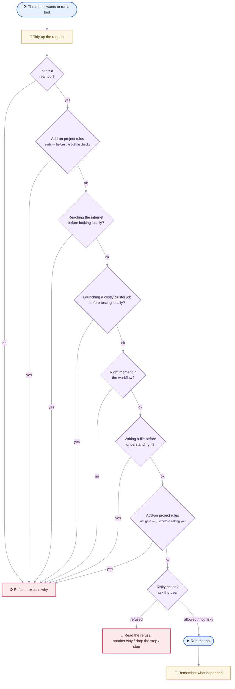
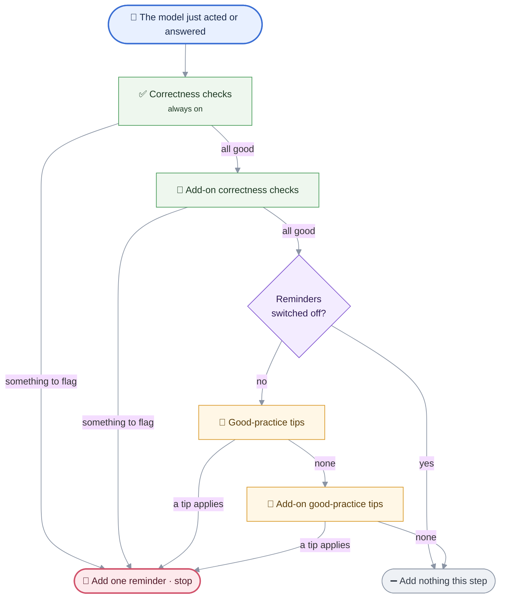

# MIMIR Policy Reference

> **MIMIR docs** — [Overview](README.md) · [Architecture](ARCHITECTURE.md) · [Setup](SETUP.md) · [Policy](POLICY.md) · [Client internals](CLIENT_DETAILED.md) · [Servers](SERVERS_DETAILED.md) · [Extension](EXTENSION_DETAILED.md) · [Plugins](PLUGINS_DETAILED.md)

The authoritative reference for MIMIR client **policy** behavior — use it to find what
policy rules exist, why they exist, where they are enforced in code, and what to update
when policy behavior changes.

---

## Policy Goals

The client policy layer exists to keep the agent useful without allowing low-context or unsafe actions.

Primary goals:
1. Require repository evidence before code changes.
2. Prevent destructive or low-context edits without forcing excessive rigidity.
3. Force validation before claiming success after code mutation.
4. Surface denied sensitive actions as incompleteness, not silent success.
5. Keep tool behavior predictable across runs.
6. Preserve model freedom during legitimate multi-file refactors and targeted repair loops.

The policy is intentionally **guardrail-oriented**, not **over-constraining**:
- it should block blind or unsafe actions,
- but it should still allow the model to finish a reasonable refactor,
- repair a failing file,
- and continue working when it already has enough local context.

---

## Trigger Workflow

Two independent mechanisms run at different moments. **Policies** gate a tool
*before* it runs (per tool call). **Nudges** append at most one reminder to the
conversation *after* a model step (per agent step). Both consult the same
`ExecutionContext`, and both let application packs add rules without editing core.

> The two flowcharts below are **zooms** on the work loop in `README.md`
> (*Architecture → Agentic loop*): the policy checks expand the
> “🛠️ Run the requested tools” step, and the reminder cascade expands the
> “Needs a nudge to finish properly?” step.

### Policy preconditions — per tool call

Every tool call passes through a chain of safety checks before it can run. The
first check that objects stops the call and hands the model an explanation it can
react to (a refused action is weighed against the three readings of a refusal — see
[If approval is refused](#if-approval-is-refused)). The checks run in a
fixed order, and add-on packs can insert extra rules but never remove any.



**The two "add-on project rules" boxes are the same mechanism at two different
moments** — not the same rule checked twice. Add-on packs plug extra rules into
one of two slots, and the difference is *what has already been checked* by the time
the rule runs:

- **Early slot (before the built-in checks)** — runs right after "is this a real
  tool?", *before* MIMIR's own guards (internet, cluster, workflow, file-writing).
  Use it to reject an action up front, on the request alone, without waiting for the
  built-in guards — for example a domain rule that forbids a tool outright, or a
  guard for a non-writing tool the built-in write rule wouldn't cover.
- **Last slot (just before asking you)** — runs *after* every built-in guard has
  already passed, immediately before the approval prompt. At this point the action
  is known to be otherwise allowed, so the rule is a final domain-specific veto right
  at the "about to run" boundary.

In both slots an add-on rule can **only block** an action — it can never wave through
something the built-in guards already rejected.

### Nudge cascade — per agent step

After each model step, MIMIR may add **at most one** short reminder to the
conversation. It first runs *correctness* checks (did the model verify its work?)
— these are always on. Then, unless reminders are switched off, it runs
*good-practice* tips. The first reminder that applies wins; if none apply, nothing
is added.



Each row is `(name, layer, should_fire, render)`; a row's own predicate carries its
per-query frequency cap and (for guidance) the `(enforcement, mode)` gate, so the
runner just walks the table.

---

## Enforcement Modules

- `mimir/client/guardrails/policy/write.py`
  - write-policy enforcement (read-before-overwrite, delete evidence, anti-thrashing)
  - `check_write_policy` / `has_delete_context` / `write_policy_violation`
  - every rule here guards a **loss**. A rule that only enforces a preferred working order does not belong in this module: it blocks reversible work, and as a hard guard it would sit outside the enforcement dial that exists to tune exactly that. The pre-edit planning gate (first code edit refused until a plan/todo was recorded) was removed on that ground — the risk it gestured at is *concluding* with open steps, which the unfinished-plan verification nudge covers directly from disk state.

- `mimir/client/guardrails/observations.py` (at the guardrails root — shared by policy **and** nudges)
  - the `execution_context` blackboard writer: `record_tool_observation` + the ordered `_observe_*` handlers
  - path evidence tracking, repeated-edit retry tracking, workflow transition recording after tool execution
  - `_observe_command`: a shell-command tool (`bash_run`, keyed off the `command_prefix` scope) is classified by `policy/bash_classify.py` and credited to the same fields as the dedicated tools, so a bash `cat`/`grep`/`sed -i` feeds discovery/edit/action state (`read_files`, `searched`, `inspected_dirs`, `dirty_written_files`, `action_op_count`) like the file/search tools would
  - (query-intent classifiers `query_prefers_*` / `query_requires_repo_discovery` moved to `context/signals.py`)

- `mimir/client/guardrails/policy/state_machine.py`
  - the workflow-state guard (`check_state_machine_guard`) + validation-retry-budget enforcement
  - (the validation/denial nudge **message builders** moved to `guardrails/nudges/messages.py`; `finalize_incomplete_answer` lives in `guardrails/workflow.py`)

- `mimir/client/guardrails/policy/engine.py`
  - `evaluate_tool_preconditions` orchestrator
  - registry validation
  - tool rewrite handling
  - registry → external-fetch guard → cluster-submit guard → proxy-exec guard → state guard → write policy → out-of-workspace guard → approval pipeline
  - capability-driven call-time guards (no hardcoded tool names), all living in `guardrails/policy/gates.py`: `_check_external_fetch` (EXTERNAL_FETCH gated on local discovery), `_check_cluster_submit` (CLUSTER_SUBMIT held once until local-validation evidence — see Cluster-Submission Guard), `_check_proxy_exec` (CODE_EXEC tools blocked from running the proxy under optimization directly — see Proxy Direct-Execution Guard), and `_check_out_of_workspace_access` (any path outside the workspace root prompts before running — see Out-of-Workspace Access Approval)
  - interactive path clarification (interactive sessions only)
  - violation payload enrichment with:
    - `policy_stage`
    - `state`
    - `missing_evidence`
    - `suggested_next_tool_class`

- `mimir/client/guardrails/policy/approval.py`
  - interactive approval gate (`ApprovalManager`)
  - per-call prompt (with a registry-driven `risk_note` sentence — see below)
  - `always` session-wide grants, **scope-narrowed** by a tool-declared `scope` spec
  - batch-mode queuing
  - pre-write file snapshot capture and unified diff display
  - revert-all on rejection
  - `denial_kind(note)`: maps each front-end's refusal note ("denied by user", "cancelled", …) to a stable token, so the policy layer branches on a kind instead of on prose

- `mimir/client/guardrails/policy/bash_classify.py`
  - classifies a `bash_run` command line (command + options) into capability **kinds** (read / search / inspect / write / exec / env) plus the operands it acts on; `classify_bash_command` (per-segment, `; && || |`) / `bash_command_is_readonly` (all segments read-only?)
  - single source reused by plan-mode gating (`plan_loop`), the read-only approval exemption, and the `_observe_command` blackboard writer. Not a security boundary — the bash server independently validates every call

- `mimir/client/guardrails/policy/readonly_exempt.py`
  - `_readonly_bash_exempt`: waives the sensitive-approval prompt for a **read-only** dual-use bash command (per `bash_command_is_readonly`) **in any mode** — running `rg`/`cat`/`sed -n` unattended is safe; an exec command or an in-place write (`sed -i`) still hits the normal gate. Formerly `plan_mode.py` (plan-mode-only), generalised when the exemption was extended to agent mode

- `mimir/client/agent_core.py`
  - tool routing
  - approval prompts
  - integration order: precondition → execution → observation

- `mimir/client/guardrails/nudges/engine.py` — `maybe_append_nudge` appends **at most one** reminder per agent step. Built-in nudges are a single ordered table, `_CORE_NUDGES` (each row: `name`, `layer`, a `should_fire` predicate, a `render`), walked by the generic runner `_append_core_nudge`; application packs add more through the `NudgeRegistry` (`_append_custom_nudge`). Both share the same shape, so a built-in and a pack nudge are described identically. There are two layers:
  - **Verification layer** (`layer="verification"`) — reality checks that run at **every** enforcement level: denial, error-recovery, the **regression** nudge (you edited a source file whose associated test exists on disk but was never run this query — `tests_run` vs. the discovered `test_<stem>.py`/`<stem>_test.py`), and the **unfinished-plan** nudge (code was written while the model's own checklist still has open non-optional steps). These point at facts about disk/process state and output honesty that no amount of model capability removes. `test_nudge_table.py` asserts the verification set is disjoint from `_ALL_GUIDANCE`, so a verification row can never be silently switched off by enforcement.
  - **Guidance layer** (`layer="guidance"`) — reasoning babysitting that is **skipped entirely when `enforcement_level == "off"`**: validation, env_resolution, env_cleanup, discovery, documentation, state, blast-radius, creation, and todo. Which categories survive at each `(enforcement, mode)` is the single table `_GUIDANCE_BY_LEVEL_MODE` (consulted via `_guidance_enabled`, **inside each guidance predicate**): `strict` permits all; `light` keeps only `blast_radius` + `env_cleanup` + `validation` (agent mode). See Enforcement Levels for the full table — it is the authority, and this line is a summary of it.

  Order per step: **core verification → pack verification → (stop if `off`) → core guidance → pack guidance**; the first row whose `should_fire` is true fires and wins. Each nudge's per-query frequency cap (`nudge_count(ec, category) < NUDGE_MAX_*`) lives inside its own predicate. Nudge and prompt text refers to tools by **capability/category**, never by literal MCP tool name (the plan output via "the plan/todo tool"). The lone exception is validation, which names the bash **commands** it steers toward (`python -m py_compile` / `pytest` / `ruff` / `mypy`) since those are shell invocations, not MCP tools.

  The nudge **message copy** (the `render` text for every built-in nudge, plus the stateful `validation_nudge_message` builder) lives in `mimir/client/guardrails/nudges/messages.py` — inside the nudges subsystem, since only it consumes them. `guardrails/workflow.py` keeps only the shared **state model + predicates** (`set_workflow_state`, `has_pending_validation`, `has_blocking_denials`, `pending_validation_paths`, plus the denial ladder — `denial_stage`, `worst_denial_stage`, `handback_required`) and the agent-loop plan/loop copy.

  Separately from the `guardrails/nudges/engine.py` layers, the agent loop itself fires **loop-control correctives** mid-tool-loop (in `agent_loop.py`) when a call is over-repeated: the failing-call guard (identical *failed* non-write call → correct, then hard-block) and the redundant-success guard (non-write call returning byte-identical content → correct on the 1st repeat, hard-block + history-strip on the 2nd, with a neutral `status:"skipped"` notice so the model proceeds rather than retries); and, once refusals reach the end of the denial ladder, a one-time **hand-back stop** (`handback_corrective_message()`), which is mid-loop for the same reason — a model that has been told to hand back and hasn't is still calling tools, where no nudge can reach it. The **firing decision** lives in the loop; the corrective message **TEXT** lives alongside the other loop-control copy in `mimir/client/guardrails/workflow.py` (`repeat_corrective_message()` / `redundant_corrective_message()` / `handback_corrective_message()`), keeping wording consistent.

---

## Enforcement Levels (model-tiered)

`config.models.enforcement_level(model)` resolves a per-model knob from the vLLM profile: `"strict"` | `"light"` (**default**) | `"off"`. It governs **only the reasoning-babysitting layer** — the guidance nudges (env resolution/cleanup, discovery, doc, state, blast-radius, creation, todo, validation) and the plan-mode evidence gate. Which guidance categories survive at each `(enforcement, mode)` is the single declarative table `_GUIDANCE_BY_LEVEL_MODE` in `guardrails/nudges/engine.py` (consulted via `_guidance_enabled`); each nudge then layers its own `active_mode`/situational conditions on top:

| level  | agent-mode guidance nudges                                                         | plan-mode guidance nudges          | plan-mode evidence gate |
|--------|-----------------------------------------------------------------------------------|------------------------------------|-------------------------|
| strict | **all** (env_resolution, env_cleanup, discovery, doc, state, blast_radius, creation, todo, validation) | all except `validation` (branch `active_mode` gates still apply) | on |
| **light** *(default)* | **`blast_radius`, `env_cleanup`, `validation` only**                    | none                               | on                      |
| off    | none                                                                               | none                               | off                     |

The plan-mode evidence gate is **advisory at every level it is on**: it appends a one-shot nudge to a plan recorded with no exploration, and the plan stands either way. `off` suppresses the nudge entirely. It never rejects a plan — doing so discarded what the model had just recorded, with nothing guaranteeing it would submit that form again, and its trigger (`query_requires_repo_discovery`) is a deliberately broad exit filter that fires just as readily for greenfield work outside the repo, where no exploration could satisfy it.

`light` is the **default**, and the reason is that its membership rule is the only one stated as a criterion rather than as a list: keep the nudges guarding a mistake that is **costly, hard to detect, and non-self-correcting** — `blast_radius` (changing a definition without checking callers), `env_cleanup` (a package install / created env that persists outside the session), `validation` (concluding on code that was never checked). Everything it drops (discovery, env_resolution, doc, state, creation, todo) is procedural hand-holding a capable model does unprompted, and it is not free: each nudge is a message injected into the model's own reasoning stream mid-plan, priced in tokens and in interruption. Having that as the opt-*down* put the burden of proof on the wrong side.

`strict` permits every guidance branch and is now the **opt-in**, declared per model with `"enforcement": "strict"` in `vllm_model_profiles.json`. The branches' own `active_mode == "agent"` gates mean agent-only nudges still don't leak into plan mode, so `strict` does not strip guidance by mode. `off` cuts the whole guidance layer. Ask mode is empty at every level — it neither plans nor edits, so nothing in the guidance layer applies. The line is per-mode, so adding (say) a plan-mode `light` nudge later is a one-line table edit.

Which models opt back in: the marker is **empirical, not a guess about model families** — a profile that already carries a recorded workaround is a model that has been observed struggling. Today that is `devstral` (which also carries a tool-count cap). `test_client_helpers` pins it, so flipping the default can never silently un-rail it.

**Verification and safety/correctness enforcement is never tiered:** the verification-layer nudges (denial, error-recovery, regression, unfinished-plan), write-policy, approval/sensitivity, the workflow state-machine anti-thrashing guard, and plan-blocked tool hiding run at every level.

**Resolution and runtime override.** The level is resolved **once** at agent construction (`MimirAgent.__init__` → `self.enforcement = enforcement_level(model)`) — the model is immutable for an agent's lifetime, so there is nothing to re-resolve per turn. Consumers read it via `config.models.resolve_enforcement(agent)` (cached attribute, with a fall-back to `enforcement_level(agent.model)` for agent-like objects that predate the attribute). It can be changed at runtime with the `/enforcement strict|light|off` command (`MimirAgent.set_enforcement`), wired in both the CLI (`chat_commands.py`) and the WebSocket server (`ws_server._handle_command`), and surfaced in `/status`.

---

## Discovery-Evidence Definition (single owner)

"What counts as the model's own discovery this query" is defined **once** in `context/execution_context.py`: `DISCOVERY_EVIDENCE_SIGNALS` — now *derived* from the `DISCOVERY` field trait rather than hand-listed, so a new discovery field cannot be added to the schema and forgotten here (membership unchanged: `searched`, `read_files`, `snippet_read_files`, `checked_paths`, `inspected_dirs`) — plus `has_discovery_evidence(ctx, *, min_distinct)`. `inspected_dirs` counts only **beyond `BASELINE_SEEDED_DIRS`** (`{"."}` — the same constant `repo_baseline` seeds from, so the two cannot drift): the repo-baseline snapshot must never pre-satisfy a gate on the model's behalf, but a subtree the model inspected itself is real exploration. Excluding the field outright, as it was, made structural discovery worth nothing and left a grep or a file read as the only way to clear any gate — the wrong bar for a task about layout rather than about one symbol. The agent-mode discovery nudge (min 2), the plan-mode evidence gate (min 1), and `engine._missing_evidence` all read this one definition instead of hand-picking field subsets.

---

## Execution Context Contract

Every run builds a validated execution context via `build_execution_context()` and `validate_execution_context()`.

The context tracks:
- repository discovery evidence
- searched and inspected paths
- known existing files
- explicitly read files
- snippet-only read files
- written and validated files
- `validation_tier_by_file`: how strongly each validated file was checked (`syntax`/`static`/`executed`/`oracle` — see Validation Policy)
- denied sensitive actions
- workflow progress
- `edit_loop_state`: per-file `(signature, count)` of repeated identical **failed** edit attempts
- `steps_since_last_edit`: steps elapsed since the last successful code edit
- `declared_edit_set`: file paths the model committed to editing via `todo_write`
- `snippet_read_files`: files observed via snippet/context tools but **not** treated as fully read
- `similar_candidates_by_dir`: known nearby peer files used to reason about placement and duplication

### Field traits: what a field *is*, declared once

Per-field properties — carried across queries? purged when a file is deleted? counts as discovery? — are declared as a `traits` frozenset on the field's own row in `_FIELD_SPECS`, and every list that answers one of those questions is **derived** (`fields_with(...)`):

| Trait | Meaning | Derived list it feeds |
|-------|---------|------------------------|
| `CARRY` | merged into the next query's context (session memory) | the carry merge + session (de)serialisation in `agent_core` |
| `FILE_PATH` | holds workspace **file** paths | the delete purge (`observations._observe_delete`) |
| `KNOWN_FILE` | holds a file path the model has encountered | `known_existing_files()` — path clarification |
| `DISCOVERY` | counts as the model's own exploration | `DISCOVERY_EVIDENCE_SIGNALS` |

These answers used to live in **eight hand-maintained name lists** across `agent_core`, `observations`, the policy engine and the nudge engine. Nothing kept them correct when a field was added, and they had already gone wrong: two computed the same four-field set twice in two modules; two named `dirty_written_files` as a carried field, which it never was; and two constants in `agent_core` shared the name `_CARRY_SET_FIELDS` with different membership. `test_client_helpers` now fails if a `*_files` / `*_paths` / `*_dirs` field is added without answering the question (or being listed as deliberately traitless).

`inspected_dirs` is `CARRY + DISCOVERY` but **not** `FILE_PATH`: it holds directories, and deleting a file does not un-inspect the directory that contained it.

**One seeder.** `backfill_execution_context()` gives a context every declared field, derived from the same table. It replaced four `bootstrap_*` helpers that each seeded the subset its own module read — one of which defaulted `steps_since_last_edit` to `99` where the schema and the others use `0`, so the same absent field meant "maximally idle" to the idle gates and "just edited" to the message builder. The old names remain as aliases.

### Important semantic distinctions

These are enforced by named predicates in `context/execution_context.py`, not by convention: `was_fully_read()`, `is_known_to_exist()`, `was_checked_for()`. As bare set membership the right field and the wrong one looked equally plausible at the call site.

- `read_files` means the file was explicitly read through a direct read tool (`read_file_lines`).
- `snippet_read_files` means the model saw only partial context and **must not** be treated as having fully read the file.
- `checked_paths` means a pre-check was attempted; it **does not prove existence**.
- `existing_paths` is stronger evidence than `checked_paths`.
- `validated_files` means a check **ran and passed**; it does **not** mean the artifact is correct. `validation_tier_by_file` carries that distinction — only the `oracle` tier reflects a comparison against something independent of the code.
- `executed_failures` means an `executed`-tier check was seen **failing** on the file at some point this query. Unlike every other validation field it is **not** retracted on re-edit: it is a fact about a check, not about a revision.
- scratchpad paths (see Out-of-Workspace Access Approval) never enter `dirty_written_files`: they are working material, not produced work.

Policy changes must preserve this contract or explicitly migrate it.

---

## Query Context Lifecycle

Execution context is query-scoped, but selected discovery evidence can be reused across repeated queries with the same canonical query key.

Current behavior:
- each run normalizes `query_id` with canonical whitespace/lowercase normalization
- baseline seeding can replay cached relevant discovery only for the same canonical query key
- cache storage is bounded and only stores discovery evidence subsets (search/read/inspection context)
- unrelated queries do not reuse cached discovery evidence

Rationale:
- reduce stale cross-query evidence bleed
- keep repeated query handling efficient without treating old context as globally valid

---

## Discovery Policy

Discovery is required when the query implies repository work.

Current rule:
- `query_requires_repo_discovery(query)` decides whether discovery is expected. It matches edit/create/HPC and repo-oriented terms but **not** pure-theory/bibliography terms (`derive`, `prove`, `integrate`, `cite`, `theorem`), so a math or literature query is not forced to scan the repository.
- The hard requirement is enforced at write time: `check_write_policy` / the workflow state guard demand direct target context (`has_direct_target_context`) and, for deletes, existence evidence (`has_delete_context`) before a mutation is allowed.
- nudges are intentionally softer than hard guards:
  - local discovery evidence may include:
    - search activity
    - directory inspection
    - explicit reads
    - snippet reads
    - successful path checks

Rationale:
- avoid blind edits
- keep planning grounded in repository facts
- avoid over-nudging when the model already has enough local evidence to proceed

---

## Read Policy

For source files, broad full-file reads are still treated more carefully than targeted reads.

Current design:
- explicit reads (`read_file_lines`) are treated as strong evidence
- snippet/context reads (`read_neighbor_files`) are tracked separately in `snippet_read_files`
- snippet reads **do not** satisfy per-file “already read” requirements for source edits

This separation is important because partial context is often sufficient for search/planning, but not sufficient for structural edits.

Rationale:
- preserve context efficiency
- avoid treating grep/snippet context as proof that a file was fully inspected
- reduce broken local edits caused by acting on partial file context

---

## Write Policy

Write actions are guarded more aggressively than reads, but the current policy is designed to remain usable during real refactor loops.

### Current runtime-enforced write-policy behavior

1. `write_file` is blocked on known existing files unless `overwrite=true` is explicitly requested.
2. `write_file` with `overwrite=true` requires the file to have been read first.
3. `delete_file` requires stronger context than a simple pre-check:
   - explicit existence/read evidence for the target file
   - and parent-directory context
4. repeated edit attempts are only blocked after **repeated identical failed edits** on the same file.
5. a successful edit resets the repeated-failure signature for that file.
6. validation-loop retries may bypass some normal write friction for already-read files:
   - `replace_in_file`
   - `replace_lines`
7. after a successful code edit, the workflow enters `validate` only when the declared planned edit set is complete; otherwise it remains in `edit`.
8. `read_neighbor_files` does **not** count as a strong prior read for source-edit policy.

### Design intent

The write policy is intentionally **not** purely restrictive. It tries to:
- prevent blind overwrite and deletion,
- block sterile repeated retries,
- but still allow the model to continue a legitimate multi-file change set before validation interrupts.

Rationale:
- prefer grounded edits over blind rewrites
- reduce accidental deletion and duplication
- avoid blocking legitimate in-progress refactors too early

---

## Workflow State Machine

Workflow states are:
- `discover`
- `edit`
- `validate`
- `conclude`

### Current state-guard behavior

1. In `edit`, source edits are blocked for a file that has already exhausted its validation retry budget. **This is the only block the guard performs.**
2. The `validate` state blocks nothing. Steering the model back toward pending validation is the validation **nudge**'s job — advisory and dial-tunable — not a block's.

The guard used to police `validate` too, refusing edits to files unrelated to the pending set. That branch accumulated three successive carve-outs (declared edit set incomplete → allow; target already pending → allow; **target already read this session** → allow), and the last one made it nearly unreachable: a model that reads before it edits never triggered it. What stayed reachable — editing a file that was never read — is already covered by `check_write_policy` on the overwrite path, which guards a real loss rather than a working order. It was removed rather than kept as near-dead code on the hot path of every write.

### Design intent

The workflow states still exist and still mean something — they drive the nudges, the
conclude gate and the finalization buckets. What they no longer do is *gate edits* on
anything but a file that has demonstrably stopped converging.

Rationale:
- editing is reversible; a wrong edit costs a diff, and the approval layer snapshots it
- unrelated drift is a *judgement* about the model's plan, not a fact about disk, so it
  belongs in the advisory layer where the enforcement dial can reach it
- a guard that reliably fires only on a case another guard already covers is cost
  without protection, and the cost is paid on every write

---

## Validation Policy

After source edits, success cannot be reported until validation is complete or the answer explicitly states that the task remains incomplete.

Current behavior:
- modified code files are tracked in `dirty_written_files`
- validation runs through the `bash` server, not a dedicated validator tool. `observations._observe_bash_validation` drives it status-agnostically. **Per file (language-agnostic):** any file named in a compile/run/check command — `python -m py_compile a.py`, `gcc a.c`, `gfortran b.f90`, `javac Foo.java`, `node --check app.js` — **succeeds** (`status="ok"`, bash's exit 0) → recorded in `validated_files`; **fails** (`status="error"`) → increments `validation_fail_count_by_file` and returns the workflow to `edit`. A leading `cd` rebases relative operands so the resolved path matches the dirty path exactly. **Whole project (big refactors):** a green run of a recognised project validator that names no specific file — bare `pytest`, `ruff check .`, `mypy src/` (Python) or `ctest` (the CMake test runner, for C/C++/CUDA/Fortran) = `_PROJECT_VALIDATORS` — clears **every** pending file at once. That set is kept to validators that are actually declared (bash `_ALLOWED_COMMANDS` + `bash_classify._EXEC_COMMANDS`); ambiguous build drivers (`make`/`cmake`) and program runs (`python foo.py`, `python -c …`, `./bin`) are excluded, crediting only the file they explicitly name. Compiled-language refactors also validate per file through their declared compilers (`gcc`/`gfortran`/`javac`/`nvcc`/`node --check`). Test files go into `tests_run` either way (feeds the regression nudge). A plugin server's dedicated `VALIDATE` tool contributes the same way via `_observe_validation_tool`.
- **validation strength is graded, not boolean.** `validated_files` answers "was it checked?"; `validation_tier_by_file` answers "with what?", on the ladder `syntax` < `static` < `executed` < `oracle` (`context/execution_context.VALIDATION_TIERS`). The tier comes from the command head (`py_compile` → syntax; `ruff`/`mypy`/`pyflakes`/`black` → static; `pytest`/`ctest` and anything else that runs a named file → executed). It is raised monotonically and retracted whenever `validated_files` is (a re-edit or a failed check), since evidence is about one revision of a file.

  **Two ways to reach `oracle`** — the tier means "compared against something the code does not itself define", and there is more than one way to observe that:

  1. **Discrimination (red→green)** — an `executed`-tier check was observed *failing* on the file and now passes. It told the broken state from the fixed one, so it is not vacuous. **Domain-agnostic**: no numerical invariant needed, so a parser, a CLI or a string refactor can reach `oracle`, which the numerical route alone made structurally impossible for them. Tracked in `executed_failures` — a set that is deliberately **never cleared within the query, not even on re-edit**, because the fix is precisely what happens between the red run and the green one; `validation_fail_count_by_file` cannot serve, since `_mark_file_validated` pops it on success, destroying the record at the moment it becomes evidence. A failing **whole-project** run records every pending file there too: it is not attribution (no retry budget is charged, nothing is un-validated), but it is testimony that the suite discriminates — and without it the dominant repair loop (*run the suite, fix, run it again*) would never earn the promotion, because the command names the test while the pending file is the source.
  2. **Reported numerical invariant** — the green run's stdout carries a `key=value` line whose key is in `NUMERICAL_INVARIANT_METRICS` (`servers/_shared/numerics.py`: `l2_rel`, `linf_rel`, `l2_abs`, `linf_abs`, `convergence_order`, `conservation_residual`, `finite`). Narrow domain, but the strongest available when present.

  Rationale: exit code 0 is the *only* thing bash reports, so a vacuous test and a rigorous one are indistinguishable from outside the process — the wave2d incident concluded "verified" on a test asserting only no-NaN and a loose magnitude bound. **Presence of the invariant key is what counts; the value is never interpreted** (a forged number is unfalsifiable from here — which is exactly why the proxy server seals references server-side instead; the two readings share one vocabulary, see `numerics.py`). Red→green needs no such caveat: a model cannot award it by writing a test *after* the fix, since such a test never ran red, and provoking it deliberately means writing a failing check first — which is TDD.

  **Why there is no "pre-existing verifier" signal.** A third route was designed and dropped: treat a verifier file that is tracked by git and clean vs `HEAD` as independently authored. It cannot fire in the current credit model. Validation credit only ever goes to a file already in `dirty_written_files`, and the file the command *names* is the file credited — so the verifier and the target are the same file, which is dirty by construction and therefore never clean vs `HEAD`. Making it fire would require crediting pending files from a test run that does not name them (today `pytest tests/test_parser.py` validates **nothing** after editing `parser.py` — only a bare `pytest` does), which loosens the conclude gate and is a separate decision. Recorded here so the gap is a known one rather than a rediscovery.

  The tier is **report-only**: it gates nothing, blocks nothing, and fires no nudge. Every tier still counts as validated for the conclude-gate, so the whole ladder is additive — it is read by the completion ledger so the *answer* can state what was actually established. Deliberate: a wrong "your evidence is weak" verdict would loop the model, whereas a pessimistic ledger line costs nothing.
- pending validation can trigger the validation guidance nudge (strict/light, not off) and annotate incomplete finalization; if a validator is unavailable in every environment, the agent states which check could not run and why, then proceeds
- after a replace edit, a completeness check may grep for leftover occurrences of `old_text`; if any remain, a `COMPLETENESS_WARNING` is appended directing the agent to finish the replacement
- short generic tokens are exempt from the completeness check to avoid false positives
- validation nudges are deferred until:
  - the model has paused editing for at least 2 steps (`steps_since_last_edit >= 2`)
  - and the declared edit set is complete
- `VALIDATION_RETRY_BUDGET` (defined in `client/config/constants.py`) caps how many times a single file may fail validation before the workflow auto-escapes to `conclude`. The exhausted count also arms the state-machine guard's anti-thrashing hard-stop (blocks further broad edits on a file that keeps failing) and the finalize stuck/retry/fresh bucketing.
- after that auto-escape:
  - residual risk must be surfaced clearly
  - post-escape validation/state nudges are suppressed

### Important nuance

Validation is still mandatory for successful completion, but the policy does **not** try to interrupt every in-progress refactor immediately. The system prefers:
1. finish the planned edit set,
2. then validate,
3. then repair locally if needed.

Rationale:
- keep the model from claiming success prematurely
- avoid deadlocks
- reduce “mid-refactor nagging”

---

## Cluster-Submission Guard

Expensive cluster launches consume real allocation hours, so a trivial unvalidated error is costly. Tools that submit/launch on the cluster declare the `CLUSTER_SUBMIT` capability (`salloc_submit`, `ft_run_slurm`, `proxy_slurm`); `engine._check_cluster_submit` runs as a call-time precondition (before approval).

Behavior:
- if the tool lacks `CLUSTER_SUBMIT`, or there is local-validation evidence (`validated_files` non-empty), the call proceeds;
- otherwise the call is **held, and stays held**, with a structured warning (`policy_stage: "cluster_submit"`, `suggested_next_tool_class: "local_validation"`). `cluster_submit_warned` no longer lifts the guard — it only shortens the message after the first hold.

**This used to be one-shot** (warn once, set the flag, let the next call through). That made it a reminder, not a guard: against a model that simply calls again — the normal reaction to an error — it cost one round trip and constrained nothing, on the most expensive and least reversible action in the system. The condition is a fact about the session ("has anything been validated?"), not a nagging budget, so it holds until that fact changes; the error names exactly what clears it, so this is a precondition with a stated exit rather than a wall. Pinned by `test_policy_manager.test_cluster_submit_stays_held_until_something_is_validated`.

This is a **verification-class** guard: it checks a fact (was anything validated locally?), independent of model strength, so it is **never** enforcement-tiered. It is capability-driven — no hardcoded tool names — so a new cluster-launch tool is covered simply by declaring the capability.

---

## Proxy Direct-Execution Guard

During a proxy optimization session the model must improve the proxy only by editing its source and going through `proxy_eval(op='run')`. A direct `python proxy.py` / `./proxy` bypasses reference sealing, the numerical invariants and the ratchet, and would let a hand-run be reported as a win. `gates._check_proxy_exec` runs as a call-time precondition (right after the cluster-submit guard).

- It is scoped by the **`CODE_EXEC`** capability (declared by `bash_run`) — a non-CODE_EXEC tool abstains immediately, without touching disk. `CODE_EXEC` only means "this tool executes a payload"; it does **not** imply a block.
- When a session is initialized (resolved from the proxy store's `active_session` → `opt_config.json`, single source of truth read read-only via `servers/proxy/_lib/store`), the guard blocks the call **only** when one of its string arguments *executes* the proxy's source/executable **in command position** — the shell command is parsed (mirroring the `bash_classify.classify_bash_command` segmentation: split on `; && || |`, skip `VAR=val`/wrapper prefixes, resolve `python X` → X). Read-only inspection of the source (`cat`/`grep`/`ls proxy.py`) never matches, because the proxy is an *argument* there, not the executed program.
- Blocking returns `policy_stage: "proxy_exec"`, `suggested_next_tool_class: "proxy_eval_run"`, steering the model to `proxy_eval(op='run')`.
- The session is closed with `proxy_eval(op='end')`, which clears `active_session` so the guard lifts (the proxy can be run by hand again). `reset`/`reset_to_best` are mid-loop reverts and do **not** end the session.

This is a **correctness / anti-bypass** guard (a hard block, like reserved-metrics purging on the server side), so it is **never** enforcement-tiered. It is capability-driven — no hardcoded tool names — and **fail-open** on any internal error (a store/parse failure yields "no opinion", never a wedged pipeline). Residual gap: executing the proxy by pasting its body inline into a fresh script is not detected; the server-side reserved-metrics guard still prevents forging an accepted result there.

---

## Out-of-Workspace Access Approval

Reads/writes/execs that touch a path **outside the workspace root** are held for explicit user approval (allow-once / always-for-this-file / deny) before the tool runs. `engine._check_out_of_workspace_access` runs as a call-time precondition, **before** the sensitive/approval gate, so a previewable write cannot bypass it.

Target extraction (`_out_of_workspace_targets`) reuses the existing file/edit-target extractor, any `cwd` arg-role, and **every path a shell command names** — file operands and `cd` destinations alike (`_shell_path_targets`) — resolves each to a realpath, and drops:
- paths under the workspace root;
- **reads** under the trusted read roots (proxy/HPC caches + state dir), defined once in `servers/_shared/trusted_read_roots.py` and mirrored client-side by `_trusted_read_roots` so the gate and the servers can't drift. The shared helper resolves the state dir from `MIMIR_STATE_DIR`, which `server_manager` only places in the **server subprocesses'** env — so the client mirror appends `constants.STATE_DIR` explicitly. Without it the two *did* drift in the one direction nothing tested: the servers admitted the state dir, the gate prompted for it, and the agent could not read back its own plans or sessions;
- paths already approved `always` this session (`ApprovalManager.is_path_approved`);
- the **scratchpad** (see below), which is granted by the system rather than the user.

Behavior:
- with no approval hook wired the gate **fails closed** — out-of-workspace access is denied;
- a granted path is recorded via `ApprovalManager.grant_path`, which mirrors the full allow set to `<state_dir>/approved_paths.json`. The sandboxed servers read that sidecar **per call** (their env is frozen at spawn, so the file is the only live client→server channel) and pass the entries as `extra_roots` to `resolve_path_in_root`. `always` also records a `path:<abspath>` scope token that skips re-prompting for the session. Both the token check and the gate's target list work by **containment**, as the server does: `extra_roots` admits a granted path as a *root*, so once a directory is approved everything under it is already allowed there and a prompt for a child could no longer deny anything;
- grants reset on session change (`reset_allowed_paths`, wired on the WS worker); a missing/corrupt sidecar yields `[]` (fail-closed — a broken allowlist can never widen the sandbox).

**Shell commands carry their paths inside a string**, where the file-target extractor cannot see them — so `cat /etc/passwd` and `python /tmp/evil.py` used to be refused by the server with no prompt ever shown, leaving the user unable to grant an access they might well have wanted. `_shell_path_targets` walks the command's segments and surfaces every path they name, so the rule is uniform: *anything* reaching outside the workspace asks the user, whatever tool or syntax it arrives in.

The operand extraction is `servers/_shared/shell_paths.py`, imported by **both** this gate and the bash server's sandbox guard — the gate prompts for exactly the paths the guard would otherwise refuse. Two copies of "which tokens are paths" would fail silently in both directions: a path the gate misses cannot be granted, a path the guard misses is never gated. `test_server_contracts` asserts the invariant directly: over a corpus of commands, every path the guard refuses is one the gate offers.

Extraction is command-family aware, so no prompt is raised for text that merely looks like a path — a `grep` pattern or a `sed` script (`grep /etc/passwd notes.txt` opens nothing) — nor for flags (`-I/usr/include`, `-m pytest`). A path built from a shell **expansion** raises no prompt either, because it is refused outright by the guard: expansion happens in the child shell, so the path checked would not be the path read. The gate does parse *around* a bare `$VAR` (`shell_segments(allow_expansion=True)`), since a command mixing `gcc -I$CUDA_HOME/include` with a genuine out-of-workspace operand must still reach the user; command substitution (`$(...)`, backticks) stays opaque on both sides because it runs code.

`cd` deserves a word, because it is the one target that is not itself an access. Moving the shell is side-effect-free, so a `cd` **inside** the workspace never reaches this gate — the approval for such a chain is decided by whatever command follows it, exactly as for any other call. Stepping **outside** does change what every later relative path in the chain resolves to, so the destination is surfaced here and the user decides. The walk threads the current directory through the segments (chained `cd`s accumulate) exactly as the server's `_resolve_cd_target` does, so `cd /etc && cat passwd` surfaces `/etc` **and** the `/etc/passwd` it reaches — then asks only about `/etc`, the grant that covers both (one command naming a directory and paths inside it used to raise one prompt per path). The gate is capability-scoped to `CODE_EXEC` and driven off the shared segmenter, so no tool name or shell keyword is spelled out in it.

**Scope.** This gate sees the paths a call *names*, not what an executed program then opens: `python`, `make`, `gcc` and a locally-built binary run with the account's full privileges, so `python -c "open('/etc/passwd')"` reaches outside without any path appearing in an argument. Note this gate is not the only line — the sensitive-tool approval below it stops **every** execution, in or out of the workspace, so nothing runs unasked (outside the auto-approving headless runner). The user therefore controls *whether* something runs; neither gate controls *what it does* once it does. That needs process-level isolation (namespaces, seccomp, a container), which is not implemented — see [SERVERS_DETAILED.md](SERVERS_DETAILED.md#scope-of-the-sandbox-read-this-before-trusting-confined) for the bounds on what an "always" grant covers.

This is a **safety-class** gate (like sensitive-tool approval): it runs at every enforcement level. The front-ends supply the prompt hook — the WS worker routes it through the approval UI, the headless runner auto-approves, and the CLI prompts on the terminal (EOF = deny).

### The scratchpad (standing grant)

`state_paths.scratch_dir()` — `<TMPDIR or /tmp>/mimir-<uid>-<workspace-id>/<sid>/`, falling back to the home itself outside a session — is writable **without approval**, and never prompts. It is the agent's place for throwaway probe scripts, intermediate data and working files.

Why it exists: without one, the only writable location is the user's own workspace, so every temporary file is indistinguishable from produced work — it lands in the repo *and* in the change ledger, and then demands validation before the run can conclude. Consequently `observations._record_code_edit` **excludes** scratch paths from `dirty_written_files`, which is what makes the scratchpad useful rather than a new source of validation noise.

Why the temp dir: that is where throwaway work belongs and where the OS reclaims it, and it is the location a user looking for MIMIR's working files will actually think of. The price is that `/tmp` is world-writable, so an existing directory at our name is not necessarily ours. `state_paths.ensure_scratch_home()` is the one function here that touches the disk: it creates the home `0700`, and **declines** — returning `""` — on a symlink, a non-directory, or a foreign owner. The client calls it **once** at startup (`MimirAgent.__init__`) and on a refusal falls back to `<state_dir>/scratch`, where the scratchpad used to live: degraded, never absent. The resolved path is then published in `MIMIR_SCRATCH_DIR`, in the client's own environment *and* the servers' (`server_manager`), so the vetting happens in exactly one place and no other end re-derives the path. `scratch_home()` stays a pure resolution — a sandbox check runs on every call and must not materialise directories.

`state_paths.standing_roots()` is deliberately **separate** from `approved_roots()` — that sidecar is the record of decisions the *user* made, and folding a system grant into it would both misreport consent and let a stale/corrupt sidecar revoke the scratchpad. It grants the scratchpad **home**, one root covering the per-session subdirectory and the session-less fallback alike, so a session switch mid-run cannot revoke a path already being written.

The grant is the scratchpad specifically, not "outside is fine now": the temp dir itself and a same-named sibling (`<home>_evil`) still prompt, paths under the state dir (plans, sessions) still prompt, and `/etc/passwd` is still refused. Client-side the exemption lives in `_out_of_workspace_targets`; `constants.STATE_DIR` is still passed to the shared helper, but only to read the active-session sidecar.

### Placement (where a new file goes)

Handled at the **tool boundary, not by a gate**: file tools reject relative paths (`server_files._require_abs`, see `SERVERS_DETAILED.md`). There is no resolution step left to get wrong — the model states the destination in the call, so a wrong choice is visible in the call itself rather than inferred from a root it cannot see.

Two prompt-level attempts failed before this. Stating the absolute root did not help; nor did rendering the tree's root line absolutely *and* spelling out the inference. Both tried to make an inference reliable; the fix removes the inference. The remaining prompt-side pieces are now prerequisites rather than patches: the orientation block names the workspace root (needed to *build* an absolute in-workspace path) and one `## Editing` bullet says file tools take absolute paths.

For the rule to be coherent the model must **copy** paths rather than construct them, so discovery reports absolute paths too (search, code-intel, and the discovery pin — see `SERVERS_DETAILED.md` → *The round-trip*). Read-only tools still *accept* relative input: their failure mode is benign, and the write-side rule exists for silent irreversible misplacement, which reads cannot cause.

Still not covered: MIMIR does not parse "outside directory X" out of the request and compare it to the destination. It does not have to — a relative path can no longer be accepted, and an absolute one names where it goes. Writing outside the workspace remains subject to the out-of-workspace approval gate above, which is the correct, user-visible outcome.

---

## Nudge Policy

Nudges are guidance, not hard blocks.

The current nudge layer is intentionally softer than the write/state guards.

Nudges are split into two layers (see Enforcement Modules / Enforcement Levels):
- **Verification nudges** (denial, error-recovery, regression, unfinished-plan) check *reality* and run at every enforcement level.
- **Guidance nudges** (validation, env_resolution, env_cleanup, discovery, documentation, state, blast-radius, creation, todo) babysit *reasoning* and are skipped entirely at `enforcement == "off"`; at `"light"` only `blast_radius` + `env_cleanup` + `validation` survive (agent mode) per the `_GUIDANCE_BY_LEVEL_MODE` table — see Enforcement Levels for the authoritative table.

Verification is evaluated first, so a pending verification reminder always preempts a guidance reminder.

### Regression nudge (verification)
Appended once when the model edited a Python source file whose associated test (`test_<stem>.py` / `<stem>_test.py`) is **known to exist** (seen via discovery) but is **not** in `tests_run` for this query. `tests_run` is populated by `observations._observe_command` whenever a bash command runs a test file (e.g. `pytest test_x.py`). Reality check — the test is on disk and was not executed — so it is model-strength independent.

### Unfinished-plan nudge (verification)
Appended once (`NUDGE_MAX_UNFINISHED_PLAN = 1`) when code has been written **and** the model's own checklist still has non-optional `- [ ]` steps. A reality check — the open boxes are in a file on disk that the model itself wrote — so it runs at every enforcement level, like the other verification rows. The message offers **two** valid exits: do the steps, or say explicitly in the final answer that a step is out of scope and leave it unchecked. A nudge with only one acceptable answer is a loop.

Requires `code_mutation_started`, so a discovery-only turn is never nudged, and degrades to silent when there is no checklist (`unchecked_checklist_items` fails closed to `[]` on a missing or unreadable file), which is the majority of runs. Note the checklist must also be *visible* to the model for this to be fair — see the live checklist in the discovery pin (`build_discovery_pin_block`), which is the only live channel for it since the copy in `messages[0]` is a build-time snapshot.

### Discovery nudges (guidance)
Discovery nudges are only appended when:
- the query requires repository discovery
- and local discovery evidence is still very weak

The system does **not** insist on a full heavy discovery ritual before every move if enough local context already exists.

### Validation nudges
Validation nudges are only appended when:
- validation is pending
- at least one pending file still has retry budget left
- the model appears to have paused editing
- the declared edit set is complete

### Denial nudges
Denial nudges are appended when a denied sensitive action is still blocking completion, but they are suppressed in exhausted-validation dead-end states where they would only add noise.

### State nudges
State nudges are now a soft catch-all:
- lower frequency
- delayed until the model has been idle long enough
- suppressed while validation is already pending
- suppressed while the declared edit set is still incomplete

### Blast-radius nudges
Blast-radius nudges are recommendations, not hard mandates:
- they encourage call-site/import-site inspection before broad signature changes
- but they explicitly allow clearly local changes to proceed

### Creation nudges
Creation nudges encourage the model to start writing once enough context exists, but they are phrased as guidance rather than imperative forcing.

### Documentation nudges
Documentation nudges are low-frequency reminders to update catalogs / READMEs after code changes, and can be ignored if no relevant documentation exists.

Rationale:
- help the model recover
- avoid policy spam
- preserve freedom during legitimate multi-step work

---

## Sensitive Tool Approval

Sensitive actions require explicit user approval.

Examples:
- file mutations
- code execution and compilation
- shell execution
- HTTP POST
- Slurm allocation submission
- Python-environment mutation (pip install/uninstall, env create/delete)
- memory deletion or clearing

Not approval-gated by design:
- `todo_write` and `todo_read` — they manage only a markdown checklist file, not source files, and must be available without a prompt during plan and agent mode
- `todo_update` is neither approval-gated nor plan-blocked: like `todo_write`/`todo_set_plan` it only manages the checklist, and the model may update an existing plan (mark/adjust items) during plan mode rather than overwrite it
- benchmark run tools (`benchmark_python_compute`, `benchmark_memory_copy`, `benchmark_numpy_matmul`) are not approval-gated but are in `PLAN_BLOCKED_TOOLS`
- `replace_lines` is an edit tool subject to write-policy guards and is plan-blocked like its siblings, but is not in `SENSITIVE_TOOLS` (no approval prompt)

**Reversibility is the declared dimension; sensitivity is derived from it.** A tool declares `tool_caps(..., reversibility="reversible" | "recoverable" | "irreversible")`, and the client sets `SENSITIVE` for anything that is not `reversible` — the same way `PLAN_BLOCKED` is already derived from the write caps. One fact stated per tool instead of two that can drift, and the failure mode of that drift is a tool running unasked.

| level | meaning | approval | examples |
|-------|---------|----------|----------|
| `reversible` | **MIMIR itself holds the undo** — the approval manager snapshots the file and `revert_last` restores it | not gated | in-workspace file writes/edits, every read tool |
| `recoverable` | undoable, but by hand and off the client's record | gated | `delete_file`, `env_pip_install`, `memory_clear`, `bash_run`, `proxy_eval` |
| `irreversible` | leaves this machine or spends something real | gated, and **no enforcement level may soften it** | `salloc_submit`, `sbatch_submit`, `proxy_slurm`, `ft_run_slurm`, `http_post` |

A tool that declares nothing gets a conservative derivation (`_derive_reversibility`): `CLUSTER_SUBMIT` → irreversible; `REMOVE`/`ENV_MUTATE`/`CODE_EXEC` → recoverable; everything else → reversible. The base case is `reversible` on purpose — since sensitivity is derived, defaulting to `recoverable` would put every read tool in the catalog behind an approval prompt. `EXTERNAL_FETCH` is deliberately *not* a trigger: it means "reaches outside the workspace", which a read-only GitHub query does as much as a POST; what makes an outbound call irreversible is that it *sends*, and no capability expresses that, so such tools declare the level themselves. A legacy descriptor still carrying `approval.sensitive: true` reads as `recoverable`, so a third-party server written before the field keeps its prompt.

The approval prompt shows the level on its own `Undo :` line (`ApprovalManager.describe_reversibility`): a binary gate spent identical friction on a file the client can restore and on a Slurm submission burning allocation hours, and the prompt is the only place that difference reaches the user.

**Registry-driven risk notes and confirm-gating.** The one-line risk sentence shown in the approval prompt is no longer a hardcoded client dictionary — each tool declares its own `risk_note` in its capability descriptor (`tool_caps(..., risk_note="…")`), seeded into the live registry at connect and read via `risk_note_of(name)`. Dry-run/preview variants are handled generically too: a tool with a `confirm_gate` arg-role is read-only when that arg is falsy and sensitive only when it is truthy (the gate can *add* sensitivity to an otherwise-unclassified tool but never downgrade one that is independently declared `SENSITIVE`). A URL-narrowing tool (e.g. an HTTP GET) is sensitive only when its `host` arg targets an authenticated/mutating endpoint. So approval logic re-lists no literal tool names.

**Scope-narrowed `always` grants.** A tool may declare a `scope` spec (`{"args": [...], "kind": "<kind>", "noun": ...}`) so that choosing **always** narrows the grant to a per-call scope token rather than the whole tool. The derivation `kind` is generic and reused across tools — `command_prefix` (the first two argv tokens of a shell command, skipping leading `cd`/connectors, so `cd /work && python3 …` and `python3 …` share one scope), `host` (URL netloc), `basename` (a path-like arg), `packages` (sorted package set), `lang_target` (`language:target` for a code job). An argless or kindless spec is dropped; tools without a spec keep the coarse `server:tool` scope. This lets the user grant "always for *this* command family / *these* packages / *this* host" without re-approving every unrelated call to the same tool.

**Where these classifications live.** There are **no hardcoded classification lists** in the client. Each tool's capabilities (`sensitive`, `plan_blocked`, `edit`, `non_batch`, …) are declared by its server via `@mcp.tool(**tool_caps(...))` and resolved at connect time into a **per-agent** live registry (`agent.tool_caps`) by `infer_tool_caps` (`tool.meta["mimir"]` › standard `annotations` › conservative default — no static fallback). The policy/approval/execution layers query that registry (`has_cap(name, cap, agent.tool_caps)` / `names_with_cap(cap, agent.tool_caps)`); the approval manager is seeded from it after connect (`MimirAgent.seed_classification_from_caps`). So a new MCP server is classified correctly with zero client edits. At startup the client logs an info line listing connected tools that declared no caps (`unannotated_live_tools` — either genuinely pure tools or one that forgot to declare). The registry is strictly per-agent because `spawn_agent` runs sub-agents concurrently with a subset of servers.

### If approval is refused

A refusal is treated as an **instruction**, not as an error to report and retry. It can carry one of three meanings, and the model is required to weigh which, in this order of priority:

1. **"Not this way"** — the goal stands, the means is wrong: reach it another way (the declared fallbacks are offered here as guidance; nothing is executed automatically).
2. **"Unnecessary"** — the step is not needed: drop it, continue the rest of the task, and report it as skipped at the user's request. Dropping a step is *never* the same as getting past the approval gate, which remains a non-negotiable.
3. **"Stop"** — end the turn and hand back, reporting what is done, what is blocked, and what is needed from the user.

The client does not guess which one the user meant, but it does put a floor under the model's choice, so a wrong first guess cannot become a loop. Every refusal is appended to `denial_history` in the execution context, keyed by the same **approval scope** the `always` grants use — so refusing `pip install numpy` also escalates `pip install scipy`, while an unrelated command family starts fresh. The stage (`guardrails/workflow.denial_stage`) governs what is still open:

| stage | reached when | readings left |
|-------|--------------|---------------|
| `reconsider` | 1st refusal of the scope | all three, model's judgment |
| `drop_or_stop` | 2nd refusal of the scope, or 3 refusals in the query | (2) or (3) — another route to the same goal is off the table |
| `handback` | 3rd refusal of the scope, 4 in the query, or the run was cancelled at the prompt | (3) only |

At `handback`, further sensitive calls on that scope are **refused by the gate without prompting again** — being shown the same card a fourth time after saying no three times is precisely the friction this removes.

The stage reaches the model through three carriers, all saying the same thing: the tool result it gets mid-loop (`agent_core._denied_tool_result`, which also carries `denial_reason` / `denial_kind` / `denial_stage`), the denial nudge once it stops calling tools (`nudges/messages.denial_nudge_message`), and — at `handback` only — a one-time mid-loop stop injected from `query_engine/dispatch.py`, since a model that has been told to hand back and hasn't is by definition still calling tools. The ladder is stated once in the system prompt's **Non-negotiables**, the only carrier that survives every enforcement level.

Two ledgers are kept, deliberately: `denied_tool_calls` is the *open* set that feeds the completion report and is cleared once the action later succeeds; `denial_history` is append-only and is what the ladder counts, so a refusal followed by an unrelated success never silently resets the escalation.

**Reporting.** A refusal alone no longer forces `Task is incomplete.` — reading (2) says the step was not needed, and the honest report of that is a finished task with a named omission. `finalize_incomplete_answer` picks one of three headlines (`is_incomplete_answer` is the predicate the CLI's re-plan offer and the sub-agent `completed` flag use):
- `Stopped at your request.` — hand-back; residual risk stays **high**
- `Task complete, except for what you refused.` — refusal absorbed, everything else done; risk **medium**, with the skipped actions listed under *Not performed*
- `Task is incomplete.` — some other blocker is open

A skipped step is never silent, whichever headline applies.

### Interactive clarification vs approval

The engine may offer **interactive path clarification** before surfacing some write-policy violations to the model, but only in truly interactive sessions.

Clarification is suppressed in:
- batch mode
- non-interactive sessions
- CI/headless execution

Batch mode:
- when `batch_mode` is enabled (via `/batch on`), sensitive tool calls are auto-approved and queued during the turn
- `flush_pending_review()` presents a unified diff and a single approval prompt at the end of the turn
- rejecting the batch review reverts all file snapshots captured during the turn

---

## Final Answer Gating

### Verification ledger (always emitted)

`query_engine/verification.build_ledger` + `render_ledger` (called from `finalize._annotate_answer_with_changes`) append a machine-recorded block to **every** answer, on every exit path — not enforcement-gated, not conditional on a plan:

```
<!--mimir:ledger status="warn" files="2" summary="2 files · 1 not validated · 2 steps open"-->
Verification ledger — machine-recorded, not model-authored:
- `solver.py` — validated: executed
- `test_solver.py` — **not validated**
- Discrimination: none observed — every check that passed was first run after the
  change and was never seen failing, so nothing establishes that it tells working
  code from broken code.
- **Declared but never written:** `helper.py`
- Checklist: **2 steps unchecked** — add the convergence test; document it
- Checklist: 1 optional step not done
```

Rows with no content are omitted, so a clean run with no checklist collapses to a single row. Why it exists: the model's closing prose and the recorded evidence used to sit side by side with nothing reconciling them, so "verified and working" could be emitted directly above files that had only ever been executed. The ledger lands *after* the model stops acting — it cannot loop and cannot be argued with.

**Marker contract** (how the ledger stays out of the way while still reaching the model). The block is always the answer's tail and opens with the `<!--mimir:ledger …-->` marker, which carries `status` (`ok` = settled evidence, nothing open · `note` = it passed but discriminates nothing · `warn` = something needs action), the number of files written, and the one-line `" · "`-separated summary. Front-ends split on the marker (`split_answer_ledger`, `parseLedger` in `ledgerUtils.ts`) and render the block as a **collapsed disclosure panel**: the VS Code webview as `VerificationLedger`, the CLI as a one-liner plus `/ledger` to expand. Bold marks exactly the rows a reader has to act on, which is what the webview tints rows by. Nothing is lost if a consumer ignores the marker — the block is plain markdown and the framing line repeats what the marker says.

- the **discrimination** line appears only once something was actually executed (a syntax/lint-only edit never claimed correctness, so the per-file tier already tells the story). It is worded **domain-neutrally** on purpose: it used to name reference comparisons, conservation checks and convergence measurements — vocabulary a parser or a CLI can never satisfy — so it fired on every non-numerical run and became wallpaper. Numerical wording now appears only to *qualify* an invariant that was actually reported (`Reported invariant: … presence is recorded, never its value`), never to announce its absence.
- a file at `oracle` names **which basis earned it**: `validated: oracle (red→green)` or `validated: oracle (reported invariant)`. The basis is derived, not stored — a file promoted by discrimination is exactly one in `executed_failures`, which is already kept for the promotion itself.
- **"Declared but never written"** is the plan-vs-implementation check, obtained free from `declared_edit_set` — paths already scraped out of the checklist's own step text, which until now only fed a state transition. The comparison is `unwritten_declared_files` (one definition, read by the ledger, the completion issues, the residual-risk level, the validation nudge and the edit-state guidance), and it matches by **resolved path**, not by string: a write records the path the file tools took (absolute outside the workspace, root-relative inside) while the prose names the file however it reads best, so a bare mention (`write wave_solver_2d.py in ../other/`) matches on basename and a relative one is resolved against the root. A raw set difference announced a file as promised-and-skipped whenever the two spellings differed — which out-of-workspace writes guarantee.
- **Optional steps** (`- [ ] (optional) …`, `[optional]`, `optional:`) are counted separately and never block; without this a step the plan marked aspirational vanished silently.

### Blocking conditions

Blocking conditions include:
- unfinished non-optional steps on the model's own checklist, once code has been written — checked **before** both validation shortcuts below, since each concludes from validation alone and neither is evidence about steps the model never started
- unvalidated written files
- denied required actions
- workflow not progressed to `conclude` after code mutation
- files declared in the plan but never written (medium residual risk)

Incomplete finalization reports:
- completed sub-conditions
- remaining blockers split into:
  - **budget-exhausted**: files that exceeded `VALIDATION_RETRY_BUDGET`
  - **failing-but-retryable**: files with at least one failed check but budget not yet consumed
  - **fresh-unvalidated**: files that have not been checked at all
- denied actions with fallback hints
- residual risk level

If all dirty files are already validated but `workflow_state` did not reach `conclude` through the normal path, `needs_incomplete_finalization()` returns `False` unless denials still block completion — **or** the checklist still has open non-optional steps. `_collect_completion_issues` also reports the achieved evidence level: `All modified files validated (weakest evidence: executed)`, governed by the **weakest** tier across the change, since a change is only as well established as its least-checked file. (The label said "highest" while printing the floor — the exact inversion a model reads back as licence.) The bare, unqualified form of that sentence was what a model read back as licence to report the work as verified.

If all remaining pending files are already budget-exhausted, the system suppresses further validation/state nudges and relies on incomplete finalization to describe residual risk cleanly.

---

## Violation Payload Metadata

Policy violations that are JSON payloads are enriched in the policy engine with:
- `policy_stage` (for example `state_guard`, `write_policy`, `approval`, `registry`)
- `state` (workflow state when available)
- `missing_evidence` (discovery/analysis gaps inferred from execution context)
- `suggested_next_tool_class` (next action category for recovery)
- `tool` (the tool name that triggered the violation)

Non-JSON violations are preserved unchanged for backward compatibility.

---

## Change Checklist

When changing policy behavior, update all relevant items:

1. code in:
   - `mimir/client/guardrails/policy/write.py` (write gate) or `guardrails/observations.py` (state updates)
   - and/or `mimir/client/guardrails/policy/state_machine.py`
   - and/or `mimir/client/guardrails/policy/engine.py`
   - and/or `mimir/client/guardrails/nudges/engine.py`
2. targeted tests in `mimir/tests/`
3. this file if behavior or rationale changed
4. `README.md` if user-facing behavior changed
5. `CLIENT_DETAILED.md` if execution flow or architecture changed

---

## Known Notes

- `checked_paths` proves that a pre-check happened; it must not be treated as proof that a file exists.
- `snippet_read_files` is not equivalent to `read_files`; it records partial context only.
- successful code edits may keep the workflow in `edit` until the declared edit set is complete; this is intentional.
- repeated edit blocking is based on repeated identical **failed** edits, not on the first retry.
- success payload helpers intentionally drop reserved protocol keys; if a success payload needs `hint`, attach it after `ok()` construction or change the helper contract explicitly.
- after `_rewrite_tool_for_context(...)`, the rewritten tool name must still be validated against the registered tool registry.