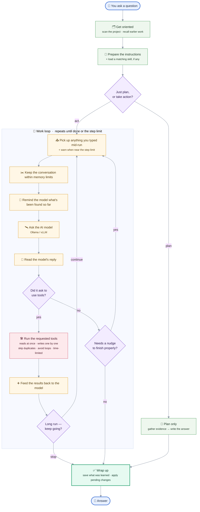

# MIMIR

> **MIMIR docs** — [Overview](README.md) · [Architecture](ARCHITECTURE.md) · [Setup](SETUP.md) · [Policy](POLICY.md) · [Client internals](CLIENT_DETAILED.md) · [Servers](SERVERS_DETAILED.md) · [Extension](EXTENSION_DETAILED.md) · [Plugins](PLUGINS_DETAILED.md)

> **M**athematical **I**ntelligence: **M**odeling, **I**mplementation, **R**untime — *from math to HPC.*

Named after [Mímir](https://en.wikipedia.org/wiki/M%C3%ADmir), the Norse keeper of wisdom.
The acronym traces the agent's pipeline — **M**ath → **M**odeling → **I**mplementation →
**R**untime (HPC) — with **I**ntelligence binding the stages together.

A local AI agent that connects to multiple [MCP](https://modelcontextprotocol.io/) tool
servers and reasons over them using a selectable LLM backend: [Ollama](https://ollama.com/)
or vLLM (OpenAI-compatible API).

The client in [`client/agent_core.py`](mimir/client/agent_core.py) runs a simple loop:
start each MCP server as a stdio child process, discover every tool and its JSON schema,
expose those tools to the backend, route each call to the right server, and repeat until the
model produces a final answer. Two modes are available: `agent` (tool-using) and `plan`
(reasoning-only).

On top of that loop sits a policy and context layer:

- **Safety** — approval before sensitive actions, discovery-before-write checks, and
  validation-gated completion (no "done" while edits are unvalidated).
- **Honest completion** — every answer carries a machine-recorded verification ledger,
  shown as a collapsed panel you expand on demand (`/ledger` in the CLI):
  what was written, how strongly each file was actually checked, and an explicit note
  when nothing showed that the checks *discriminate* — that they tell working code from
  broken code. A check seen failing before the fix and passing after counts; one that was
  only ever green does not. "The tests passed" and "the result is correct" are tracked as
  different claims, for any language, not just numerical code.
- **Exit 0 is not a result** — a linter or compiler validates on its exit code, because its
  output *is* the verdict. Anything that *executes* leaves the file unvalidated until the
  model states what the output showed (`verdict: pass|fail|unknown — <why>`), which is then
  recorded as the model's claim, next to but never mixed with what the machine observed.
  Judging arbitrary output — fields, convergence tables, plots, logs — is the one thing no
  parser generalises over, so it is asked of the model rather than guessed at.
- **Context efficiency** — cached repository baseline, per-query read caching, cross-query
  carry of discovery state with staleness eviction, and token-budget history trimming +
  compaction.
- **Throughput & UX** — real-time token streaming and parallel dispatch of independent calls.
- **Skills** — automatic detection of a methodology prompt from the query and recent turns.

### Companion docs

The README is an overview; the authoritative detail lives in dedicated docs:

| Doc | Covers |
|-----|--------|
| [`SETUP.md`](SETUP.md) | Full setup, backends, SLURM, and VS Code settings |
| [`ARCHITECTURE.md`](ARCHITECTURE.md) | The client's internal dependency graph, layer by layer |
| [`POLICY.md`](POLICY.md) | Policy behaviour, completion gating, enforcement levels |
| [`CLIENT_DETAILED.md`](CLIENT_DETAILED.md) | Client architecture and execution flow |
| [`SERVERS_DETAILED.md`](SERVERS_DETAILED.md) | Per-server tool catalog |
| [`EXTENSION_DETAILED.md`](EXTENSION_DETAILED.md) | VS Code extension frontend internals |
| [`PLUGINS_DETAILED.md`](PLUGINS_DETAILED.md) | Authoring skills, servers, policies, nudges, base prompt |
| [`CONTRIBUTING.md`](CONTRIBUTING.md) | Dev environment, running the tests, opening a PR |

Tunable thresholds (timeouts, history/compaction budgets, step limit, context sizes) are
centralized in [`client/config/constants.py`](mimir/client/config/constants.py).

## Quick start

Pick the path that fits you. All three need an LLM backend (a vLLM endpoint by default, or
Ollama) — see [Installation](#installation) and [`SETUP.md`](SETUP.md).

**A. pip** (installs the `mimir` / `mimir-server` commands)

```bash
git clone https://github.com/MIMIR-LLM4CSE/MIMIR.git && cd MIMIR
./install.sh                       # creates .venv and installs the package
source .venv/bin/activate
cd /path/to/your/project           # becomes the sandbox root
mimir                              # interactive CLI
```

`pip install .` (or `pip install ".[vllm]"`) works too; `install.sh` just wraps it in a
virtualenv with a smoke test.

**B. Docker** (reproducible, no local Python setup)

```bash
docker build -t mimir:latest .
docker run --rm -it -v "$PWD":/workspace \
    -e LLM_BACKEND=vllm -e VLLM_BASE_URL=http://<node>:8000 \
    mimir:latest mimir
```

Or start the WebSocket server for the VS Code extension with `docker compose up mimir`.
SLURM "launch" mode is not available in a container — use vLLM **connect** mode.

**C. VS Code extension**

```bash
cd mimir/vscode-extension
npm install && npm run build && npm run package   # builds mimir-<version>.vsix
code --install-extension mimir-*.vsix
```

Then configure `mimir.*` settings in `.vscode/settings.json` (see [`SETUP.md`](SETUP.md) §6).

## Installation

**Prerequisites:** Python ≥ 3.10 and one LLM backend — a vLLM OpenAI-compatible endpoint
(the default, e.g. `http://127.0.0.1:8000/v1`), or [Ollama](https://ollama.com/) running locally.

```bash
pip install ".[vllm]"                          # installs the `mimir` command
export VLLM_BASE_URL=http://<node>:8000        # vLLM is the default backend
cd /path/to/your/project && mimir

# Ollama instead:
#   pip install . && export LLM_BACKEND=ollama && ollama pull qwen3:8b
```

`pip install -r mimir/requirements.txt` still installs the same core dependencies, but it
does **not** register the `mimir` / `mimir-server` commands; from a bare repo checkout the
CLI is then `python -m mimir.client.ui.cli.main`. See [`SETUP.md`](SETUP.md) §2.

Optional extras: `pip install ".[finetune]"` for the LoRA stack (torch / transformers /
peft / datasets / trl); `sudo apt-get install gfortran` for Fortran compilation;
`GITHUB_TOKEN` to raise GitHub API limits.

### Configuration

| Environment variable | Default | Purpose |
|----------------------|---------|---------|
| `LLM_BACKEND` | `vllm` | Backend selector: `vllm` or `ollama` |
| `MIMIR_DEFAULT_MODEL` | *(empty)* | Model selected at startup; overridden by `--model` or the UI |
| `OLLAMA_BASE_URL` | `http://127.0.0.1:11434` | Ollama API endpoint |
| `VLLM_BASE_URL` | `http://127.0.0.1:8000` | vLLM API base URL (client appends `/v1` if needed) |
| `VLLM_API_KEY` | `EMPTY` | API key for vLLM OpenAI-compatible calls |
| `MIMIR_EMBED_MODEL` | *(empty; `nomic-embed-text` on Ollama)* | Embedding model for semantic memory search & tool ranking (required for vLLM; else lexical fallback) |
| `MCP_FILES_ROOT` | current working dir | Workspace root (guardrail on paths tools name — [not a sandbox](SERVERS_DETAILED.md#scope-of-the-sandbox-read-this-before-trusting-confined)) |
| `GITHUB_TOKEN` | *(none)* | Raises GitHub API rate limits |
| `MIMIR_OLLAMA_NUM_CTX` | *(model's context length)* | Overrides the Ollama context window (`num_ctx`) |

The context-window budget is sized automatically from the backend (vLLM `max_model_len` or
Ollama's model context length), falling back to 200K/32K if it can't be determined. Per-model
vLLM behaviour (tool-call parser, reasoning parser) is configured in
[`vllm_model_profiles.json`](mimir/client/config/vllm_model_profiles.json); unlisted models
get a parser inferred from their name. Full backend, connect/launch, and thinking-model setup
is documented in [`SETUP.md`](SETUP.md).

## Architecture

```
┌─────────────────────────────────────────────────────────────────────────────┐
│                             MimirAgent (client)                               │
│      backend.chat(model, messages, tools=[...]) (Ollama or vLLM)           │
│                                                                             │
│  servers/_shared/          shared response helpers, path sandboxing,         │
│                            text tools, module env, platform profile store    │
│                                                                             │
│  workspace/                utilities/              agent_state/              │
│  ┌───────────────────┐     ┌───────────────────┐   ┌───────────────────┐     │
│  │ files             │     │ math              │   │ memory            │     │
│  │ search            │     │ strings           │   │ todo              │     │
│  │ code_intel (nav)  │     │ datetime          │   │ agent (spawn)     │     │
│  │ bash (exec/valid) │     │ symbolic_math     │   └───────────────────┘     │
│  │ localgit          │     └───────────────────┘                             │
│  └───────────────────┘                            interaction/               │
│                                                   ┌───────────────────┐      │
│  external/                 hpc/                   │ ask_user_question │      │
│  ┌───────────────────┐     ┌───────────────────┐  └───────────────────┘      │
│  │ github            │     │ hpc               │                             │
│  │ web               │     │ platform          │                             │
│  │ system            │     │ benchmark  env    │                             │
│  └───────────────────┘     └───────────────────┘                             │
│                                                                             │
│  ml/                       proxy/                                            │
│  ┌───────────────────┐     ┌───────────────────────────────────────────┐     │
│  │ finetune          │     │ proxy  (7 op-dispatched tools: registry,  │     │
│  │ (LoRA / HF)       │     │  refs, runs, suites, eval loop, Slurm)    │     │
│  │ _ft_runner.py     │     │  _ops/ (op bodies) + _lib/ (helpers)        │     │
│  └───────────────────┘     └───────────────────────────────────────────┘     │
└─────────────────────────────────────────────────────────────────────────────┘
```

Each server runs as a child process connected over stdio (MCP standard). The agent discovers
all tools at startup and feeds their JSON-Schema definitions to the backend, which decides
which tools to call. The client is organized under `mimir/client/` into `config/` (static
config + tuning knobs), `context/` (execution-context schema + tool-capability registry),
`prompt/` (repo baseline, hardware probe, system-prompt building), `extensions/` (the user's
`.mimir/` servers / skills / plugins), `integration/` (MCP lifecycle), `guardrails/` (the
precondition pipeline **plus** the soft nudges + shared workflow state), `query_engine/` (the
agentic loop + backends), `tool_execution/` (arg normalization, caching, post-write
validation), the `MimirAgent` core (`agent_core.py`, at the client root — the engine every
frontend drives), and `ui/` (the CLI and WebSocket/VS Code frontends). See
[`CLIENT_DETAILED.md`](CLIENT_DETAILED.md) for the full module breakdown.

### Agentic loop

When you ask a question, MIMIR first gets oriented (scans the project once and recalls what it
learned earlier), prepares the instructions for the AI model, then either just writes a plan
or enters a work loop where it repeatedly asks the model, runs the tools the model requests,
and feeds the results back — until the task is done. Every path ends with the same wrap-up
(save what was learned, apply any pending changes).



## Registered Servers

The client registers 22 servers by default; the authoritative registry lives in
[`constants.py`](mimir/client/config/constants.py). Per-server tool details are in
[`SERVERS_DETAILED.md`](SERVERS_DETAILED.md).

| Name | Main capabilities |
|------|-------------------|
| `math` | Safe AST math (`+ - * / ** % //` + curated NumPy fns) |
| `strings` | reverse/case/strip/replace/split/contains/count/prefix/suffix/title |
| `datetime` | Current time, day-of-week, date arithmetic, formatting, timestamp conversion |
| `symbolic_math` | SymPy: simplify/expand/factor/differentiate/integrate/solve/limit/series/matrix |
| `memory` | Persistent memory with tags, search, list, delete, clear |
| `files` | Root-scoped file CRUD, surgical edits (`replace_in_file`, `replace_lines`), batch edits |
| `search` | File/pattern search, file reads, cached tree summaries, directory listing, ranking |
| `web` | Safe HTTP GET/POST, JSON parsing and field extraction (SSRF-hardened) |
| `github` | Read-only GitHub search, metadata, issues, branches, file fetch |
| `hpc` | Slurm tools (`sinfo`, `squeue`, `salloc`, `sbatch`) + async batch tracking (Environment Modules go through `bash`'s `module`) |
| `platform` | Platform profiling (CPU/NUMA/memory/GPU/Slurm/toolchains) + arch-aware advice |
| `env` | Mutating Python-environment management (pip install/uninstall, create/delete) |
| `benchmark` | Lightweight micro-benchmarks (Python compute, memory copy, NumPy matmul) |
| `system` | Read-only OS/CPU/memory/disk/uptime inspection |
| `code_intel` | Symbol navigation (ctags + LSP): definition, references, outline, hover |
| `bash` | Controlled workspace shell: allowlisted inspection + compile/run/validate/test (`gcc`/`python`/`pytest`/`ruff`/`mypy`/`nvcc`/`make`/`module`), TeX (`pdflatex`/`latexmk`) and file management (`mv`/`cp`/`mkdir`/`chmod`) |
| `localgit` | Read-only git inspection (status/log/diff/show/branches/blame/grep) |
| `todo` | Agent task checklist: create, read, update an ordered per-session todo list |
| `interaction` | `ask_user_question` — pause mid-run to ask a structured clarifying question |
| `agent` | `spawn_agent` — delegate a sub-task to a fresh agent that runs to completion |
| `finetune` | LoRA fine-tuning lifecycle (config, run local/Slurm, metrics, iterate, promote) |
| `proxy` | Proxy registration, references, runs, benchmark suites, and the iterative eval loop (7 op-dispatched tools) |

Most tools return structured payloads (`status`, `result`, `error`, `hint`, `stdout`,
`stderr`), carry rich docstrings, and provide recovery hints on failure — this improves tool
selection, chaining, and recovery.

## Safety & approvals

The client gates sensitive tool calls through an interactive approval prompt (`yes` /
`no` / `always`). Approval-gated actions include file writes, memory mutation, code
execution/compilation, shell commands, external POST requests, Slurm allocation, and benchmark
persistence. A refusal is handed back as an instruction, not an error to retry: MIMIR weighs
whether you meant "not this way" (reach the goal another way), "that's unnecessary" (drop the
step and carry on, saying it was skipped) or "stop" (end the turn and report what is blocked) —
and after repeated refusals of the same action it stops asking you at all. See
[POLICY.md](POLICY.md#if-approval-is-refused).

Sandboxing and hardening highlights:

- `files` / `search` are restricted to `MCP_FILES_ROOT` (the workspace root).
- `web` allows only `http`/`https`, validates resolved IPs, and blocks internal/non-routable
  targets (SSRF protection).
- `github` is read-only via the GitHub API (no local git credentials).
- `bash` is an allowlist of mostly read-only commands (no shell interpreter, no `rm`).
  Every path it names — a file operand, both ends of `mv`/`cp`, the target of a `cd` —
  is confined to the workspace; anything outside it goes to the user for approval
  first, whatever tool or syntax it arrives in. Every build/exec command is
  approval-gated too, in the workspace as much as outside it — so nothing runs unasked.
  What that approval does *not* buy you is any constraint on the program once started
  (`python`/`make`/`gcc` run with the account's full privileges): see
  [the scope note](SERVERS_DETAILED.md#scope-of-the-sandbox-read-this-before-trusting-confined).
  `finetune` / `proxy` keep all state
  outside the workspace sandbox and run as detached subprocesses or Slurm jobs.

The authoritative definition of policy, completion gating, and workflow-state rules is in
[`POLICY.md`](POLICY.md).

## Client features

- **Modes** — `/mode agent` (tool-use loop), `/mode plan` (read-only exploration ending in a
  plan you approve before any work; an advisory evidence gate flags — never rejects — a
  plan written with zero exploration on repo-touching queries), and `/mode ask` (read-only Q&A about the codebase —
  same exploration-only tool surface, but no checklist, no evidence gate, no approval step).
  The mode is **live**: switching it mid-query lands on the very next step — write tools are
  revoked (or restored) and the system prompt is rebuilt without waiting for the turn to end.
- **Repository baseline** — a lazy, never-persisted `os.walk` snapshot injected as
  orientation; `/rescan` refreshes it.
- **Session carry-context** — discovery/read state is reused across queries in a session, with
  mtime-based staleness eviction so stale content is never used as an edit anchor.
- **Caching** — read-only tool results are cached per query; a write invalidates cached reads
  for that path.
- **Streaming** — model tokens stream to the UI; thinking blocks are shown but never re-fed to
  the model; each tool call emits structured `tool_call` / `tool_result` events.
- **Parallel dispatch** — independent reads run concurrently; writes run serially; duplicate
  and runaway-repeat calls are deduplicated/blocked; each call has a 120 s timeout.
- **Resilience** — backend round-trips retry transient failures with exponential backoff.
- **Enforcement levels** — `/enforcement strict|light|off` dials the guidance-nudge layer.
  Default is `light`: only the reminders guarding a costly, hard-to-detect,
  non-self-correcting mistake (blast radius, environment cleanup, unvalidated code).
  `strict` adds the procedural reminders back and is opted into per model. Verification
  nudges and safety guards are unaffected at every level.
- **Thinking depth** — `/think off|auto|quick|medium|deep|max`. Default is **`auto`**:
  thinking is on but uncapped and self-calibrated (a prompt directive asks the model to
  keep it short on trivial turns and spend a long chain only where the task is genuinely
  uncertain); the fixed rungs impose a token budget instead. Live, like the mode.
- **Server & skill toggles** — hide a server's tools or a skill from the model via the webview
  panel or `/servers` / `/skills`; persisted in `<state-dir>/preferences.json`.
- **Approval & trust** — `/trust` / `/untrust` a tool for the session; `/batch on|off` batches
  write approvals into one diff review at turn end.
- **Context management** — history is trimmed by token budget (not count), with intra-query
  compaction of intermediate tool results when the window fills.
- **Skills** — methodology prompts auto-detected from the query and recent turns.

See [`POLICY.md`](POLICY.md) and [`CLIENT_DETAILED.md`](CLIENT_DETAILED.md) for the full
behaviour and rationale.

## Skills

Skills are reusable methodology prompts injected into the agent context when a relevant task is
detected. They guide *how* the agent works without replacing the base system instructions.

Each lives at `mimir/skills/<skill-name>/SKILL.md` with YAML front-matter (`name` must match
the directory) followed by the methodology body. Built-in skills:

| Skill | Description |
|-------|-------------|
| `fix-bug` | Fix a bug with minimal, safe changes and validate the result |
| `refactor-code` | Improve code structure without changing external behavior |
| `write-tests` | Write tests for existing code |
| `explore-repo` | Systematically explore and summarize a repository |
| `analyze-only` | Analyse code and report findings without making edits |
| `prepare-pr` | Prepare a pull-request description from recent changes |
| `finetune` | Run and iterate on a LoRA fine-tuning session |
| `proxy-optimize` | Optimize a registered proxy through the iterative eval loop |

Trigger a skill explicitly with a slash command (`/fix-bug the import error in …`) or let the
classifier detect it implicitly — it reads the current query plus the last few turns, so a
short "yes" can activate a skill whose intent was set earlier. In the VS Code chat, typing
`/` at the start of the input opens an autocomplete dropdown of available skills (mirroring
the `@` resource-attach menu).

## Extending MIMIR

`.mimir/` in the workspace root (override with `MCP_FILES_ROOT`) is the home for all
user-provided extensions. Every type is auto-detected by directory scan — drop a file in, no
core edit, no registration call:

| Type | Location | Env override | Collision with bundled |
|------|----------|--------------|------------------------|
| Skills | `.mimir/skills/<name>/SKILL.md` | `MIMIR_SKILLS_DIR` | user **overrides** bundled |
| MCP servers | `.mimir/servers/server_<name>.py` (or `.js`) | `MIMIR_SERVERS_DIR` | user **skipped** (core protected) |
| Policies + nudges | `.mimir/plugins/*.py` | `MIMIR_PLUGINS_DIR` | additive |
| Base prompt | `.mimir/system_prompt.md` | `MIMIR_SYSTEM_PROMPT_FILE` | user **replaces** the built-in default |

Agent **state** lives elsewhere, in a central per-workspace dir (`~/.mimir/<workspace-id>/`,
override `MIMIR_STATE_DIR`): memory, sessions, plans, todos. The agent's **scratchpad** sits
under the temp dir instead — `<TMPDIR or /tmp>/mimir-<uid>-<workspace-id>/<session-id>/`,
override `MIMIR_SCRATCH_DIR`. It is writable without approval and is where throwaway scripts,
probes, intermediate data and diagnostic plots belong; nothing written there is reported as
produced work or asked to be validated, so that is also where to look for a run's working
files afterwards (MIMIR never deletes them — the OS reclaims the temp dir). Keeping both out
of `.mimir/` leaves the workspace directory the user's alone.

**Custom servers** — drop a `FastMCP` `server_<name>.py`; give each tool a precise docstring
and structured return, then restart. Tag each tool with **capabilities** via `tool_caps(...)`
so MIMIR's policies, caching, and nudges apply — optional but recommended, and required for
capability-based policies/nudges (see the
[capability reference](PLUGINS_DETAILED.md#tool-capabilities)). A foreign server with no MIMIR
metadata is still connected.

**Base prompt (general context)** — replace MIMIR's built-in system prompt with your own:
set `MIMIR_SYSTEM_PROMPT_FILE` to any `.md` file, or drop `.mimir/system_prompt.md` in the
workspace. Resolution order: `MIMIR_SYSTEM_PROMPT_FILE` → `.mimir/system_prompt.md` → built-in
default; the dynamic platform / memory / todo / plan sections are still appended on top
automatically. See [`SETUP.md`](SETUP.md) §4.

**Extension packs** — an application can plug in its own policies (which **block** a tool call)
and nudges (which inject an advisory reminder) without editing core. Packs reference
*capabilities*, never literal tool names, and can only **add** constraints. Ready-to-copy
examples ship in [`mimir/examples/`](mimir/examples/); the full authoring guide (skills,
servers, policies, nudges, base prompt) is [`PLUGINS_DETAILED.md`](PLUGINS_DETAILED.md).

```python
from mimir.client.extensions import PolicyCheck, register_policy_check
from mimir.client.context.capabilities import EXTERNAL_FETCH, has_cap

def _no_secret_exfil(agent, tool, args, ec):
    if has_cap(tool, EXTERNAL_FETCH, agent.tool_caps) and _looks_secret(args):
        return '{"status":"error","error":"Outbound call carries a secret"}'
    return None

register_policy_check(PolicyCheck(name="no_secret_exfil", check=_no_secret_exfil,
                                  stage="pre_mutation"))   # or "pre_approval"
```

## VS Code extension + WebSocket frontend

A graphical chat interface backed by a Python WebSocket server. It mirrors the CLI —
streaming output, inline approval cards, and a live todo sidebar — inside a VS Code webview.
The agent runs in a background thread with its own asyncio loop, so blocking approval prompts
never freeze the WebSocket.

```bash
# 1. Start the WebSocket server (needs: pip install websockets)
python3 -m mimir.client.ui.ws.ws_server --port 8765
#    options: --host --port --model --backend {ollama,vllm} --vllm-base-url --vllm-api-key

# 2. Build & install the extension (needs Node.js ≥ 16)
cd mimir/vscode-extension
npm install && npm run build && npm run package
code --install-extension mimir-*.vsix

# 3. In VS Code: run "MimirAgent: Open Chat" (F1), type a query, press Enter
```

Configure `mimir.*` settings in `.vscode/settings.json` — `mimir.wsUrl`, `mimir.serverScript`,
`mimir.pythonPath`, backend/SLURM/model settings. Model and cluster lists
(`mimir.availableModels`, `mimir.vllmAvailableModels`, `mimir.modelSizes`,
`mimir.clusterConfig`) are personal/platform-specific and have empty defaults. The full
settings reference is in [`SETUP.md`](SETUP.md); the WebSocket message protocol and frontend
internals are in [`EXTENSION_DETAILED.md`](EXTENSION_DETAILED.md).

## Testing & benchmarks

```bash
pytest                                   # needs the `dev` extra: pip install -e ".[dev]"
python3 -m unittest discover mimir/tests  # same tests, no extra needed
```

The tests are plain `unittest` cases (no `conftest.py`, no pytest-only constructs), so
either runner works; `pytest` is what `pyproject.toml` configures and what
[`CONTRIBUTING.md`](CONTRIBUTING.md) asks for before a PR. The suite covers approval,
policy rules, client-helper contracts, server response contracts, and the agent loop.

[`mimir/runner/`](mimir/runner/) is the agent's **batch mode**: a library that drives the
non-interactive path over a list of tasks — each in a throwaway workspace, fresh agent per
task, every tool auto-approved — and returns a JSON report. It does no scoring of its own; a
benchmark supplies the tasks and grades the result. Write a small integration that implements
the `BenchmarkAdapter` contract (`load_tasks` + `score`) and calls `run_benchmark(...)`:

```python
from mimir.runner import run_benchmark, BenchTask, CheckContext

class MyAdapter:
    name = "my_bench"
    def load_tasks(self, limit=None):
        return [BenchTask(id=t.id, query=t.prompt, setup=t.materialize, requires=t.tools)
                for t in my_benchmark.tasks][:limit]
    async def score(self, task, answer, ctx: CheckContext):   # grade the workspace
        return my_benchmark.grade(task, ctx.workspace)

summary = await run_benchmark(MyAdapter(), model="<model>", backend="vllm", report_path="run.json")
```

**The engine approves every tool without confirmation — only point it at trusted workloads in
a sandbox.**
